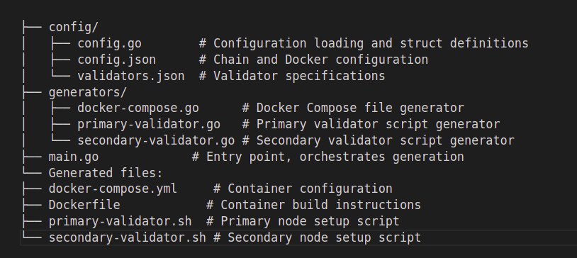

# Pastel Network Devnet Setup

## 1. Overview

This tool automates the creation of blockchain validator networks by generating Docker configurations and validator scripts from JSON input files. It provides:

- Configuration-driven network generation
- Dynamic validator scaling
- Automated peer discovery and network setup
- Customizable chain parameters
- Docker-based deployment system

The system takes `config.json` and `validators.json` as inputs to generate Docker Compose files and validator scripts, enabling rapid deployment of distributed validator networks of any size.
The system take `claims.json` as input to be used by Claim module on genesis initialization.
The system CAN take existing `genesis.json` as input to be extended to include new validators. 

## 2. Directory Structure



## 3. Configuration Files

### 3.1 config.json

The `config.json` file defines the global configuration for the validator network. This includes chain parameters, Docker settings, filesystem paths, and daemon configurations. All validators share these settings to ensure network consistency.

```json
{
    "chain": {
        "id": "chain-id",          // Network identifier
        "denom": {
            "bond": "token",       // Staking token denomination
            "mint": "token",       // Minting token denomination
            "minimum_gas_price": "0upsl" // Minimum transaction fee
        }
    },
    "docker": {
        "network_name": "network", // Docker network name
        "container_prefix": "prefix", // Container naming prefix
        "volume_prefix": "prefix"  // Volume naming prefix
    },
    "paths": {
        "base": {
            "host": "~",          // Host machine path
            "container": "/root"   // Container path
        },
        "directories": {
            "daemon": ".chain"     // Chain data directory
        }
    },
    "daemon": {
        "binary": "chaind",       // Chain daemon binary
        "keyring_backend": "test" // Keyring storage type
    }
}
```

### 3.2 validators.json
```json
[
    {
        // Primary validator - Uses default Tendermint ports
        "name": "validator1",
        "moniker": "validator1",
        "key_name": "key1",
        "port": 26656,      // Default P2P port
        "rpc_port": 26657,  // Default RPC port
        "rest_port": 1317,  // Default REST port
        "grpc_port": 9090,  // Default gRPC port
        "initial_distribution": {
            "account_balance": "1000",
            "validator_stake": "900upsl"
        }
    },
    {
        // Secondary validators - Use incremented ports
        "name": "validator2",
        "moniker": "validator2", 
        "key_name": "key2",
        "port": 26666,      // P2P: 26656 + 10
        "rpc_port": 26667,  // RPC: 26657 + 10
        "rest_port": 1327,  // REST: 1317 + 10
        "grpc_port": 9091,  // gRPC: 9090 + 1
        "initial_distribution": {
            "account_balance": "1000upsl",
            "validator_stake": "900upsl"
        }
    }
]
```

#### 3.2.1 Validator Configuration Details

- **Primary Validator (First Entry)**
  - Uses standard Tendermint ports (26656, 26657, 1317, 9090)
  - Acts as the genesis validator for network initialization
  - Manages initial account creation and token distribution

- **Secondary Validators**
  - Use incremented ports to prevent conflicts
  - P2P ports increment by 10 (26666, 26676, etc.)
  - RPC ports increment by 10 (26667, 26677, etc.)
  - REST ports increment by 10 (1327, 1337, etc.)
  - gRPC ports increment by 1 (9091, 9092, etc.)

- **Common Configuration**
  - `name`: Unique identifier for the validator
  - `moniker`: Display name on the network
  - `key_name`: Keyring key identifier
  - `initial_distribution`: Token allocation and staking amounts

Each validator can have unique initial token distributions and stakes, though they typically match for network stability.

## 4. Core Components

### 4.1 Config Package (`config.go`)
Core configuration management system that handles:
- Loading and parsing of config files
- Data models for chain and validator settings
- Configuration validation

### 4.2 Generators Package
Set of generators that create deployment configurations and scripts.

#### 4.2.1 Docker Compose Generator (`docker-compose.go`)
Creates Docker network configuration:
- Service definitions for each validator
- Network and volume mappings
- Port configurations
- Container dependencies

#### 4.2.2 Validator Script Generators
Produces initialization and startup scripts:
1. Primary Validator (`primary-validator.go`)
   - Chain initialization
   - Genesis configuration
   - Account creation
   - Network bootstrapping
2. Secondary Validator (`secondary-validator.go`)
   - Validator initialization
   - Genesis synchronization
   - Peer discovery
   - Network joining

Each generator uses the config package structures to ensure consistent network setup across all components.

## 5. Docker Components

### 5.1 Dockerfile Structure
From [dockerfile](dockerfile):
```dockerfile
FROM debian:bookworm-slim

# System dependencies
RUN apt-get update && apt-get install -y \
    curl \
    jq \
    bash \
    sed \
    ca-certificates

# Copy chain binary and WASM library
COPY pasteld /usr/local/bin/pasteld            # Chain binary executable
COPY libwasmvm.x86_64.so /usr/lib/            # Required for WASM contract support
RUN chmod +x /usr/local/bin/pasteld && ldconfig

# Copy validator scripts
COPY primary-validator.sh /root/scripts/
COPY secondary-validator.sh /root/scripts/
RUN chmod +x /root/scripts/*.sh

# Expose ports
EXPOSE 26656 26657 1317 9090  # P2P, RPC, REST, gRPC respectively

WORKDIR /root
```

### 5.2 Docker Compose
Generated from `docker-compose.go`
```yaml
services:
  validator1:
    build: .
    container_name: pastel-validator1
    ports:
      - "26656:26656"  # P2P
      - "26657:26657"  # RPC
      - "1317:1317"    # REST API
      - "9090:9090"    # gRPC
    volumes:
      - /tmp/pastel-devnet/validator1-data:/root/.pastel  # Chain data directory
      - /tmp/pastel-devnet/shared:/shared                 # Shared directory for validator coordination
    environment:
      MONIKER: validator1
    command: bash /root/scripts/primary-validator.sh

  validator2:
    # ... similar config with incremented ports
    depends_on:
      - validator1
    command: bash /root/scripts/secondary-validator.sh bob 900000000000000upsl validator2
```

## 6. Usage Guide

### 6.1 Build and Setup

> Be sure there is only ONE version of the `wasmvm` go package.
> ```bash
> ls -l ~/go/pkg/mod/github.com/\!cosm\!wasm/wasmvm/
> total 4.0K
> dr-xr-xr-x 13 user user 4.0K Oct 22 13:56 v2@v2.1.2
> ```
> If you have multiple versions, remove all of them and run `make devnet-build` again.  

#### Full build process

1. If using pre-existing genesis file
```bash
make devnet-build EXTERNAL_CLAIMS_FILE=/paht-to/claims.csv EXTERNAL_GENESIS_FILE=/paht-to/genesis-template.json
```
> NOTE: if EXTERNAL_GENESIS_FILE is provided, new validators will be added to the existing genesis file

2. Creating fresh genesis file
```bash
make devnet-build EXTERNAL_CLAIMS_FILE=/paht-to/claims.csv EXTERNAL_GENESIS_FILE=/paht-to/genesis-template.json
```
> NOTE: if EXTERNAL_GENESIS_FILE is not provided, new genesis will be generated based on the validators.json file

These will:
1. Downloads WasmVM v2.1.2 library
2. Builds chain binary with Ignite
3. Extracts binary from release archive
4. Copies files to devnet/:
   - pasteld binary
   - libwasmvm.x86_64.so
   - claims.csv
5. Generates network configuration
6. Builds Docker images

#### Clean old data
```bash
make devnet-clean   # Removes /tmp/pastel-devnet/shared and all ~/validator*-data directories
```

### 6.2 Network Operations
```bash
# Start network with console output
make devnet-up

# Start network in background
make devnet-up-detach

# Clean start (removes old data and regenerates configs)
make devnet-up-clean

# Stop network and cleanup containers
make devnet-down
```

### 6.3 Network Files Location
```bash
# Final Genesis File
/tmp/pastel-devnet/validator1-data/config/genesis.json   # On host machine
/root/.pastel/config/genesis.json       # Inside containers

# Node IDs, IPs and Ports
/tmp/pastel-devnet/shared/validator*_nodeid              # Node IDs 
/tmp/pastel-devnet/shared/validator*_ip                  # Container IPs
/tmp/pastel-devnet/shared/validator*_port                  # Container P2P Ports
```

### 6.4 Joining New Node to Network

#### 1. Get Validator Info
```bash
# Get node ID
VALIDATOR1_ID=$(cat /tmp/pastel-devnet/shared/validator1_nodeid)
# e.g., 4cb8e2eb7bb90fd026e02f693927230fe3fb9c89

# Get container IP
VALIDATOR1_IP=$(cat /tmp/pastel-devnet/shared/validator1_ip) 
# e.g., 172.20.0.2
```

> NOTE: It might be better to use `localhost` instead of validators internal docker IP address.
> ```bash
> VALIDATOR1_IP=localhost
> ```


#### 2. Initialize New Node
```bash
# Clean previous data (if needed)
rm -rf ~/.pasteld

# Initialize node with same chain-id
pasteld init my-local-node --chain-id pastel-devnet
```

#### 3. Copy Genesis
```bash
# Copy from validator1's data directory /shared
cp /tmp/pastel-devnet/validator1-data/config/genesis.json ~/.pastel/config/
```

#### 4. Start Node
```bash
# Start with container IP peer connection
pasteld start --minimum-gas-prices 0upsl \
    --p2p.persistent_peers "${VALIDATOR1_ID}@${VALIDATOR1_IP}:26656" \
    --p2p.laddr tcp://0.0.0.0:26626 \
    --rpc.laddr tcp://127.0.0.1:26627
```

*Note: You can use any validator as a peer by using their respective node ID and IP from the shared directory.*

### 6.5 Verify Connection
```bash
# Check peer connections
pasteld net-info

# Check sync status 
pasteld status | jq .SyncInfo
```

### 6.6 CLI Sessions

#### Access Container Shell
```bash
# Access primary validator
docker exec -it pastel-validator1 bash

# Access any validator (n = 1-5)
docker exec -it pastel-validator{n} bash
```

#### Direct CLI Commands
```bash
# Primary validator commands
docker exec -it pastel-validator1 pasteld keys list --keyring-backend test
docker exec -it pastel-validator1 pasteld query bank balances <address>

# Secondary validator commands (n = 2-5)
docker exec -it pastel-validator{n} pasteld status
```

#### Interactive CLI Sessions
From inside container after `docker exec -it pastel-validator1 bash`:
```bash
# Query commands
pasteld query bank balances <address>
pasteld query staking validators
pasteld query gov proposals

# Transaction commands
pasteld tx bank send <from> <to> 1000upsl --chain-id pastel-devnet --keyring-backend test
```

#### Common Operations
```bash
# View logs
docker exec -it pastel-validator1 tail -f /root/.pastel/pastel.log

# Check config
docker exec -it pastel-validator1 cat /root/.pastel/config/config.toml

# Monitor sync status
docker exec -it pastel-validator1 watch 'pasteld status | jq .SyncInfo'
```

*Note: The keyring-backend is set to 'test' in the dev environment, so no password prompts appear. For production, use 'file' or 'os' backend.*


