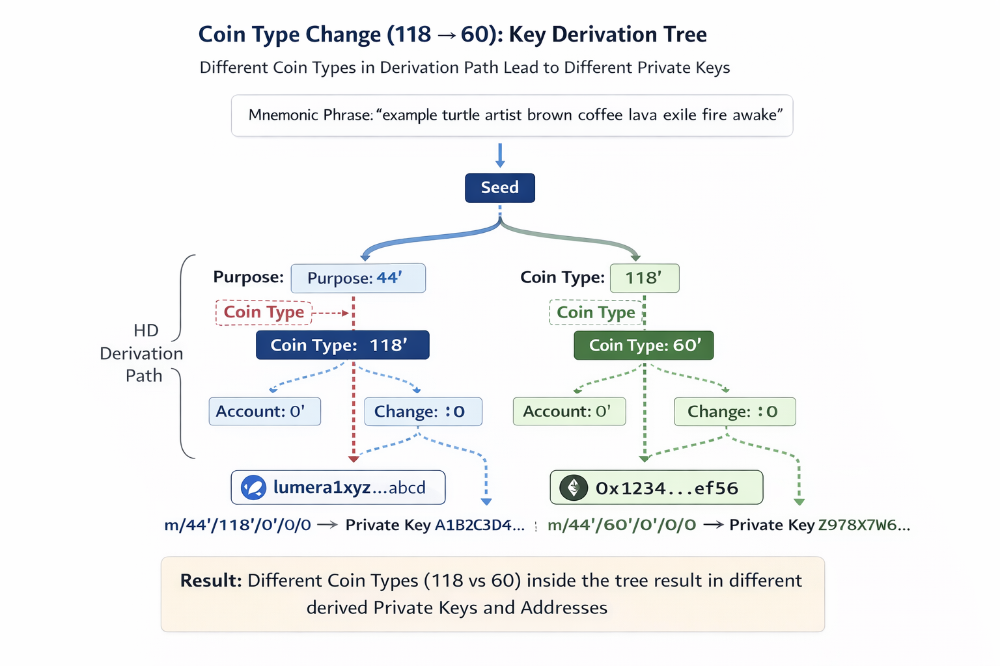

# Coin Type Change: 118 -> 60

## What "coin type" is

When wallets derive keys from a mnemonic, they follow the BIP-44 standard path layout:

```
m / 44' / coin_type' / account' / change / address_index
```

The **coin type** is a number that selects a distinct subtree of keys:

- **118**: Cosmos ecosystem default (most Cosmos chains)
- **60**: Ethereum ecosystem default

> Coin type does not change cryptography. It changes which child key is selected from the HD tree.

## Why the same mnemonic yields different keys when coin type changes

A mnemonic deterministically produces a single seed. From that seed, BIP-32 defines a tree of keys. BIP-44 is a convention for which branches to use.

If only `coin_type` changes, a **different hardened branch** is selected, which produces a **different private key** even though the mnemonic (seed) is the same.

Typical default first-account paths:

- Cosmos-style: `m/44'/118'/0'/0/0`
- Ethereum-style: `m/44'/60'/0'/0/0`

The derived private keys differ.



## What breaks when Lumera changes the default coin type

If Lumera defaults to **118** and the default switches to **60** (to support standard Ethereum wallet derivation), then:

- Importing the **same mnemonic** into a wallet using the default 60 path will show a **different account/address** than the old 118-derived one.
- Users may think "my funds disappeared" because their existing balances are still on the **old address**.
- Any tooling that generates keys by default (CLI, faucet, scripts, tests) will start producing **different addresses** for the same mnemonic.

## Where balances live on-chain (`x/bank`)

Lumera account **balances are stored on-chain by address** in the `x/bank` module's KV store. The chain does *not* store balances "by mnemonic" or "by coin type" -- those are wallet-side derivation conventions.

When the default derivation path switches from `m/44'/118'/...` to `m/44'/60'/...`, the **derived address bytes change**, which means the **bank-store key changes**. The original funds remain under the *old* address, and the "new" 60-derived address starts with an empty balance unless the user migrates/claims/transfers.

> The human-readable Bech32 string (e.g., `lumera1...`) is just an encoding of `address_bytes`. Changing coin type doesn't change on-chain storage; it changes which address is derived in the wallet.

This is a **breaking UX change**, even though it's not a breaking change to consensus or signature verification.

## Lumera's resolution: chain-assisted claim-and-move migration

Lumera chose **Approach 2A (claim-and-move)** -- the chain performs a one-time atomic state migration when the user proves ownership of both the legacy and new accounts.

### How it works

1. User submits `MsgClaimLegacyAccount { legacy_address, new_address, legacy_proof, new_proof }`.
2. Chain verifies both sides of the migration intent:
   - legacy Cosmos key signs `SHA256("lumera-evm-migration:<chainID>:<evmChainID>:claim:<legacyAddr>:<newAddr>")`
   - new EVM key signs `"lumera-evm-migration:<chainID>:<evmChainID>:claim:<legacyAddr>:<newAddr>"`
3. Chain atomically migrates all address-keyed state from old -> new across 10 modules (bank, staking, distribution, authz, feegrant, auth, supernode, action, claim, evmigration).
4. The old address becomes empty; the new address holds all state.

### What state gets migrated

| Module | State migrated |
| --- | --- |
| `x/bank` | All coin balances |
| `x/staking` | Delegations, unbonding entries, redelegations + UnbondingID indexes |
| `x/distribution` | Reward withdrawal, delegator starting info |
| `x/auth` | Account record (vesting-aware: lock removed before transfer, re-applied after) |
| `x/authz` | Grant re-keying (both grantor and grantee roles) |
| `x/feegrant` | Fee allowance re-keying (both granter and grantee) |
| `x/supernode` | SupernodeAccount, Evidence, PrevSupernodeAccounts, MetricsState |
| `x/action` | Creator and SuperNodes fields in action records |

### Key design properties

- **Dual-signature verification** -- prevents unauthorized migration
- **Zero-fee migration** -- custom ante decorator waives gas fees (the new address has no balance before migration completes)
- **Rate limiting** -- `max_migrations_per_block` (default 50) prevents migration flood attacks
- **Validator migration** -- dedicated `MsgMigrateValidator` for the additional complexity of validator record re-keying

See [../evmigration/main.md](../evmigration/main.md) for the full `x/evmigration` module reference.

## Operational checklist

- **Wallets**: Must update default derivation path to `m/44'/60'/0'/0/0` and communicate the change to users
- **Exchanges**: Must support the new address format and potentially re-derive deposit addresses
- **Explorers/indexers**: Must handle both old (118-derived) and new (60-derived) addresses during the migration window
- **CLI/scripts**: Default `--key-type` is now `eth_secp256k1`; old scripts that rely on default key generation will produce different addresses
- **IBC counterparties**: No protocol-level impact; IBC packets use address bytes, not derivation paths
