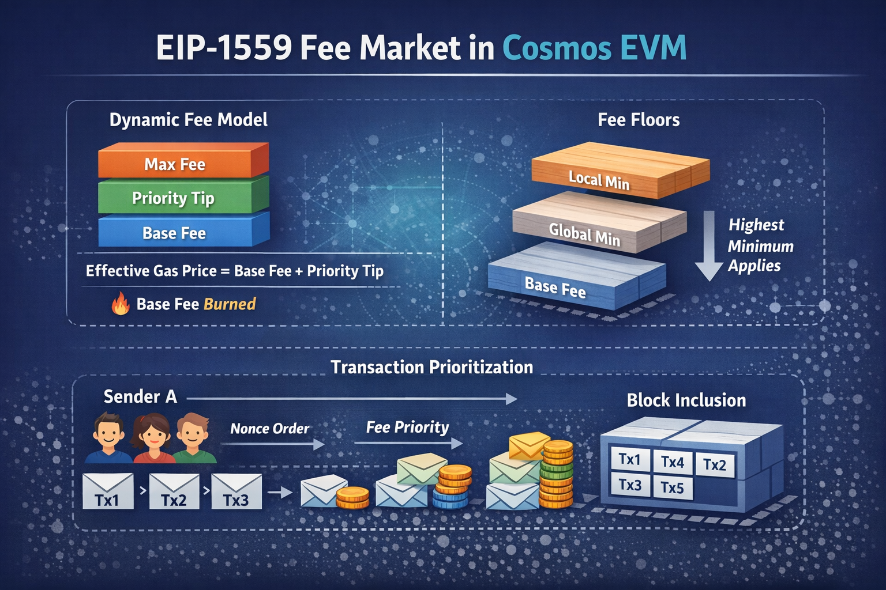

# EIP-1559 Fee Market

## What changes

Cosmos EVM integration introduces the **Fee Market** module (`x/feemarket`) that implements an EIP-1559-style dynamic fee mechanism for EVM transactions.

Compared to "classic" Cosmos fee behavior (static `minimum-gas-prices` filtering + fee checks), the EVM path changes in three major ways:

- **Per-block base fee** becomes a protocol-defined price floor that adjusts with block utilization.
- **Priority tips** (a.k.a. "tip") become an explicit mechanism to bid for faster tx inclusion.
- **Transaction selection / replacement behavior** becomes Ethereum-like (fee-priority + nonce ordering, and higher-fee replacement for the same nonce).



## Dynamic fee model (EIP-1559 semantics)

EIP-1559 splits what clients think of as "gas price" into components:

- **Base fee**: protocol-calculated minimum fee per gas unit for the current block
  - It moves up/down based on how full blocks are.
- **Priority fee (tip)**: an additional fee per gas unit paid to validators to prioritize tx inclusion. This is what the sender offers to pay validators *on top* of base fee to get picked sooner.
- **Max fee**: the maximum total fee per gas unit the sender is willing to pay.

### Effective gas price calculation

```
baseFeePerGas = current block base fee
maxFeePerGas  = sender's total cap
maxPriorityFeePerGas = sender's priority fee (tip) cap

effectiveGasPrice = min(maxFeePerGas, baseFeePerGas + maxPriorityFeePerGas)
feePaid           = gasUsed * effectiveGasPrice
```

### Fee floors

The effective minimum fee for EVM transactions is the **highest** of:

1. **Local minimum**: per-validator node config (`minimum-gas-prices` in `app.toml`)
2. **Global minimum**: a chain-wide parameter (`MinGasPrice`)
3. **Base fee**: the current protocol-calculated base fee

This means:
- even if base fee is low, local/global minimums can still reject low-priced transactions
- even if local/global minimums are low, a high base fee under congestion will reject underpriced transactions

## Lumera's fee market configuration

| Parameter | Value | Purpose |
| --- | --- | --- |
| `NoBaseFee` | `false` | Dynamic base fee enabled |
| `BaseFee` | `0.0025 ulume/gas` | Initial base fee at genesis/upgrade activation |
| `MinGasPrice` | `0.0005 ulume/gas` | Floor preventing base fee decay to zero |
| `BaseFeeChangeDenominator` | `16` | Gentler ~6.25% adjustment per block (upstream default is 8 = ~12.5%) |
| `ChainDefaultConsensusMaxGas` | `25,000,000` | Block gas limit |

### Why a min gas price floor matters

Without the `MinGasPrice` floor, empty blocks cause the EIP-1559 algorithm to reduce the base fee by ~6.25% per block until it reaches zero, effectively disabling all fee enforcement. Evmos experienced zero-base-fee spam attacks because it lacked this floor. Lumera ships with the floor from day one.

### Why a gentler change denominator

The upstream default of 8 produces ~12.5% base fee adjustment per block, which causes noticeable fee volatility. Lumera uses 16 (~6.25% per block) to smooth fee transitions and slow decay during low-activity periods.

## Transaction ordering and prioritization (mempool behavior)

Cosmos EVM integration replaces the default FIFO CometBFT mempool behavior for EVM flows with an Ethereum-like transaction pool that supports:

- **Fee-based prioritization**: transactions are selected with a notion of "fee priority"
- **Per-sender nonce ordering**: selection respects nonce order within an account
- **Nonce-gap queuing**: future-nonce transactions can be queued locally and promoted when gaps are filled
- **Replacement**: a resent transaction with the same nonce and higher fee can replace a lower-fee version

Block construction generally follows the pattern:

- transactions are grouped by sender
- within each sender, selection follows nonce order
- across senders, selection is influenced by fee priority (tips / effective gas price)

## Lumera's fee distribution model

Lumera currently uses **standard SDK fee collection** for EVM transactions:

- The EVM keeper computes and deducts the full effective gas price (`base fee + effective priority tip`) up front and sends it to the normal fee collector module account.
- Unused gas is refunded from the fee collector back to the sender after execution.
- The remaining collected fees are then distributed by `x/distribution` using the normal SDK path:
  - fees move from the fee collector to the distribution module account
  - community tax is applied
  - the remainder is allocated across validators by voting power / stake fraction
  - each validator share is split into validator commission and delegator rewards

There is currently no custom Lumera path that isolates the EVM base-fee component from the tip component. There is currently no burn path for EVM base fees.

## Interaction with 6 -> 18 decimal bridging (PreciseBank)

With `x/precisebank`, EVM fees are naturally expressed in **18-decimal units** (e.g., `alume`), while Cosmos fees remain in `ulume`. Fee market + precisebank together imply:

- base fee / tip accounting is performed in the EVM unit system
- fee deduction and any "burn" accounting must remain consistent with the underlying Cosmos supply model

See [gas-token-decimals.md](gas-token-decimals.md) for the precisebank architecture.

## Operational checklist

- Add `x/feemarket` store key and module wiring
- Decide activation height and initial params (`base_fee`, floors, responsiveness)
- Decide base fee handling model (burn vs distribute) and reflect it in token-economics documentation
- Ensure the EVM mempool integration is enabled so prioritization, replacement, and nonce-gap behavior match Ethereum tooling expectations
- Update ops runbooks and monitoring to track base fee evolution and common failure modes
- Wallets submit **type-2 (EIP-1559)** transactions by default
- Explorers must display **baseFeePerGas**, effective gas price, and tip
- RPC consumers rely on endpoints such as `eth_feeHistory` / suggested fees to estimate transactions
