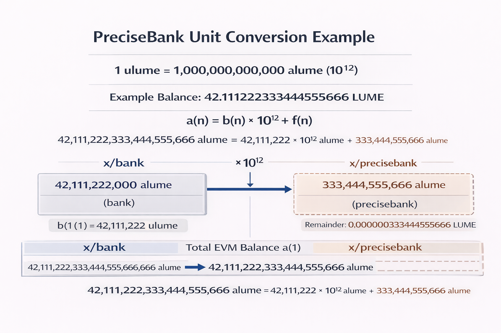

# Gas Token Decimals: 6 -> 18

## Current Lumera configuration

Lumera's genesis `denom_metadata` indicates a **6-decimal display token**:

- base: `ulume` (exponent 0)
- display: `lume` (exponent 6)

Meaning: `1 lume = 1,000,000 ulume = 10^6 ulume`

This is the typical "micro-denom" Cosmos layout.

## Why this is a breaking change with EVM

Most EVM tooling and Solidity conventions assume **18-decimal native units** (ETH/wei-style). Without an 18-decimal representation, EVM transfers/fees that require sub-micro precision either **round** or **fail**, and common DeFi math can break.

For Lumera to keep `ulume` (6 decimals) as the gas denom while exposing EVM JSON-RPC, a decision is required on how EVM "wei-like" values map to on-chain balances.

## Lumera's resolution: keep `ulume` (6 decimals) and add `x/precisebank`

Because Lumera mainnet is already running, changing the native token's decimal model (effectively rescaling every amount in state by `10^12`) is not a practical option. It would require a chain-wide, high-risk migration affecting all account balances, total supply, staking, distribution, vesting, grants, exchanges, explorers, wallets, and IBC/accounting assumptions.

The realistic post-genesis path is:

- keep Cosmos-side balances and fees in `ulume` (as today)
- expose an EVM-native, **18-decimal** representation via `x/precisebank` using an extended denom `alume`

At a high level:

- Cosmos layer continues to use `ulume` in `x/bank` (integer-only)
- EVM layer uses an **18-decimal extended denom**: `alume`
- Conversion factor: `1 ulume = 10^12 alume`

## What `x/precisebank` is

`x/precisebank` "extends the precision" of `x/bank` for EVM compatibility:

- It tracks **fractional balances** (sub-`ulume` amounts) separately from integer `x/bank` balances.
- It maintains invariants so those fractional units are consistently accounted for.

### Representation (conceptual)

- `b(n)` = integer balance in base denom (`ulume`) stored in `x/bank`
- `f(n)` = fractional balance stored in `x/precisebank` with `0 <= f(n) < 10^12`
- total EVM-view balance in 18-dec units:

```
a(n) = b(n) * 10^12 + f(n)
```

### State kept by `x/precisebank`

- `fractional_balances`: per-address remainder amounts that are too small to represent in `x/bank`
- `remainder`: a module-level accounting bucket used to maintain supply invariants



## What breaks / what changes in practice

- **Cosmos transactions** (CLI, IBC transfers, `bank/MsgSend`) continue to use `ulume` / `lume` exactly as before.
- **EVM JSON-RPC** balance and value transfers are in 18-decimal units (effectively `alume`, i.e., "wei-like").
- Very small EVM transfers (smaller than `1 ulume`) become possible because `x/precisebank` records them in `fractional_balances`.

## Lumera configuration

### Denom mapping

The VM/EVM module is configured with:

- `native_denom`: `ulume`
- `extended_denom`: `alume`

This tells the EVM side to treat `alume` as the 18-decimal representation of the underlying `ulume`.

### Genesis / state initialization

For the upgrade on an existing chain, PreciseBank is initialized empty:

- `fractional_balances`: `[]`
- `remainder`: `"0"`

Existing user balances remain in `x/bank` unchanged; EVM reads present them as `balance_ulume * 10^12` in `alume` units.

## Operational checklist

**Code / wiring (mandatory):**

- Add `x/precisebank` module and store key
- Initialize `PreciseBankKeeper` and wire it into the VM/EVM keeper (do not pass raw `BankKeeper`)

**Genesis / params (mandatory):**

- Add `app_state.precisebank` with empty state
- Set VM/EVM params to include the denom mapping (`native_denom = "ulume"`, `extended_denom = "alume"`)

**Upgrade handler (mandatory for mainnet upgrade):**

- Add the new module store to the upgrade plan
- Initialize `precisebank` state and set VM params at upgrade height

**Operational / ecosystem (strongly recommended):**

- Document clearly that:
  - Cosmos UI shows `lume` (6 decimals)
  - EVM UI shows "wei-like" 18-decimal units backed by the same underlying supply
- Update explorers/indexers and any app code that assumes "native token has 6 decimals" on EVM
