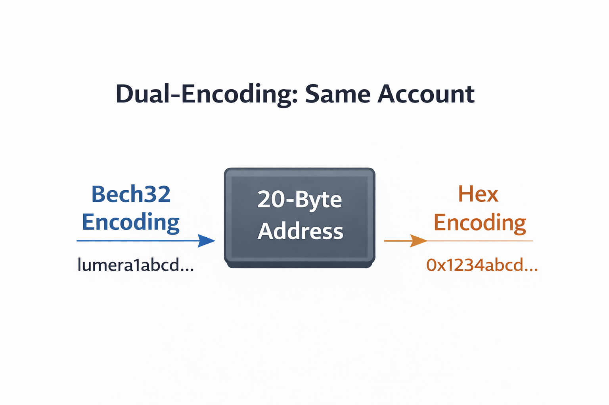

# Key Type and Address Format Changes

## What changes

Cosmos EVM integration introduces a distinct key type called `eth_secp256k1` / `EthSecp256k1`. Both Cosmos and Ethereum use the same **secp256k1 curve** for ECDSA keys -- the breaking change is the **account/public-key type and address derivation rules** used by the chain and tooling.

## Cosmos-style vs Ethereum-style address derivation

Even if the underlying private key is the same, Cosmos-style and Ethereum-style addresses are derived differently:

**Cosmos-style (common in many SDK chains):**
- address bytes = `RIPEMD160(SHA256(pubkey_bytes))`
- then encoded as Bech32 (e.g., `lumera1...`)

**Ethereum-style:**
- address bytes = last 20 bytes of `Keccak256(uncompressed_pubkey_without_prefix)`
- then encoded as hex with `0x` prefix (e.g., `0xabc...`)

**Implication:** with plain Cosmos `secp256k1` accounts, it is not possible to reliably "convert" a Bech32 address into the correct `0x...` address for the same key, because the **address derivation function differs**.

## How `eth_secp256k1` solves this

`EthSecp256k1` makes the chain's account/address derivation **Ethereum-compatible**, so:

- the underlying **20-byte address bytes** are Ethereum-style
- they can be represented either as:
  - `0x...` hex, or
  - Bech32 with Lumera's prefix (`lumera1...`)

For EVM-compatible accounts, **Bech32 vs 0x... is just encoding**, not a different account.

## What breaks for Lumera

Lumera already has accounts created under Cosmos-style `secp256k1` address derivation. After adding EVM:

1. **Legacy accounts keep working for Cosmos modules**, but are not "native" EVM accounts
   - users can still sign and send Cosmos SDK txs
   - but Ethereum wallets/tooling will not automatically see the same address/balances

2. **EVM tooling expects Ethereum address semantics**
   - JSON-RPC `eth_sendRawTransaction` style txs identify the sender by recovering it from `(r, s, v)` signature fields
   - dApps assume 20-byte `0x...` addresses everywhere

3. **Two "account universes" can appear** unless a strategy is chosen
   - existing Cosmos accounts (Cosmos-derived addresses)
   - new EVM accounts (Ethereum-derived addresses)

Because on-chain storage keys (e.g., `x/auth` account store, `x/bank` balances) are keyed by **address bytes**, different derivation rules mean different on-chain identities.

## After migration: one key, two signing formats

After claim-and-move migration, the canonical user account becomes the new `eth_secp256k1`-based account/address (coin type 60 derivation branch). From that point on:

### Cosmos SDK txs (bank / staking / gov / IBC / etc.)

- **Tx format:** Cosmos SDK protobuf tx (`TxBody` + `AuthInfo`).
- **Signing:** normal Cosmos signing (typically `SIGN_MODE_DIRECT`) over a protobuf `SignDoc` (includes `chain_id`, `account_number`, `sequence`, body/auth info).
- **Address used in messages:** Bech32 `lumera1...`, but for `eth_secp256k1` accounts this Bech32 is just an encoding of the same 20-byte Ethereum-style address bytes.

### EVM txs (JSON-RPC, contracts, transfers)

- **Tx format:** Ethereum tx (legacy/EIP-155 or typed tx like EIP-1559).
- **Signing:** Ethereum `(v,r,s)` signature over the Ethereum tx hash; sender is recovered from the signature and uses `0x...` address encoding.
- **Fee fields:** EIP-1559 fields (`maxFeePerGas`, `maxPriorityFeePerGas`) if type-2 txs are enabled.

### Sequence / nonce behavior

In Cosmos-EVM, **EVM nonce is backed by the Cosmos account sequence**, effectively creating **one shared counter**:

- A Cosmos tx consumes the next **sequence** -> the next EVM tx must use the next **nonce**.
- An EVM tx consumes the next **nonce** -> the next Cosmos tx must use the incremented **sequence**.

This implies that a pending EVM tx (nonce gap) can also block later txs from the same account until the gap is resolved (Ethereum-like "nonce ordering" behavior).

### Wallet implications

- Cosmos wallets / CLI must support `eth_secp256k1` keys for Cosmos tx signing.
- MetaMask signs EVM txs natively; signing Cosmos txs via MetaMask typically requires **EIP-712 support** on the chain/client side.

## How this relates to coin type 60

Coin type 60 changes **which key** a wallet derives from the mnemonic. Key type/address derivation changes **how the address bytes are computed** from a public key.

To achieve the "unified account access" goal (same mnemonic -> same account visible in both Cosmos wallets and MetaMask), both are generally required:

- coin type 60 (wallet derives the "expected" EVM key branch), and
- `EthSecp256k1` key type (chain derives Ethereum-compatible address bytes)

See [coin-type-change.md](coin-type-change.md) for the coin type change details.

## Operational checklist

- **Keyring:** Add `eth_secp256k1` to the keyring/signing options (`keys add ... --algo eth_secp256k1`)
- **Protobuf:** Ensure interface registration and encoding config includes the `EthSecp256k1` pubkey type
- **EVM module:** Uses the expected account keeper/bank interface for sender recovery, nonce management, and fee deduction
- **Migration:** There is no safe, automatic way to "convert" existing Cosmos-derived addresses into EVM-derived addresses while keeping the same mnemonic. The practical post-genesis options are user transfers (manual) or claim/association (chain-assisted via `x/evmigration`)
