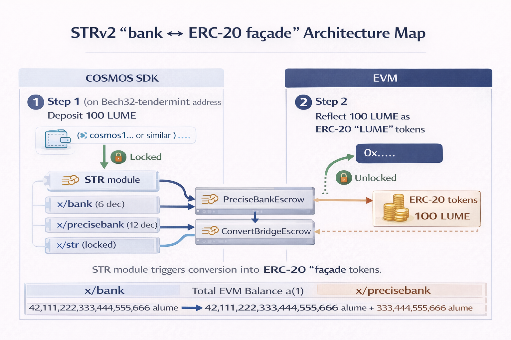

# Token Representation Inside EVM (STRv2)

## What changes

Cosmos-native assets live in `x/bank` as `sdk.Coin` balances (canonical supply, staking, governance, IBC, fee payment). EVM dApps and wallets, however, expect ERC-20 contracts and the EIP-20 interface (`balanceOf`, `transfer`, `approve`, `transferFrom`, etc.).

Without a clear model, a chain can end up with multiple representations of the same asset (native coin, wrapped ERC-20, bridged variants), fragmenting liquidity and breaking UX.

## Lumera's approach: canonical Cosmos coin + ERC-20 interface via STRv2

The intended model for Lumera is:

- **Canonical representation:** the base token (e.g., `ulume`) remains a Cosmos `sdk.Coin` in `x/bank` or `x/precisebank` that wraps `x/bank`.
- **EVM-facing representation:** the EVM gets an **ERC-20 interface** for the same underlying token via **Single Token Representation v2 (STRv2)**.

STRv2 uses native code / precompiled contracts that look like ERC-20 contracts to the EVM, while internally mapping reads/writes to the underlying `x/bank` balance. This provides ERC-20 compatibility without deploying a separate "wrapped token" contract and without creating a second supply.

## How STRv2 behaves

The STRv2 design keeps **one canonical supply** in `x/bank`, while exposing an **ERC-20-compatible interface** to the EVM. The ERC-20 facade is implemented by the STRv2 stack (`x/erc20` + native EVM plumbing) and routes contract calls into Cosmos keepers.

Two internal "escrow / reserve" buckets are typically involved:

- **ConvertBridgeEscrow** (`x/erc20` module account escrow): holds coins during conversion flows to prevent double-representation. When converting a Cosmos coin into an ERC-20 representation, the corresponding Cosmos coins are escrowed under the `x/erc20` module account; the reverse conversion releases coins from that escrow.

- **PreciseBankEscrow** (`x/precisebank` reserve / remainder): maintains the 6->18 precision bridge. Canonical balances remain integers in `x/bank` (e.g., `ulume`), while the extra 12 decimals are tracked as fractional remainders (e.g., `alume`) in `x/precisebank` state so EVM-facing balances behave like 18-decimal "wei-like" units.

### High-level data flow

1. **EVM / wallet tooling** calls an ERC-20 method (e.g., `transfer`, `balanceOf`).
2. The **STRv2 ERC-20 facade** routes the call to `x/erc20` and the configured bank interface.
3. **Balance reads / writes** hit `x/bank` directly or go through `x/precisebank` (when enabled) to preserve 18-decimal behavior.
4. **Conversion flows** (coin <-> ERC-20 representation) use the `x/erc20` module account escrow to lock/unlock the canonical coin supply.
5. **Allowances** (`approve` / `transferFrom`) are maintained in the STRv2 layer (`x/erc20` state), since `x/bank` does not implement ERC-20 allowance semantics.

For a registered denom (e.g., `ulume`):

- `ERC20.balanceOf(addr)` returns the underlying `x/bank` balance (expressed in the EVM unit system; see [gas-token-decimals.md](gas-token-decimals.md) for 6->18 precision considerations).
- `ERC20.transfer(to, amount)` results in a bank send between the corresponding accounts (and emits standard ERC-20 events on the EVM side).
- `ERC20.approve(spender, amount)` and `transferFrom(...)` require an allowance model; allowances are maintained in the STRv2/`x/erc20` layer (since `x/bank` does not natively implement ERC-20 allowances).

The key property is **one underlying asset supply**, with two interfaces:

- Cosmos: `x/bank` coins
- EVM: ERC-20 ABI surface backed by the same `x/bank` balances

## Implications for Lumera

### 1) Clear "one asset" UX (avoids wrapped-token fragmentation)

- Wallet tooling and dApps can treat the native token as an ERC-20 token without manual conversion/wrapping flows.
- Liquidity fragmentation risk is reduced compared to "native + wrapped ERC-20" dual supplies.

### 2) New module + state for mappings and allowances

Even though balances stay canonical in `x/bank`, STRv2/`x/erc20` introduces additional state:

- registrations/mappings between Cosmos denoms and their ERC-20 interface addresses
- allowance state for `approve`/`transferFrom`

This is a new state surface that must be included in upgrades, exports, and audits.

### 3) Event/log expectations change (indexers/explorers)

EVM consumers rely on:

- ERC-20 `Transfer` and `Approval` logs
- receipts/log indexing for token movement

Indexer and explorer support should be validated for these logs, especially for "native token movement via bank" that is mirrored as ERC-20 events.

### 4) Interaction with IBC assets

If IBC vouchers are expected to be usable in EVM dApps, STRv2 typically requires:

- a policy for which IBC denoms are eligible
- registration/metadata handling for IBC denoms

Lumera ships a governance-controlled IBC voucher ERC20 registration policy (`all` / `allowlist` default / `none`) via `MsgSetRegistrationPolicy`. Default allowlisted base denoms (uatom, uosmo, uusdc, inj) are inert placeholders until governance binds IBC channels.

### 5) Precision alignment with `x/precisebank`

For a 6-decimal native token, the EVM view generally operates in 18-decimal units. STRv2 should be wired so that the ERC-20 interface uses the EVM-native unit system (e.g., `alume` semantics) while the underlying bank supply remains in `ulume`.

See [gas-token-decimals.md](gas-token-decimals.md) for the precisebank architecture.

## Operational checklist

- Add the STRv2 module (`x/erc20`) and store key
- Decide the registration policy for:
  - the native gas token (`ulume`)
  - IBC vouchers (if required)
- Initialize mappings/registrations at the upgrade height (genesis state for `x/erc20`)
- Validate ERC-20 logs/receipts indexing on the chosen RPC/indexer stack
