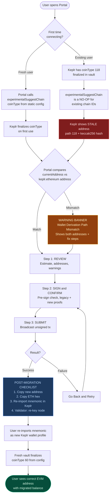
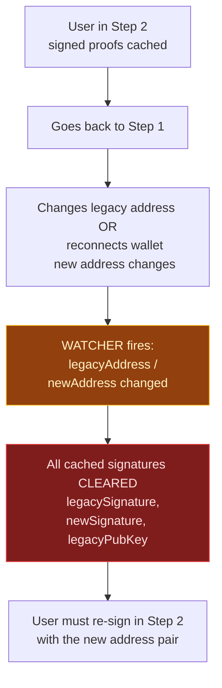
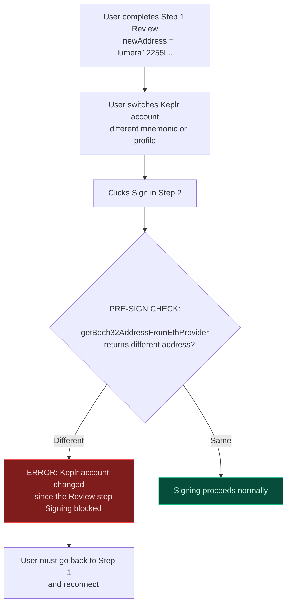
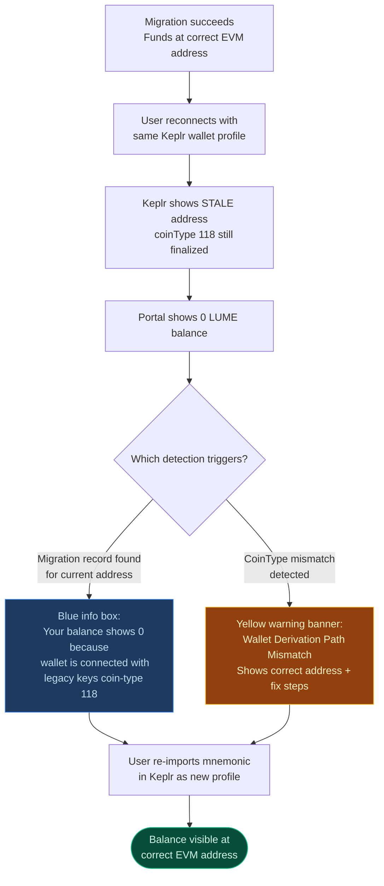
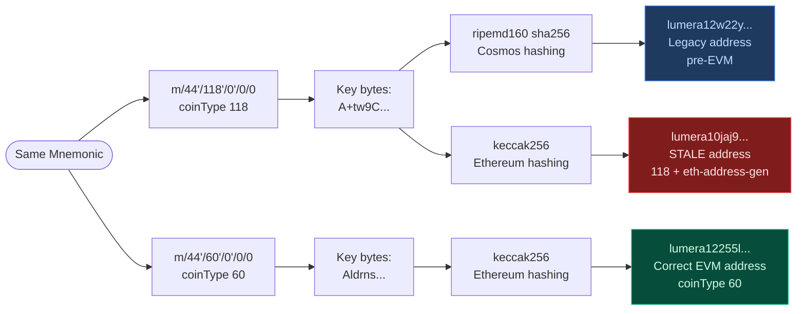

# EVM Legacy Account Migration - Portal UI and Wallet Rollout

**Last updated**: 2026-04-02
**Chain module**: `x/evmigration`
**Portal UI**: `lumera-portal/src/modules/[chain]/claim`

This document describes the current implementation, not the earlier design draft. It also records the current Keplr constraints that matter for mainnet rollout.

---

## 1. Current Protocol

### 1.1 Migration Payload

Both migration messages use the same canonical payload string:

```text
lumera-evm-migration:<chain_id>:<evm_chain_id>:<kind>:<legacy_address>:<new_address>
```

Examples:

```text
lumera-evm-migration:lumera-mainnet-1:76857769:claim:lumera1legacy...:lumera1new...
lumera-evm-migration:lumera-mainnet-1:76857769:validator:lumera1legacy...:lumera1new...
```

`kind` is `claim` for `MsgClaimLegacyAccount` and `validator` for `MsgMigrateValidator`.

### 1.2 Message Shape

Current fields:

- `new_address`
- `legacy_address`
- `legacy_pub_key`
- `legacy_signature`
- `new_signature`

Proto field numbers: `new_address=1`, `legacy_address=2`, `legacy_pub_key=3`, `legacy_signature=4`, `new_signature=5`.

Relevant files:

- [tx.proto](/home/akobrin/p/lumera/proto/lumera/evmigration/tx.proto)
- [verify.go](/home/akobrin/p/lumera/x/evmigration/keeper/verify.go)

### 1.3 Verification Rules

#### Legacy proof

The legacy proof still requires `legacy_pub_key` because the legacy flow supports both CLI/keyring signing and wallet ADR-036 signing.

Accepted legacy signature formats:

1. CLI/keyring path:
   - sign over `SHA256(payload)`
   - verification passes `SHA256(payload)` into SDK secp256k1 `VerifySignature`
2. Wallet path:
   - Keplr/Leap `signArbitrary`
   - chain reconstructs the ADR-036 canonical sign doc and verifies that

#### New proof

The chain now recovers the new signer directly from `new_signature` and checks that the recovered address equals `new_address`.

Accepted new signature formats:

1. CLI/keyring path:
   - sign over `Keccak256(payload)`
2. Wallet path:
   - Keplr/Leap Ethereum provider `personal_sign`
   - chain verifies against `Keccak256("\x19Ethereum Signed Message:\n" + len(payload) + payload)`

Implementation notes:

- 64-byte and 65-byte ECDSA signatures are both accepted
- recovery ID normalization is handled in `verify.go`

### 1.4 Unsigned Cosmos Tx

Migration transactions remain unsigned at the Cosmos tx layer:

- zero signer infos
- zero fee amount
- non-zero gas limit

Fee-free is not gasless. Ante still consumes tx-size gas, so `gas_limit` must be set.

Current portal constants:

- claim migration gas limit: `1_500_000`
- validator migration gas limit: `5_000_000`

Relevant file:

- [migrationTx.ts](/home/akobrin/p/lumera-portal/src/modules/[chain]/claim/migrationTx.ts)

---

## 2. Query Surface

Current evmigration queries:

- `GET /lumera/evmigration/params` — module parameters (migration window, enabled flag)
- `GET /lumera/evmigration/migration_record/{legacy_address}` — completed migration record for a legacy address
- `GET /lumera/evmigration/migration_record_by_new_address/{new_address}` — reverse lookup of migration record by destination address
- `GET /lumera/evmigration/migration_records` — paginated list of all completed migration records
- `GET /lumera/evmigration/migration_estimate/{legacy_address}` — pre-flight check: balances, delegations, eligibility, rejection reason
- `GET /lumera/evmigration/migration_stats` — aggregate counters: total legacy, migrated, remaining
- `GET /lumera/evmigration/legacy_accounts` — paginated list of unmigrated legacy accounts
- `GET /lumera/evmigration/migrated_accounts` — paginated list of accounts that have completed migration

### 2.1 Legacy Account Counting

The `migration_stats` and `legacy_accounts` queries use `remainingLegacyAccountStatus` to determine which accounts are legacy. An account is counted as legacy if:

- it is NOT a module account
- its pubkey is either `nil` (funded but never signed) or `secp256k1` (legacy key type)
- it has NOT already migrated (no entry in `MigrationRecords`)
- it is NOT a migration destination address (no entry in `MigrationRecordByNewAddress`)
- it has non-zero balance, active delegations, or is a validator

Accounts with `eth_secp256k1`, `ed25519`, or other non-legacy key types are excluded.

Relevant files:

- [query.proto](/home/akobrin/p/lumera/proto/lumera/evmigration/query.proto)
- [query.go](/home/akobrin/p/lumera/x/evmigration/keeper/query.go)

---

## 3. Portal Implementation

### 3.1 Where The UI Lives

The migration UI is integrated into the Claim page, not a separate module.

Main files:

- [index.vue](/home/akobrin/p/lumera-portal/src/modules/[chain]/claim/index.vue)
- [migrationState.ts](/home/akobrin/p/lumera-portal/src/modules/[chain]/claim/migrationState.ts)
- [migrationTypes.ts](/home/akobrin/p/lumera-portal/src/modules/[chain]/claim/migrationTypes.ts)
- [migrationWallet.ts](/home/akobrin/p/lumera-portal/src/modules/[chain]/claim/migrationWallet.ts)
- [migrationTx.ts](/home/akobrin/p/lumera-portal/src/modules/[chain]/claim/migrationTx.ts)

### 3.2 Runtime EVM Detection

The portal does not key EVM support off the app version.

Instead, it probes:

- `GET /lumera/evmigration/params`

If that query succeeds, the effective runtime coin type becomes `60`. Otherwise it falls back to the configured coin type.

Relevant file:

- [useBlockchain.ts](/home/akobrin/p/lumera-portal/src/stores/useBlockchain.ts)

### 3.3 Connected Wallet Status Card

The claim page checks the connected wallet automatically:

1. Display the connected wallet address from `walletStore.currentAddress`
2. Derive the coin-type-60 address via `keplr.ethereum` (`getBech32AddressFromEthProvider`)
3. Query `migration_record/{address}`
4. If not found, query `migration_record_by_new_address/{address}`
5. If still not found, query `migration_estimate/{address}`

This produces four main states:

- **legacy**: eligible for migration (would_succeed + has state)
- **blocked**: legacy but cannot migrate yet (rejection_reason shown)
- **migrated**: migration record found
- **new**: EVM account, no legacy state

The `Start Migration Wizard` button is only enabled when the connected address is a migratable legacy address. When clicked, the wizard opens with the estimate and addresses preloaded — the user skips manual address entry entirely.

The card also uses the live wallet balance from the portal wallet store for display.

### 3.4 Stats Card

Migration stats are loaded from `migration_stats` and auto-refresh every 5 minutes.

The UI also includes a manual refresh action.

Chain-side semantics were tightened so `total_legacy` counts only unmigrated legacy accounts that still have relevant state. This includes accounts with nil pubkeys (funded but never signed a tx).

### 3.5 Keplr CoinType Mismatch Detection

After wallet connection, the portal compares two addresses:

- **Keplr cosmos address**: `walletStore.currentAddress` (derived from Keplr's finalized coinType for the chain)
- **Keplr ethereum address**: `getBech32AddressFromEthProvider()` (always uses `m/44'/60'/0'/0/0`, independent of chain finalization)

If the chain's runtime coinType is `60` and these two addresses differ, the portal sets `keplrCoinTypeMismatch = true` and shows a prominent warning banner.

See section 4 for the full explanation of why this happens.

### 3.6 Wizard Flow (3-step)

The wizard uses three steps: **Review → Sign & Confirm → Submit**.

#### Step 1: Review

Shows the migration summary and both addresses. When launched from the status card, the estimate and legacy address are preloaded and the new coin-type 60 address is derived eagerly.

Content:

- estimate summary: balance, delegations, unbondings, authz/feegrant counts, supernode status, validator status
- eligibility label (`"Eligible for migration"`) with a note that the chain performs additional validation at submission time (migration window, rate limits, address uniqueness)
- legacy address (coin-type 118) → new address (coin-type 60) pair, with the new address shown in both Lumera bech32 and Ethereum hex form
- same-address error: blocks progression when `legacyAddress === newAddress`
- inline `Connect Keplr` button when wallet is not connected (calls `walletStore.connectKeplrDirect()` directly, no redirect)

**Warnings shown in Step 1:**

- **Same-address error** (red alert): `legacyAddress === newAddress` — blocks Next
- **CoinType mismatch** (yellow alert): when `keplrCoinTypeMismatch` is true — informs user that migration will work (new address is derived via Keplr's Ethereum provider independently) but they will need to re-import their mnemonic in Keplr afterward to see the balance

For validators, this step includes a **required pre-migration checklist** with three checkboxes that must all be checked before Next is enabled:

1. Maintenance window planned
2. Validator node stopped (`systemctl stop lumerad`)
3. Post-migration commands copied (re-key + restart)

For supernodes (non-validator), an info note explains that the supernode registration will be migrated automatically.

A collapsible "Check a different legacy address" section at the bottom provides manual address entry for the advanced case.

Step 1 Next is gated on: `canMigrate` + `walletsConnected` + (for validators) `valChecklistComplete`.

#### Step 2: Sign & Confirm

Collects both cryptographic proofs and the irreversibility confirmation.

**Pre-sign account consistency check:**

Before any signing begins, the portal re-derives the coin-type-60 address via `getBech32AddressFromEthProvider()` and compares it against the `newAddress` from Step 1. If they differ (e.g., the user switched Keplr accounts between steps), signing is blocked with an error message instructing the user to go back and reconnect.

Signing:

- legacy proof: `keplr.signArbitrary(chainId, legacyAddr, payload)` (ADR-036)
- new proof: `keplr.ethereum.request({ method: 'personal_sign', ... })` (EIP-191)
- if one proof succeeds and the other fails, retry only re-prompts the failed proof
- if Keplr does not know the chain, `walletStore.connectKeplrDirect()` is called inline (runs `experimentalSuggestChain` + `enable`) without leaving the wizard

**Proof invalidation on address change:**

If the user goes back to Step 1 and changes `legacyAddress` or `newAddress` (e.g., via the manual address input or wallet reconnect), all cached signatures are automatically cleared. The signing step requires fresh proofs for the current address pair. This prevents broadcasting a transaction with mismatched proofs.

The step shows:

- sign button with per-proof status indicators (checkmarks, spinners)
- compact summary (from → to addresses, fee: none)
- validator final reminder to confirm node is stopped
- irreversibility confirmation checkbox

Step 2 Next (labeled "Migrate" / "Migrate Validator") is gated on: `bothSigned` + `confirmChecked`.

#### Step 3: Submit

Broadcast and result. Triggered automatically when stepping from Step 2.

Broadcast behavior:

- build raw unsigned protobuf tx
- broadcast through `POST /cosmos/tx/v1beta1/txs`
- poll `GET /cosmos/tx/v1beta1/txs/{hash}`
- refresh migration status and wallet balance after success

On success, the step shows a **post-migration checklist**:

1. New Lumera bech32 address (with copy button)
2. Ethereum hex address (with copy button)
3. Step-by-step Keplr re-import instructions (see section 4.4)

For validators, an urgent "Action Required: Update Your Node" section shows the re-key and restart commands with a warning about block-missing and jailing risk.

For supernodes, a note reminds the operator to update the supernode configuration.

On failure, a "Go Back & Retry" button returns to Step 2.

---

## 4. Wallet Details and Keplr CoinType Problem

### 4.1 Current Lumera Keplr Shape

For post-EVM Lumera, the portal currently suggests Keplr with:

```json
{
  "bip44": { "coinType": 60 },
  "features": [
    "eth-address-gen",
    "eth-key-sign",
    "eth-secp256k1-cosmos"
  ]
}
```

However, `connectKeplrDirect()` uses `configCoinType` (the static JSON value) for the suggest-chain, NOT the runtime override. This is intentional — see section 4.3.

### 4.2 Keplr CoinType Finalization (Root Cause of Mismatch)

Keplr stores a **finalized coinType per chain per vault** in its internal metadata:

```text
keyRing-{chainIdentifier}-coinType: <number>
```

This value is written once when the user first enables the chain and is **permanent**:

- `experimentalSuggestChain()` is a no-op if the chain already exists (Keplr `chains/service.ts`: `if (this.hasChainInfo(...)) return;`)
- `finalizeKeyCoinType()` throws `"Coin type is already finalized"` if called again
- Removing the chain from Keplr UI does not reliably clear the finalized coinType
- Resetting Keplr cache data does not clear vault-level finalization
- The only reliable fix is re-importing the mnemonic as a new wallet profile

**Keplr also strips version suffixes** from chain IDs (`lumera-devnet-1` → `lumera-devnet`), so bumping the chain version does not create a fresh entry.

### 4.3 Why `connectKeplrDirect` Uses Static CoinType 118

During migration, the user needs to sign with their legacy (coin-type 118) key via `signArbitrary(chainId, legacyAddress, ...)`. For this to work, Keplr must have the coin-type-118 key for the chain. If the chain were suggested with coinType 60, Keplr would only have the 60-derived key and could not sign as the legacy address.

Therefore:

- **During migration**: the chain must be registered in Keplr with coinType 118 so legacy signing works
- **After migration**: the user needs coinType 60 to see their new address and balance

This creates a fundamental tension. The portal resolves it by:

1. Suggesting the chain with the static config coinType (118 for mainnet/legacy devnet) — enables legacy proof signing
2. Deriving the new address via `keplr.ethereum` (always uses coin-type 60, independent of chain registration) — the migration `new_address` is always correct
3. After migration, instructing the user to re-import their mnemonic in Keplr to get a fresh vault with coinType 60

### 4.4 Post-Migration Wallet Fix Instructions

The portal shows these instructions in two places: the main-page mismatch warning and the wizard success checklist:

1. Disconnect your wallet in the Portal
2. In Keplr, click your wallet name (top-left) to open the wallet list
3. Click the **+** button (top-right of the wallet list)
4. Choose **Import an existing wallet** → **Use recovery phrase or private key**
5. Enter the same mnemonic seed phrase
6. Select the new wallet profile and reconnect to the Portal

The old wallet profile can be deleted afterward.

### 4.5 Why `alternativeBIP44s` Is Not Used

Keplr's chain validator (`packages/chain-validator/src/schema.ts`) enforces:

1. If `bip44.coinType === 60`, no `alternativeBIP44s` are allowed at all
2. CoinType 60 cannot appear as an alternative BIP44
3. No duplicates between primary and alternatives

This means there is no Keplr-supported way to offer both coinType 118 and 60 as options for the same chain.

### 4.6 Current Practical Constraint

Keplr's signing and key APIs are chain-id scoped:

- `getKey(chainId)`
- `getOfflineSigner(chainId)`
- `signArbitrary(chainId, signer, ...)`

They do not expose a supported API such as "give me the 118 key and the 60 key for this same chain ID".

This matters for migration:

- the new address can be derived from Keplr's Ethereum provider
- the legacy proof still depends on Keplr being able to sign for the legacy address on the Cosmos side

---

## 5. Address Derivation Reference

The same mnemonic produces three different addresses depending on the derivation path and hashing algorithm:

| Label | BIP44 Path | Key Type | Hash | Address Example |
|-------|-----------|----------|------|-----------------|
| Legacy (pre-EVM) | `m/44'/118'/0'/0/0` | `secp256k1` | `ripemd160(sha256(pubkey))` | `lumera12w22y...` |
| Stale (mismatch) | `m/44'/118'/0'/0/0` | `eth_secp256k1` | `keccak256(pubkey)[12:]` | `lumera10jaj9...` |
| Correct EVM | `m/44'/60'/0'/0/0` | `eth_secp256k1` | `keccak256(pubkey)[12:]` | `lumera12255l...` |

**The "stale" address** occurs when Keplr has coinType 118 finalized but `eth-address-gen` is active. The same key bytes from path `m/44'/118'/0'/0/0` are hashed with keccak256 (Ethereum-style) instead of ripemd160/sha256 (Cosmos-style). This produces an address that matches neither the legacy nor the correct EVM address.

Note: the Legacy and Stale rows use the **same key material** (same compressed pubkey bytes from the same derivation path) — only the hashing differs. The Correct EVM row uses **different key material** from a different derivation path.

---

## 6. Migration Flow Diagrams

### 6.0 Main Migration Flow



### 6.1 Edge Case: Address Change During Wizard



### 6.2 Edge Case: Account Switch Between Steps



### 6.3 Edge Case: Post-Migration 0 Balance



### 6.4 Keplr CoinType Finalization and Address Derivation



---

## 7. Portal Warnings and Error States

### 7.1 Main Page Warnings

| Condition | UI Element | Color | Message |
|-----------|-----------|-------|---------|
| `keplrCoinTypeMismatch && currentAddress` | Banner below wallet card | Yellow | "Wallet Derivation Path Mismatch" — shows both addresses, explains stale coinType, lists Keplr re-import steps |
| `connectedWalletMigrationState === 'blocked'` | Below wallet address | Red text | Shows `rejection_reason` from estimate |
| `connectedWalletMigrationError` | Below wallet card | Red text | Generic error from status check failure |
| Migration record found for current address as legacy | Green card | Green | Shows full migration record (legacy addr, new addr, block height, timestamp) |
| Current address matches legacy side of migration record | Blue info box | Blue | "Your balance shows 0 because this wallet is still connected with legacy keys" |
| Not an EVM chain | Full section | Gray | "Not Available on This Chain" with explanation |

### 7.2 Wizard Warnings

| Step | Condition | UI Element | Effect |
|------|-----------|-----------|--------|
| 1 | `legacyAddress === newAddress` | Red alert | Blocks Next — "Legacy and new addresses are identical" |
| 1 | `keplrCoinTypeMismatch && newAddress` | Yellow alert | Informational — "migration will work correctly but you'll need to re-import mnemonic afterward" |
| 1 | Validator: checklist incomplete | Disabled Next | Three checkboxes must all be checked |
| 2 | Pre-sign check: `currentEth !== newAddress` | Error thrown | Blocks signing — "Keplr account changed since the Review step" |
| 2 | Keplr does not know the chain | Auto-suggest | `connectKeplrDirect()` called inline, then retry hint shown |
| 3 | TX broadcast fails | Error + "Go Back" button | Returns to Step 2 for retry |
| 3 | TX confirmed with non-zero code | Error thrown | "Transaction failed in block: code=... raw_log=..." |
| 3 | Confirmation timeout (60s) | Error thrown | "Timed out waiting for tx" |

### 7.3 Proof Lifecycle

Proofs are created in Step 2 and consumed in Step 3. They are invalidated (cleared) when:

1. The wizard is closed (`resetMigrationState()`)
2. `legacyAddress` or `newAddress` changes (watcher in `index.vue`)

Proofs are NOT cleared when:

- The user navigates back from Step 2 to Step 1 without changing addresses

This means if the user goes back and returns to Step 2 without changing any addresses, the already-signed proofs are reused (the "Sign" step shows checkmarks and skips re-prompting).

---

## 8. Mainnet Upgrade and Registry Rollout

This section is partly implementation fact and partly rollout guidance. Where it is guidance rather than an implemented guarantee, treat it as recommendation.

### 8.1 What Happens If Lumera Registry Is Changed To 60-Only

#### Fresh clients

Fresh Keplr clients that add Lumera after the registry becomes 60-only are expected to derive the new coin-type-60 address by default.

That is good for normal post-migration use, but it creates a migration risk:

- the current portal flow still needs a legacy ADR-036 signature
- Keplr does not currently expose both derivation paths for a `coinType: 60` Lumera chain entry

So a fresh 60-only Keplr client may be able to connect as the new address, but may not be able to produce the legacy proof through the current wallet flow.

#### Existing clients

Do not assume a registry update alone will switch existing Keplr users to the new address.

Reasons:

- `experimentalSuggestChain()` is documented to no-op if the same chain is already added
- existing Keplr installs retain a sticky chain entry and address binding (coinType finalized in vault)
- Keplr strips version suffixes from chain IDs, so `lumera-1` and `lumera-2` resolve to the same identifier

Operationally, existing users must **re-import their mnemonic as a new Keplr wallet profile** to get a fresh vault entry with coinType 60.

### 8.2 Should Registry Be Updated Before Or After Upgrade

Recommendation: do **not** update the public Keplr Lumera entry to 60-only before the chain upgrade, and do not rely on a same-day 60-only switch unless a separate legacy signing path is available.

Why:

1. Before upgrade:
   - Keplr would show the new 60 address while the chain still holds user state on legacy 118 accounts.
   - Users would see the wrong working address for the live chain state.
2. Immediately after upgrade:
   - fresh users could connect as 60-only and then fail to complete migration because the portal still needs a legacy `signArbitrary` proof.

### 8.3 Safer Mainnet Procedure

With the current implementation, the safer operational sequence is:

1. Upgrade the chain and enable `x/evmigration`
2. Keep the migration portal available immediately
3. Keep the Keplr-facing Lumera config usable for legacy signing during the migration window
4. Migrate users
5. Switch the public Lumera Keplr registration to 60-only only after the migration window, or after a separate legacy-signing path exists

In other words:

- migration phase: prioritize legacy signing
- post-migration phase: prioritize 60-only normal usage

### 8.4 If A One-Step Wallet Switch Is Desired

The current portal cannot guarantee a one-click Keplr switch for already-added chains.

The lowest-friction reliable path today is:

1. Complete migration
2. Re-import mnemonic as a new Keplr wallet profile (creates fresh vault with coinType 60)
3. Select the new profile and reconnect to the Portal

If an even smoother path is required, one of these needs to be added:

- a dedicated legacy-signing alias or temporary secondary chain entry for the migration window
- another supported legacy signing path outside the current Keplr chain-id-scoped API surface

### 8.5 Chain ID Bump Consideration

Keplr documents special handling when chain IDs follow the `{identifier}-{version}` format.

Changing `lumera-mainnet-1` to `lumera-mainnet-2` at the network upgrade may help Keplr treat the upgraded chain as a fresh entry, but that alone does not solve legacy signing:

- it may simplify switching normal usage to 60-only
- it does not by itself give the portal a way to sign the legacy 118 proof unless the old entry remains accessible or another legacy signing path exists

---

## 9. Recommended User Communication

### 9.1 During Migration

Suggested message:

> Migration uses two addresses derived from the same mnemonic:
> your legacy Lumera address (coin-type 118) and your new EVM-compatible Lumera address (coin-type 60).
> The wizard verifies the legacy address and shows the new address in both Lumera bech32 and Ethereum hex form.

### 9.2 After Successful Migration

Suggested message:

> Your legacy address now has 0 LUME.
> Your funds and migrated state are now on your new coin-type-60 address.
> To see your balance in Keplr, you need to re-import your mnemonic as a new wallet profile.
> Open Keplr → click your wallet name → click + → Import existing wallet → enter the same recovery phrase.
> Select the new wallet profile and reconnect to the Portal.

### 9.3 If User Sees Wrong Address After Migration

Suggested message:

> If your Keplr address does not match the migration destination, your wallet has a cached
> derivation path from before the EVM upgrade. Re-importing your mnemonic as a new Keplr
> wallet profile will fix this. Your funds are safe at the correct address on chain.

---

## 10. Implementation Checklist

Current chain-side implementation:

- legacy verifier accepts raw CLI and ADR-036 wallet signatures
- new verifier recovers signer from signature and accepts raw or EIP-191 wallet signatures
- reverse migration lookup by `new_address` added
- migration stats semantics tightened (includes nil-pubkey accounts, excludes module accounts and migration destinations)

Current portal-side implementation:

- 3-step wizard (Review → Sign & Confirm → Submit)
- claim page auto-detects connected wallet state; wizard opens with estimate preloaded
- migration estimate labeled "Eligible for migration" with caveat about chain-side validation
- same-address blocked at Step 1 (`legacyAddress === newAddress` disables Next)
- inline wallet connect and `suggestChain` inside the wizard (no external redirects)
- signing retry skips already-completed proofs
- **proof invalidation**: cached signatures cleared when `legacyAddress` or `newAddress` changes
- **pre-sign account consistency check**: re-derives EVM address before signing, blocks if Keplr account changed
- **coinType mismatch detection**: compares cosmos vs ethereum-derived address after connection
- **mismatch warning on main page**: yellow banner with both addresses and Keplr re-import instructions
- **mismatch warning in wizard Step 1**: informational alert that migration will work but wallet fix needed
- **post-migration checklist**: step-by-step Keplr re-import instructions (no "reconnect" button that would re-suggest stale coinType)
- validator path: required pre-migration checklist (maintenance, node stopped, commands copied) gates Step 1
- unsigned tx broadcaster sets a non-zero gas limit
- local/devnet chains disable public registry-dependent asset list behavior

Known operational limitation:

- the current wallet flow is still constrained by Keplr's chain-id-scoped key APIs and permanent coinType finalization
- therefore the mainnet wallet-switch experience must be planned as an operational rollout, not assumed to happen automatically from a registry JSON change
- the portal cannot programmatically clear Keplr's finalized coinType; user action (mnemonic re-import) is required

---

## 11. External References

These links are relevant because Keplr behavior here is an external dependency.

- Keplr `experimentalSuggestChain` docs:
  - <https://raw.githubusercontent.com/chainapsis/keplr-wallet/develop/docs/docs/guide/suggest-chain.md>
- Keplr wallet type surface (`getKey`, `getOfflineSigner`, `signArbitrary`, `ethereum` provider):
  - <https://raw.githubusercontent.com/chainapsis/keplr-wallet/develop/packages/types/src/wallet/keplr.ts>
- Keplr chain validator rule rejecting `coinType: 60` with `alternativeBIP44s`:
  - <https://raw.githubusercontent.com/chainapsis/keplr-wallet/develop/packages/chain-validator/src/schema.ts>
- Keplr `suggestChainInfo` early return for existing chains:
  - <https://github.com/chainapsis/keplr-wallet/blob/develop/packages/background/src/chains/service.ts>
- Keplr `finalizeKeyCoinType` permanent finalization:
  - <https://github.com/chainapsis/keplr-wallet/blob/develop/packages/background/src/keyring/service.ts>
- Keplr community-driven chain registry guidelines:
  - <https://github.com/chainapsis/keplr-chain-registry>
- Keplr issue #232 — stale coinType surviving chain removal:
  - <https://github.com/chainapsis/keplr-wallet/issues/232>
