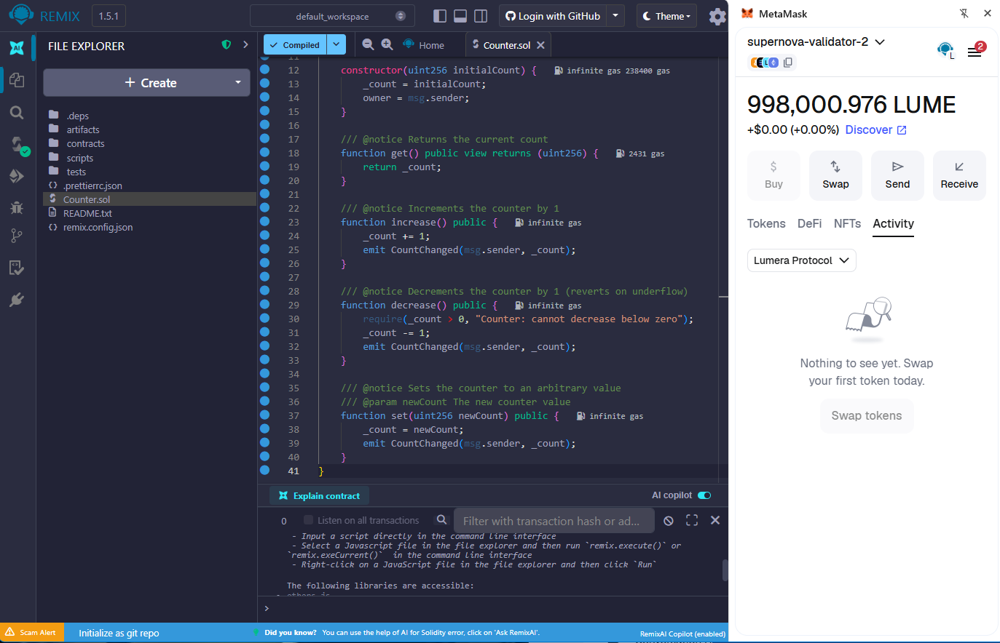
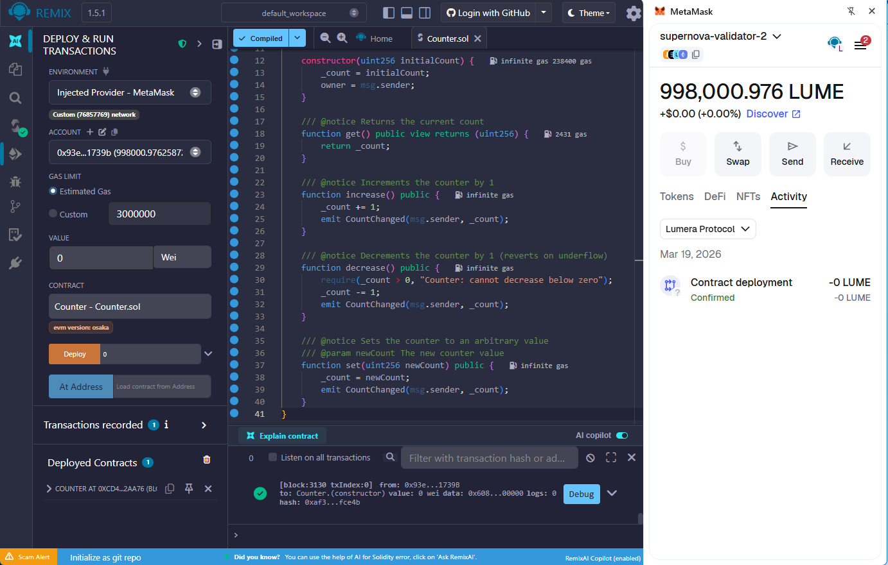
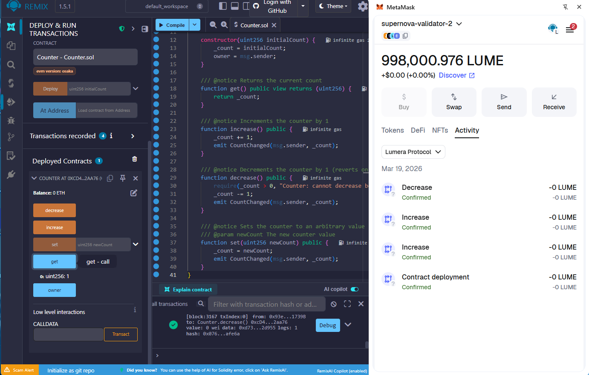

# Testing Smart Contracts on Lumera with Remix IDE

This guide walks through deploying and interacting with a simple smart contract on Lumera's EVM using [Remix IDE](https://remix.ethereum.org) connected to MetaMask.

---

## Prerequisites

- **MetaMask** browser extension installed and configured with the Lumera network
- **LUME tokens** in your MetaMask account for gas fees
- A running Lumera node with JSON-RPC enabled (devnet or testnet)

### MetaMask network configuration

Add Lumera as a custom network in MetaMask. Settings differ between the public testnet and a local devnet:

**Lumera Testnet** (public)

| Field              | Value                                     |
| ------------------ | ----------------------------------------- |
| Network Name       | Lumera Testnet                            |
| RPC URL            | `https://rpc.testnet.lumera.io`         |
| Chain ID           | `76857769`                              |
| Currency Symbol    | LUME                                      |
| Block Explorer URL | `https://testnet.ping.pub/lumera/block` |

> Testnet LUME can be obtained from the faucet at `https://testnet.ping.pub/lumera`.

**Local Devnet** (Docker-based, for development)

| Field           | Value (validator 2 example) |
| --------------- | --------------------------- |
| Network Name    | Lumera Devnet               |
| RPC URL         | `http://localhost:8555`   |
| Chain ID        | `76857769`                |
| Currency Symbol | LUME                        |

The chain ID is the same across all environments. For other devnet validators, use the corresponding JSON-RPC port (see [openrpc-playground.md](openrpc-playground.md) for the port mapping table).

> **WSL2 users**: `localhost` port forwarding to Windows works automatically on recent builds. If not, use the WSL IP address (`hostname -I | awk '{print $1}'`) as the RPC URL host.

---

## Step 1: Create the contract in Remix

1. Open [Remix IDE](https://remix.ethereum.org) in your browser.
2. In the **File Explorer** panel (left sidebar), create a new file: `Counter.sol`.
3. Paste the following Solidity code:

```solidity
// SPDX-License-Identifier: MIT
pragma solidity ^0.8.20;

/// @title Counter - A simple counter contract for testing Lumera EVM
/// @notice Demonstrates basic state reads and writes on Lumera
contract Counter {
    uint256 private _count;
    address public owner;

    event CountChanged(address indexed caller, uint256 newCount);

    constructor(uint256 initialCount) {
        _count = initialCount;
        owner = msg.sender;
    }

    /// @notice Returns the current count
    function get() public view returns (uint256) {
        return _count;
    }

    /// @notice Increments the counter by 1
    function increase() public {
        _count += 1;
        emit CountChanged(msg.sender, _count);
    }

    /// @notice Decrements the counter by 1 (reverts on underflow)
    function decrease() public {
        require(_count > 0, "Counter: cannot decrease below zero");
        _count -= 1;
        emit CountChanged(msg.sender, _count);
    }

    /// @notice Sets the counter to an arbitrary value
    /// @param newCount The new counter value
    function set(uint256 newCount) public {
        _count = newCount;
        emit CountChanged(msg.sender, _count);
    }
}
```

---

## Step 2: Compile the contract

1. Click the **Solidity Compiler** tab (second icon in the left sidebar).
2. Ensure the compiler version matches the pragma (`0.8.20` or later).
3. Click **Compile Counter.sol**.
4. A green checkmark appears next to the file name when compilation succeeds.

   

---

## Step 3: Connect Remix to MetaMask

1. Click the **Deploy & Run Transactions** tab (third icon in the left sidebar).
2. In the **Environment** dropdown, select **Injected Provider - MetaMask**.
3. MetaMask will prompt you to connect. Select the account you want to use and click **Connect**.
4. Verify:

   - The **Account** field shows your MetaMask address.
   - The **Balance** shows your LUME balance.
   - The network indicator shows `Custom (76857769)` - this is Lumera's EVM chain ID.

---

## Step 4: Deploy the contract

1. In the **Contract** dropdown, select `Counter`.
2. Next to the **Deploy** button, enter the constructor argument:

   - Type `0` (or any initial count value) in the input field.
3. Click **Deploy**.
4. MetaMask pops up with a contract creation transaction. Review the gas estimate and click **Confirm**.
5. Wait for the transaction to be confirmed (typically 5-6 seconds on devnet).
6. The deployed contract appears under **Deployed Contracts** at the bottom of the panel.

   

---

## Step 5: Interact with the contract

Expand the deployed contract to see its functions. Remix color-codes them:

- **Blue buttons** — read-only (`view`) functions (no gas cost, no MetaMask popup)
- **Orange buttons** — state-changing functions (require gas, trigger MetaMask confirmation)

### Read the current count

Click **get**. The result appears below the button:

```text
0: uint256: 0
```

### Increment the counter

1. Click **increase**.
2. Confirm the transaction in MetaMask.
3. After confirmation, click **get** again to verify:

```text
0: uint256: 1
```

### Set a specific value

1. Enter a value (e.g. `42`) in the input field next to **set**.
2. Click **set**.
3. Confirm in MetaMask.
4. Click **get** to verify:

```text
0: uint256: 42
```

### Decrement the counter

1. Click **decrease**.
2. Confirm in MetaMask.
3. Click **get** to verify:

```text
0: uint256: 41
```



### Test the underflow guard

1. Click **set** with value `0`.
2. Confirm in MetaMask.
3. Click **decrease**.
4. The transaction will **revert** with: `Counter: cannot decrease below zero`.
5. MetaMask may warn about likely failure before you confirm.

---

## Step 6: View transaction details

### In Remix

Each transaction appears in the Remix terminal (bottom panel). Click the transaction entry to expand details:

- **Transaction hash** — click to copy
- **From / To** — sender and contract addresses
- **Gas used**
- **Decoded input** — shows the function called and arguments
- **Logs** — shows emitted events (`CountChanged`)

### In the node

Use the JSON-RPC endpoint to query transaction receipts:

```bash
# Replace TX_HASH with the actual transaction hash from Remix
curl -s -X POST http://localhost:8555 \
  -H "Content-Type: application/json" \
  -d '{"jsonrpc":"2.0","method":"eth_getTransactionReceipt","params":["TX_HASH"],"id":1}' | jq '.'
```

### Check events

The `CountChanged` event is emitted on every state change. Query logs for the contract:

```bash
# Replace CONTRACT_ADDRESS with the deployed contract address
curl -s -X POST http://localhost:8555 \
  -H "Content-Type: application/json" \
  -d '{
    "jsonrpc":"2.0",
    "method":"eth_getLogs",
    "params":[{"address":"CONTRACT_ADDRESS","fromBlock":"0x0","toBlock":"latest"}],
    "id":1
  }' | jq '.result | length'
```

---

## Step 7: Check the owner

The contract records the deployer as `owner`. Click the **owner** button (blue — it's a public state variable auto-getter). It should return your MetaMask address.

---

## Troubleshooting

### MetaMask shows wrong chain ID

Ensure your MetaMask network is configured with chain ID `76857769`. If the node was upgraded from a pre-EVM binary, verify that `app.toml` has the correct `[evm]` section (see [node-evm-config-guide.md](node-evm-config-guide.md) — the config migration runs automatically on first startup after upgrade).

### Transaction fails with "nonce too low"

MetaMask may cache nonces. Go to **MetaMask > Settings > Advanced > Clear activity tab data** to reset the nonce cache for the current network.

### Transaction pending indefinitely

Check that the node is producing blocks:

```bash
curl -s -X POST http://localhost:8555 \
  -H "Content-Type: application/json" \
  -d '{"jsonrpc":"2.0","method":"eth_blockNumber","params":[],"id":1}' | jq '.result'
```

If the block number is not advancing, the node may be stalled or the consensus is not running.

### Gas estimation fails

Lumera's EVM uses EIP-1559 fee market. If gas estimation fails, try manually setting gas parameters in MetaMask's advanced transaction settings.

### "Internal JSON-RPC error" on deploy

Check the Remix console for the full error. Common causes:

- Insufficient LUME balance for gas
- Contract code too large (exceeds block gas limit)
- Constructor arguments missing or wrong type

---

## Next steps

- **Deploy ERC-20 tokens**: Use OpenZeppelin's ERC-20 template in Remix to create a token on Lumera
- **Interact with precompiles**: Lumera exposes native chain functionality (staking, governance, IBC transfers) via[precompile contracts](action-precompile.md) callable from Solidity
- **Use Hardhat/Foundry**: For production workflows, configure Hardhat or Foundry with the Lumera JSON-RPC endpoint
