# MetaMask Configuration Guide

This guide explains how end users, validators, and infrastructure operators can
connect MetaMask to Lumera EVM networks.

> **The MetaMask RPC URL is NOT the same as the Keplr RPC URL.**
>
> Keplr is a Cosmos wallet and talks to the Cosmos endpoints (LCD/REST + CometBFT
> RPC). MetaMask is an EVM wallet and talks **only** to the Ethereum **JSON-RPC**
> endpoint, which is a **separate service on a different port and a different
> URL**. Pasting a Keplr/Cosmos URL into MetaMask is the most common reason a
> connection fails ("could not fetch chain ID").

MetaMask connects to EVM networks through Ethereum JSON-RPC. Do not use Cosmos
LCD/REST endpoints or CometBFT RPC endpoints as MetaMask RPC URLs.

The two wallets use entirely different endpoints:

| Wallet | Protocol | Public devnet URL | Local validator-1 port |
| --- | --- | --- | --- |
| **Keplr** | Cosmos LCD/REST | `https://lcd.pastel.network` | `1327` |
| **Keplr** | CometBFT RPC | `https://rpc.pastel.network` | `26667` |
| **MetaMask** | EVM JSON-RPC (HTTP) | `https://evm-rpc.pastel.network` | `8545` |
| **MetaMask** | EVM JSON-RPC (WebSocket) | `wss://evm-rpc.pastel.network/ws` | `8546` |

Only the **EVM JSON-RPC** row belongs in a MetaMask network configuration. The
Cosmos LCD/REST and CometBFT RPC URLs will never answer `eth_chainId`, so
MetaMask cannot use them.

Official references:

- MetaMask custom network guide: <https://support.metamask.io/configure/networks/how-to-add-a-custom-network-rpc/>
- MetaMask `eth_chainId` reference: <https://docs.metamask.io/services/reference/ethereum/json-rpc-methods/eth_chainid/>
- MetaMask `wallet_addEthereumChain` reference: <https://docs.metamask.io/metamask-connect/evm/reference/json-rpc-api/wallet_addEthereumChain/>

## EVM RPC URLs by Network

The RPC URL you give MetaMask is always the **EVM JSON-RPC** endpoint (`evm-rpc.*`)
for the target network. The chain ID (`76857769`) and currency symbol (`LUME`) are
identical on every Lumera network.

| Network | RPC URL (EVM JSON-RPC) | Chain ID |
| --- | --- | --- |
| Lumera Mainnet | `https://evm-rpc.lumera.io` | `76857769` |
| Lumera Testnet | `https://evm-rpc.testnet.lumera.io` | `76857769` |
| Lumera Devnet (public) | `https://evm-rpc.pastel.network` | `76857769` |
| Local devnet node | `http://localhost:8545` (validator 1 — see [Validator Local Ports](#validator-local-ports)) | `76857769` |

The rest of this guide uses the public **devnet** values as the worked example.

## Lumera Devnet Values

Use these values for the public Lumera devnet endpoint operated for the Portal.

| Field | Value |
| --- | --- |
| Network name | `Lumera-Devnet-Evm` (the EVM network name; distinct from the Cosmos `lumera-devnet` profile used by Keplr) |
| RPC URL (EVM JSON-RPC — **not** the Keplr/Cosmos URL) | `https://evm-rpc.pastel.network` |
| Chain ID | `76857769` |
| MetaMask/JSON-RPC chain ID | `0x494c1a9` |
| Currency symbol | `LUME` |
| Block explorer URL | Leave blank unless an EVM explorer is deployed |

The current public RPC can be checked with:

```bash
curl -H 'content-type: application/json' \
  --data '{"jsonrpc":"2.0","id":1,"method":"eth_chainId","params":[]}' \
  https://evm-rpc.pastel.network
```

Expected result:

```json
{"jsonrpc":"2.0","id":1,"result":"0x494c1a9"}
```

## Connect the Lumera Portal to MetaMask (Walkthrough)

This is the recommended path for end users. There is **no manual network setup**:
the Portal configures the Lumera EVM network in MetaMask automatically. When you
click **Connect Wallet → MetaMask**, the Portal reads the selected chain config
(`evm_rpc` + `evm_chain_id`) and drives MetaMask through three JSON-RPC calls in
order:

1. `eth_chainId` — is MetaMask already on the Lumera EVM chain?
2. `wallet_switchEthereumChain` — switch to it if MetaMask already knows it.
3. `wallet_addEthereumChain` — add it (the "Add network" popup) only if MetaMask
   does not recognize the chain ID yet (MetaMask error `4902`).

Then it calls `eth_requestAccounts` to read your selected account and maps the
`0x…` address to its `lumera1…` Bech32 equivalent.

### Prerequisites

- The MetaMask browser extension is installed and unlocked.
- You have an EVM-compatible account (coin-type 60, `eth_secp256k1`). If you
  migrated a legacy Lumera account, that migration produced an `0x…` / `lumera1…`
  pair on the EVM key — [import that key into MetaMask](#optional-import-your-evm-account-into-metamask)
  before connecting if it is not there yet.
- The chain config exposes an EVM JSON-RPC endpoint. For the public devnet:

  ```json
  {
    "evm_rpc": [
      { "address": "https://evm-rpc.pastel.network", "provider": "pastel-devnet" }
    ],
    "evm_chain_id": "76857769"
  }
  ```

### Step 1 — Open the Portal and start the connect flow

On the Portal dashboard the wallet panel reads **Not Connected**. Click
**CONNECT WALLET** in the top-right (or the wallet icon in the header).

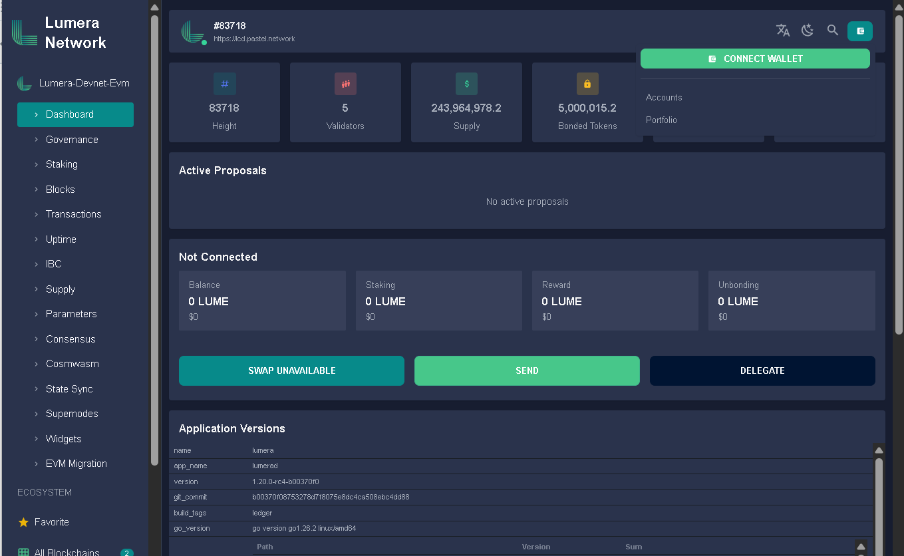

### Step 2 — Choose MetaMask

In the **Connect Wallet** dialog, select **MetaMask** (a green check marks the
selection), then click **CONNECT**. The Portal locates the injected MetaMask
provider via EIP-6963, so it picks MetaMask even when several wallet extensions
are installed.

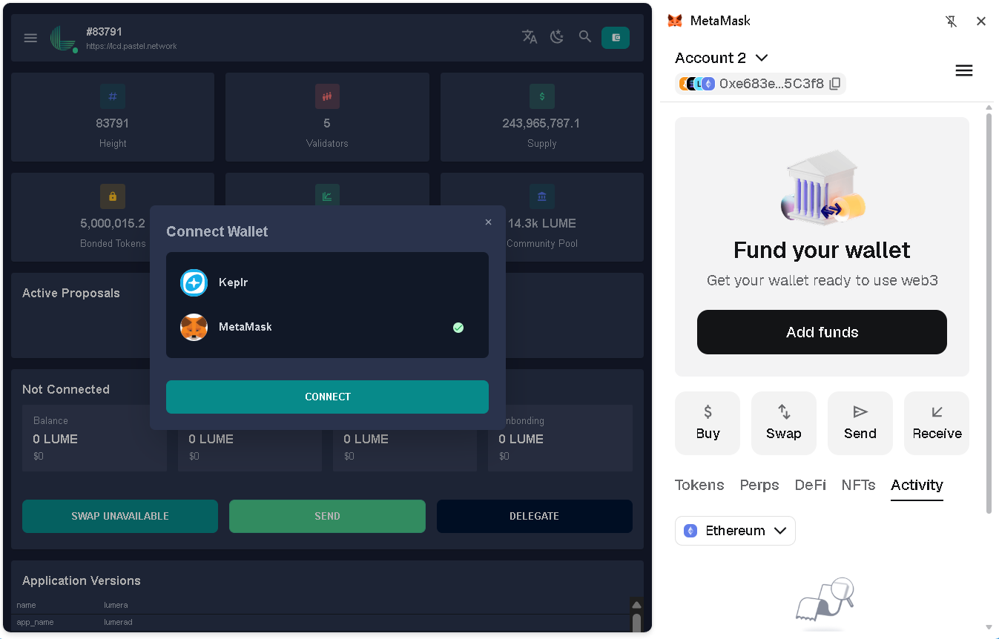

### Step 3 — Approve adding the Lumera network

If MetaMask has never seen the Lumera EVM chain, it shows an **Add network**
request. Confirm that:

- **Request from** is your Portal host (e.g. `p1p2p3p4.pastel.network`).
- **Network** is `lumera-devnet-evm`.
- **RPC** is `evm-rpc.pastel.network` (an EVM JSON-RPC endpoint, not LCD/CometBFT).

Click **Confirm**. The Portal supplies the currency symbol `LUME` and **18
decimals** (the EVM side uses 18-decimal `alume`, the 1:1 EVM representation of
6-decimal `ulume`).

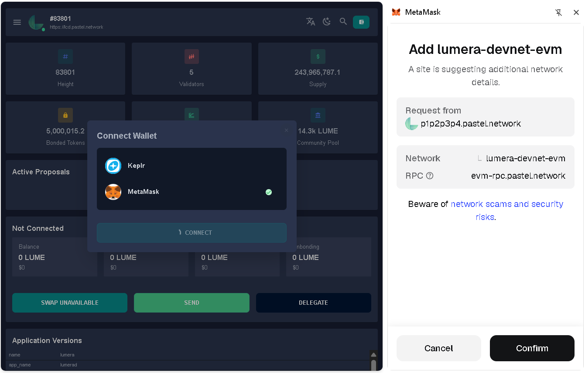

> If MetaMask is already on the Lumera chain this popup is skipped — the Portal
> only reaches `wallet_addEthereumChain` when the chain ID is unrecognized.

### Step 4 — Approve the connection and pick an account

The Portal then shows **"Check MetaMask for the connection request."** and
MetaMask opens its **Connect this website** dialog. Select the account(s) you
want the Portal to see and click **Connect**.

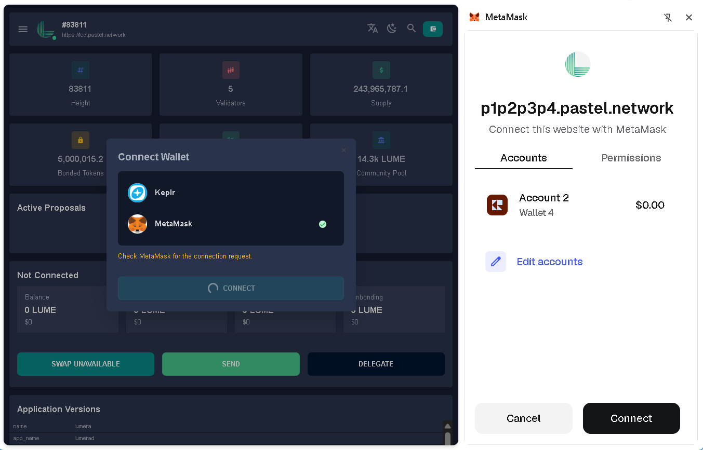

> If no MetaMask popup appears, click the MetaMask extension icon in your browser
> toolbar — Chrome sometimes suppresses the auto-popup, so the Portal cannot
> force it open.

### Step 5 — Connected

The Portal navbar wallet now shows both representations of your account — the
`lumera1…` Bech32 address and the `0x…` hex address — plus **SWITCH METAMASK
ACCOUNT** and **Disconnect** actions. The dashboard fills in your balance,
staking, rewards, and delegations. In MetaMask the account is on the
**lumera-devnet-evm** network.

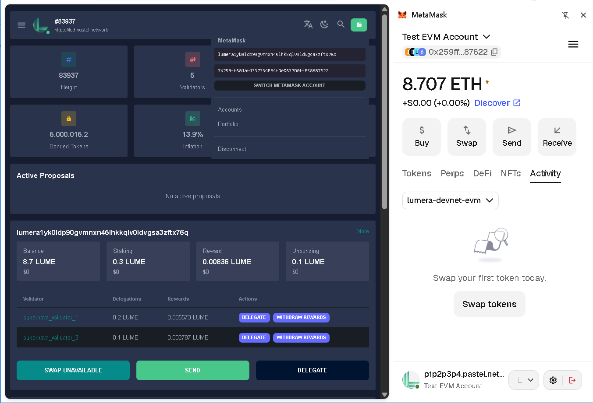

> MetaMask may label the native balance as **ETH** (e.g. `8.707 ETH`). This is a
> MetaMask display quirk for custom EVM chains — the amount is correct and equals
> your `LUME` balance, because the EVM side reports 18-decimal `alume`.

**Switch MetaMask account** re-requests `eth_accounts` permission
(`wallet_requestPermissions`) before reading the new selection, so it works even
on a browser profile that previously authorized a different account.

### Step 6 — Verify on the EVM Migration page

Open **EVM Migration** in the sidebar. The **Migration Status** card confirms the
end-to-end wiring:

- **MetaMask network** → EVM chain ID `76857769`
- **MetaMask account key** → EVM key / coin-type 60
- The **Connected wallet address** matches your `lumera1…` address, with a
  **Migration Successful** card linking the legacy (coin-type 118) address to the
  new EVM address.

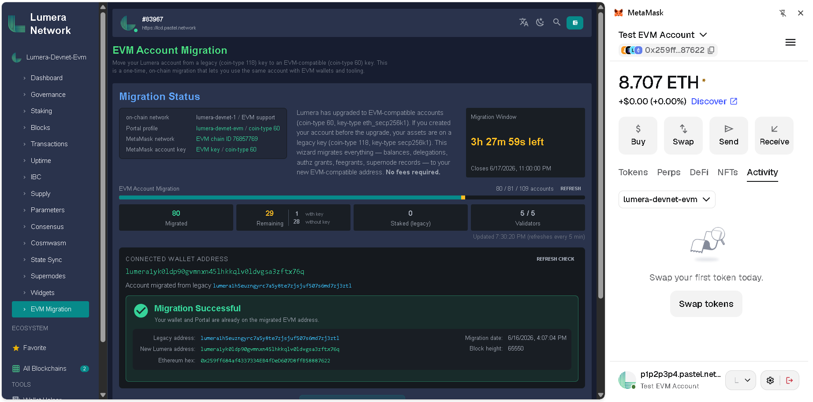

### (Optional) Import your EVM account into MetaMask

If the migrated account is not in MetaMask yet, import its key first, then
connect.

1. Open the account selector and choose **Accounts**, then **Add wallet**.

   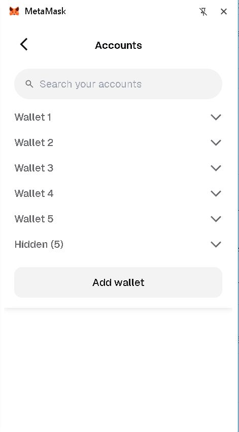
   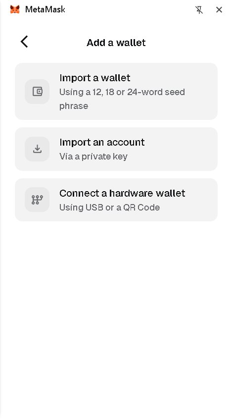

2. Choose **Import a wallet** (12/18/24-word Secret Recovery Phrase) or **Import
   an account** (single private key), depending on what you hold for the migrated
   key, and enter it.

   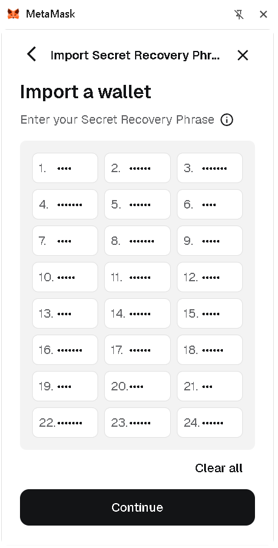

3. (Recommended) Rename the account so it is easy to find — open the account's
   **⋮** menu, choose **Rename**, and give it a clear label such as
   `Test EVM Account`.

   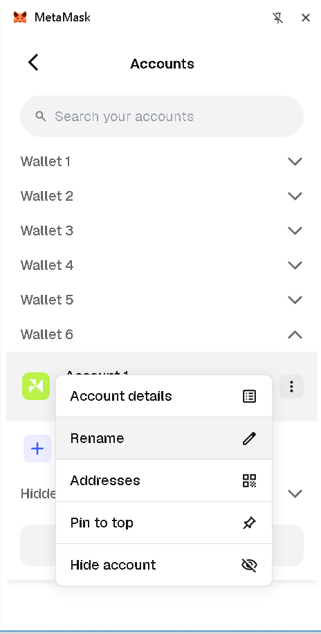
   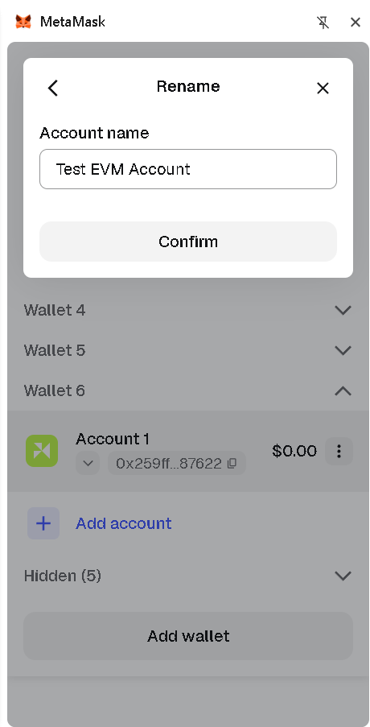

> **Security:** only import a Secret Recovery Phrase or private key you own and
> control. The EVM account uses coin-type 60 (`eth_secp256k1`); a legacy Lumera
> account created before the EVM upgrade uses coin-type 118 and must be migrated
> on-chain first (see [migration.md](migration.md)). Never paste a seed phrase
> into a site — only into the MetaMask extension's own import screen.

## Add Lumera Devnet Manually In MetaMask

If you prefer not to use the Portal's one-click flow (or you are connecting a
tool other than the Portal), add the network by hand using the
[Lumera Devnet Values](#lumera-devnet-values) above.

1. Open MetaMask.
2. Open the network selector.
3. Choose **Add a custom network** or **Add network manually**.
4. Enter the Lumera devnet values above.
5. Save the network.
6. Switch to **Lumera-Devnet-Evm**.

If MetaMask says it cannot fetch the chain ID, the RPC URL is not an EVM
JSON-RPC endpoint or the endpoint is unavailable from your browser.

Common mistakes:

- `https://lcd.pastel.network` is Cosmos LCD/REST, not EVM JSON-RPC.
- `https://rpc.pastel.network` is CometBFT RPC, not EVM JSON-RPC.
- `http://localhost:8545` only works when MetaMask runs on the same machine as
  the validator node. It does not work for remote users.

## Validator Local Ports

For local validator testing, use the validator's local EVM JSON-RPC port.

| Validator | Cosmos LCD | CometBFT RPC | EVM HTTP JSON-RPC | EVM WebSocket |
| --- | ---: | ---: | ---: | ---: |
| validator 1 | `1327` | `26667` | `8545` | `8546` |
| validator 2 | `1337` | `26677` | `8555` | `8556` |
| validator 3 | `1347` | `26687` | `8565` | `8566` |
| validator 4 | `1357` | `26697` | `8575` | `8576` |
| validator 5 | `1367` | `26707` | `8585` | `8586` |

Local MetaMask values for validator 1:

```text
Network name: Lumera-Devnet-Evm Local
RPC URL: http://localhost:8545
Chain ID: 76857769
Currency symbol: LUME
Block explorer URL: blank
```

Verify a local validator endpoint:

```bash
curl -H 'content-type: application/json' \
  --data '{"jsonrpc":"2.0","id":1,"method":"eth_chainId","params":[]}' \
  http://127.0.0.1:8545
```

## Operator Guide: Public HTTPS RPC

Browsers and MetaMask require HTTPS for a public RPC URL. The usual production
shape is:

```text
MetaMask -> https://evm-rpc.example.org -> nginx -> http://127.0.0.1:8545
```

DNS must point the public hostname at the validator/proxy host before TLS can
be issued. A CNAME is fine:

```text
evm-rpc.example.org CNAME existing-rpc-host.example.org
```

or use an A record:

```text
evm-rpc.example.org A <server-public-ip>
```

Then issue a certificate:

```bash
sudo certbot --nginx -d evm-rpc.example.org
```

Use an nginx server block like this:

```nginx
server {
    server_name evm-rpc.example.org;

    location / {
        if ($request_method = 'OPTIONS') {
            add_header 'Access-Control-Allow-Origin' '*' always;
            add_header 'Access-Control-Allow-Methods' 'GET, POST, OPTIONS' always;
            add_header 'Access-Control-Allow-Headers' 'DNT,User-Agent,X-Requested-With,If-Modified-Since,Cache-Control,Content-Type,Range,Authorization' always;
            add_header 'Access-Control-Max-Age' 3600 always;
            add_header 'Content-Type' 'text/plain; charset=utf-8' always;
            add_header 'Content-Length' 0 always;
            return 204;
        }

        add_header 'Access-Control-Allow-Origin' '*' always;
        add_header 'Access-Control-Allow-Methods' 'GET, POST, OPTIONS' always;
        add_header 'Access-Control-Allow-Headers' 'DNT,User-Agent,X-Requested-With,If-Modified-Since,Cache-Control,Content-Type,Range,Authorization' always;
        add_header 'Access-Control-Expose-Headers' 'Content-Length,Content-Range' always;

        proxy_hide_header Access-Control-Allow-Origin;
        proxy_hide_header Access-Control-Allow-Methods;
        proxy_hide_header Access-Control-Allow-Headers;
        proxy_hide_header Access-Control-Expose-Headers;
        proxy_http_version 1.1;
        proxy_set_header Host $host;
        proxy_set_header X-Real-IP $remote_addr;
        proxy_set_header X-Forwarded-For $proxy_add_x_forwarded_for;
        proxy_set_header X-Forwarded-Proto $scheme;
        proxy_pass http://127.0.0.1:8545;
    }

    listen 443 ssl;
    ssl_certificate /etc/letsencrypt/live/evm-rpc.example.org/fullchain.pem;
    ssl_certificate_key /etc/letsencrypt/live/evm-rpc.example.org/privkey.pem;
    include /etc/letsencrypt/options-ssl-nginx.conf;
    ssl_dhparam /etc/letsencrypt/ssl-dhparams.pem;
}

server {
    server_name evm-rpc.example.org;
    listen 80;
    return 301 https://$host$request_uri;
}
```

Check and reload nginx:

```bash
sudo nginx -t
sudo systemctl reload nginx
```

Verify from a machine outside the validator:

```bash
curl -H 'content-type: application/json' \
  --data '{"jsonrpc":"2.0","id":1,"method":"eth_chainId","params":[]}' \
  https://evm-rpc.example.org
```

## Operator Guide: Path-Based HTTPS RPC

If DNS is not ready for a new hostname, reuse an existing HTTPS host and expose
EVM RPC under a path:

```text
MetaMask -> https://portal.example.org/evm-rpc -> nginx -> http://127.0.0.1:8545/
```

The trailing slash in `proxy_pass` is important because it strips `/evm-rpc`
before forwarding to the EVM JSON-RPC server.

```nginx
server {
    server_name portal.example.org;

    root /var/www/explorer;
    index index.html;

    location = /evm-rpc {
        if ($request_method = 'OPTIONS') {
            add_header 'Access-Control-Allow-Origin' '*' always;
            add_header 'Access-Control-Allow-Methods' 'GET, POST, OPTIONS' always;
            add_header 'Access-Control-Allow-Headers' 'DNT,User-Agent,X-Requested-With,If-Modified-Since,Cache-Control,Content-Type,Range,Authorization' always;
            add_header 'Access-Control-Max-Age' 3600 always;
            add_header 'Content-Type' 'text/plain; charset=utf-8' always;
            add_header 'Content-Length' 0 always;
            return 204;
        }

        add_header 'Access-Control-Allow-Origin' '*' always;
        add_header 'Access-Control-Allow-Methods' 'GET, POST, OPTIONS' always;
        add_header 'Access-Control-Allow-Headers' 'DNT,User-Agent,X-Requested-With,If-Modified-Since,Cache-Control,Content-Type,Range,Authorization' always;
        add_header 'Access-Control-Expose-Headers' 'Content-Length,Content-Range' always;

        proxy_http_version 1.1;
        proxy_set_header Host $host;
        proxy_set_header X-Real-IP $remote_addr;
        proxy_set_header X-Forwarded-For $proxy_add_x_forwarded_for;
        proxy_set_header X-Forwarded-Proto $scheme;
        proxy_pass http://127.0.0.1:8545/;
    }

    location / {
        try_files $uri $uri/ /index.html;
    }

    listen 443 ssl;
    ssl_certificate /etc/letsencrypt/live/portal.example.org/fullchain.pem;
    ssl_certificate_key /etc/letsencrypt/live/portal.example.org/privkey.pem;
    include /etc/letsencrypt/options-ssl-nginx.conf;
    ssl_dhparam /etc/letsencrypt/ssl-dhparams.pem;
}
```

This was the temporary public Lumera devnet bridge shape before the dedicated
RPC hostname was issued:

```text
https://p1p2p3p4.pastel.network/evm-rpc -> http://127.0.0.1:8545/
```

The current public Lumera devnet shape is:

```text
https://evm-rpc.pastel.network -> http://127.0.0.1:8545/
wss://evm-rpc.pastel.network/ws -> ws://127.0.0.1:8546/
```

## Operator Guide: WebSocket RPC

MetaMask network configuration uses the HTTPS JSON-RPC URL. Some dapps,
indexers, and developer tools also want WebSocket RPC.

The usual production shape is:

```text
wss://evm-rpc.example.org/ws -> nginx -> ws://127.0.0.1:8546/
```

Add this `location` to the same TLS server block:

```nginx
location /ws {
    proxy_http_version 1.1;
    proxy_set_header Upgrade $http_upgrade;
    proxy_set_header Connection "upgrade";
    proxy_set_header Host $host;
    proxy_set_header X-Real-IP $remote_addr;
    proxy_set_header X-Forwarded-For $proxy_add_x_forwarded_for;
    proxy_set_header X-Forwarded-Proto $scheme;
    proxy_read_timeout 3600s;
    proxy_send_timeout 3600s;
    proxy_pass http://127.0.0.1:8546/;
}
```

Verify with a WebSocket-capable tool:

```bash
npx wscat -c wss://evm-rpc.example.org/ws
```

Then send:

```json
{"jsonrpc":"2.0","id":1,"method":"eth_chainId","params":[]}
```

Expected response:

```json
{"jsonrpc":"2.0","id":1,"result":"0x494c1a9"}
```

## Security And Operations Notes

- Expose only the EVM JSON-RPC and WebSocket ports that users need.
- Keep node-local upstreams bound to `127.0.0.1` when possible.
- Prefer a dedicated hostname such as `evm-rpc.example.org` for long-lived
  public RPC. A path on the Portal host is fine as a quick bridge.
- Add rate limiting before publishing high-traffic endpoints.
- Use trusted TLS certificates; MetaMask will reject invalid HTTPS endpoints.
- Avoid logging sensitive request bodies in production access logs.
- Restrict CORS to trusted origins if the endpoint is only for a known Portal
  deployment. Use `*` only for public RPC endpoints.
- Confirm `eth_chainId` after every node upgrade, proxy change, or DNS change.

Optional nginx rate limit in the `http` context:

```nginx
limit_req_zone $binary_remote_addr zone=evm_rpc_per_ip:10m rate=20r/s;
```

Then inside the EVM RPC location:

```nginx
limit_req zone=evm_rpc_per_ip burst=40 nodelay;
```

## Troubleshooting

### MetaMask says it cannot fetch the chain ID

Run:

```bash
curl -H 'content-type: application/json' \
  --data '{"jsonrpc":"2.0","id":1,"method":"eth_chainId","params":[]}' \
  <RPC_URL>
```

The response must include:

```json
"result":"0x494c1a9"
```

If the response is `Method not found`, the URL probably points at CometBFT RPC
instead of EVM JSON-RPC.

### Browser requests fail but curl works on the server

Check DNS, TLS, and CORS from outside the server:

```bash
dig +short evm-rpc.example.org
curl -I https://evm-rpc.example.org
curl -i -X OPTIONS \
  -H 'Origin: https://portal.example.org' \
  -H 'Access-Control-Request-Method: POST' \
  -H 'Access-Control-Request-Headers: content-type' \
  https://evm-rpc.example.org
```

### Path-based proxy returns 404

The upstream probably received `/evm-rpc` instead of `/`. Use:

```nginx
proxy_pass http://127.0.0.1:8545/;
```

not:

```nginx
proxy_pass http://127.0.0.1:8545;
```

for a path-based location.

### WebSocket fails

Confirm the node is listening:

```bash
sudo ss -ltnp | grep 8546
```

Then confirm nginx includes:

```nginx
proxy_set_header Upgrade $http_upgrade;
proxy_set_header Connection "upgrade";
```
