# EVM Legacy Account Migration - User Guide

**Last updated**: 2026-04-21
**Applies to**: Lumera chain with `x/evmigration` module enabled (post-EVM upgrade)

---

## Why Migration Is Needed

The Lumera chain upgraded from a standard Cosmos SDK chain to an EVM-compatible chain. This changed the underlying cryptography used for account addresses:

- **Before the upgrade (legacy)**: accounts used **coin-type 118** with `secp256k1` keys and Cosmos-style address hashing (`ripemd160(sha256(pubkey))`)
- **After the upgrade (EVM)**: accounts use **coin-type 60** with `eth_secp256k1` keys and Ethereum-style address hashing (`keccak256(pubkey)[12:]`)

Because the address derivation changed, the same mnemonic now produces a **different Lumera address**. Your funds, delegations, and other on-chain state remain at the old (legacy) address. Migration moves all of that state to your new EVM-compatible address.

### What Gets Migrated

Migration transfers **all** on-chain state from your legacy address to your new address in a single atomic transaction:

- **Bank balances** (all denominations)
- **Staking delegations** (active delegations to validators)
- **Unbonding delegations**
- **Redelegations**
- **Authz grants** (both as granter and grantee)
- **Feegrant allowances** (both as granter and grantee)
- **Action records** (creator and supernode references)
- **Claim records**
- **Supernode registration** (if applicable)
- **Vesting schedules** (if applicable)

For **validators**, migration additionally re-keys:

- Validator operator address
- All delegations pointing to the validator (from all delegators)
- Validator distribution state (commission tracking)
- Supernode record tied to the validator

### What Happens to the Legacy Account

After migration:

- The legacy account is removed from the auth module
- All balances are transferred to the new address (legacy balance becomes 0)
- A migration record is created on-chain linking the legacy and new addresses
- The legacy address cannot be migrated again

### Important Notes

- Migration is **irreversible** - once completed, it cannot be undone
- Migration is **fee-free** - no LUME is required on either address to submit the transaction
- Both addresses must come from the **same mnemonic** (same seed phrase)
- The migration transaction is unsigned at the Cosmos tx layer; authentication is embedded in the message as dual cryptographic proofs

---

## Method 1: Portal + Keplr (Recommended)

This is the easiest method. The Lumera Portal provides a guided wizard that handles address derivation, signing, and broadcasting.

### Prerequisites

- [Keplr browser extension](https://www.keplr.app/) installed
- Your mnemonic (recovery phrase) imported in Keplr

### Step-by-Step Guide

#### 1. Connect Your Wallet and Check Migration Status

Navigate to the Lumera Portal and go to the **Claim** page. The **EVM Account Migration** section appears automatically when the chain has the `x/evmigration` module enabled.

Click **Connect Keplr**. If the Lumera chain is not yet added to Keplr, the portal will prompt you to approve it (screenshot 9 below shows this dialog).

After connecting, the portal automatically checks your wallet address against the chain and shows your migration status. If you have a legacy (coin-type 118) account with on-chain state, you will see the green **"Ready to Migrate"** badge with a summary of your assets:

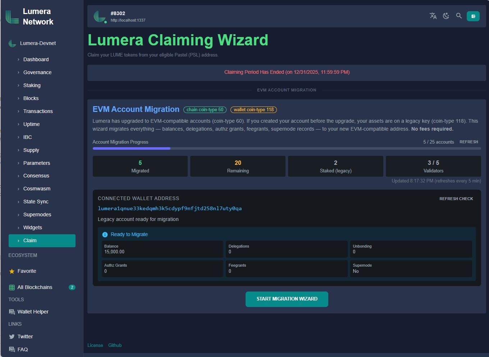

The status panel shows:

- **Balance** — your available LUME balance
- **Delegations** — active staking delegations
- **Unbonding** — pending unbonding entries
- **Authz Grants / Feegrants** — authorization and fee grant counts
- **Supernode** — whether this account runs a supernode

The top progress bar shows the overall migration progress across all accounts on the chain. Click **START MIGRATION WIZARD** to begin.

#### 2. Step 1: Review

The wizard opens with a review of what will be migrated. Verify that all the information is correct:

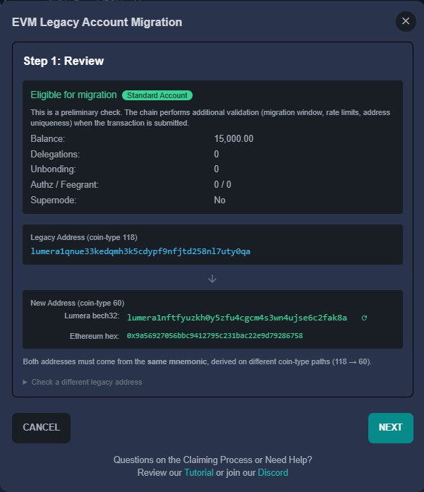

Key things to check:

- **"Eligible for migration"** badge at the top (green) with your account type (Standard Account or Validator)
- **Legacy Address (coin-type 118)** — your current Lumera address, shown in cyan
- **New Address (coin-type 60)** — your destination address, shown in both Lumera bech32 and Ethereum hex format. This address is derived automatically from Keplr's Ethereum provider using the same mnemonic
- **Balance, Delegations, Unbonding, Authz/Feegrant, Supernode** — summary of all state that will be moved

The note at the bottom reminds you that both addresses must come from the **same mnemonic**, derived on different coin-type paths (118 to 60).

If you need to migrate a different account, expand **"Check a different legacy address"** at the bottom.

**For validators**: additional pre-migration confirmations appear here — you must confirm your maintenance window is planned, your node is stopped, and you have copied the post-migration restart commands.

Click **NEXT** when ready.

#### 3. Step 2: Sign & Confirm

This step collects two cryptographic proofs that authenticate you as the owner of both the legacy and new addresses. No private keys leave your device — all signing happens locally in Keplr.

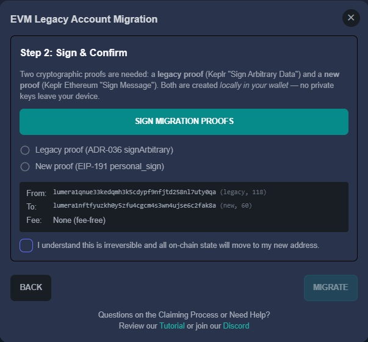

Click the **SIGN MIGRATION PROOFS** button. Keplr will open **two signature popups** in sequence:

**First popup — Legacy proof (ADR-036 signArbitrary):**

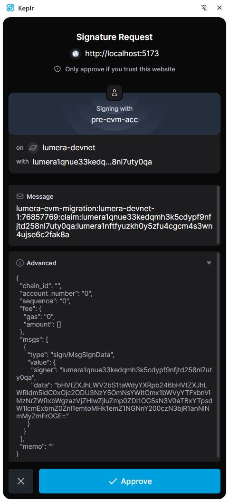

This is the legacy account proof. Notice:

- **"Signing with"** shows your Keplr wallet name (e.g., "pre-evm-acc")
- **"on lumera-devnet"** — the Lumera chain
- **"with lumera1qnue33..."** — your legacy address
- **Message** contains the migration payload: `lumera-evm-migration:{chainID}:{evmChainID}:claim:{legacyAddr}:{newAddr}`
- **Advanced** section shows the full ADR-036 JSON sign doc with `sign/MsgSignData` — this is the standard Cosmos arbitrary message format

Click **Approve** to sign with your legacy key.

**Second popup — New proof (EIP-191 personal_sign):**

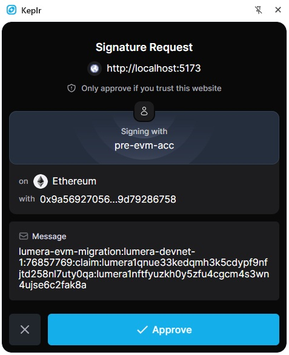

This is the new address proof. Notice the differences:

- **"on Ethereum"** — this time Keplr uses its Ethereum signing provider, not the Cosmos one
- **"with 0x9a56927056..."** — your Ethereum hex address (the EVM-compatible address)
- **Message** contains the same migration payload as above

Click **Approve** to sign with your new (coin-type 60) key.

After both signatures are collected, the portal shows green checkmarks next to each proof:

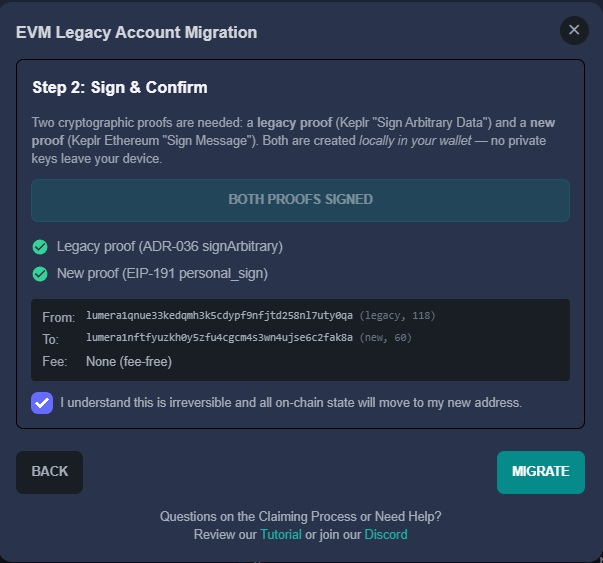

Both proofs are now signed:

- **Legacy proof (ADR-036 signArbitrary)** — green checkmark
- **New proof (EIP-191 personal_sign)** — green checkmark

The transaction summary shows the **From** (legacy) and **To** (new) addresses, and confirms **Fee: None (fee-free)**.

Check the **"I understand this is irreversible and all on-chain state will move to my new address"** confirmation checkbox. Then click **MIGRATE**.

#### 4. Migration Result

The portal broadcasts the transaction and waits for confirmation (typically one block, 5-6 seconds). On success:

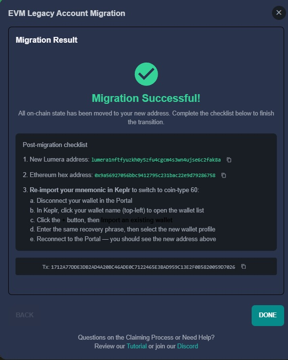

The result screen shows:

1. **New Lumera address** — your new bech32 address with a copy button
2. **Ethereum hex address** — your 0x-prefixed address with a copy button
3. **Switch to the new Lumera chain definition in Keplr** — instructions to add the coin-type 60 chain definition (see next section)
4. **Transaction hash** — the on-chain tx hash for verification

**For validators**: an urgent section shows the restart command (`systemctl start lumerad`). Restart your validator promptly to avoid missed blocks and jailing.

Click **DONE** to close the wizard. The main page now shows your migration record and updated progress counters:

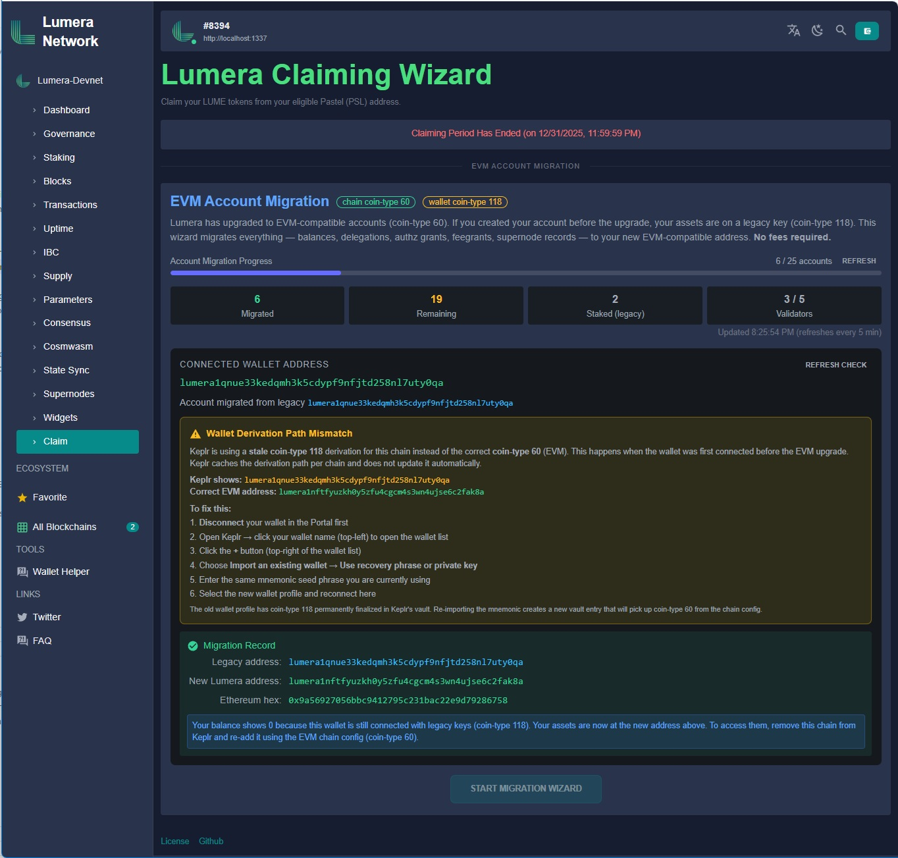

However, notice that Keplr is still using the old coin-type 118 chain definition. The next step switches it to the new EVM-compatible definition.

#### 5. Switch to the New Lumera Chain Definition in Keplr

After migration, your on-chain state lives at the new coin-type 60 address, but Keplr still has the old Lumera chain definition (coin-type 118) cached. You need to add the **new Lumera chain definition** (coin-type 60, EVM-compatible) to Keplr.

The chain registry provides two Lumera definitions for this purpose:

- **Lumera (Legacy)** — coin-type 118, `secp256k1` — the pre-migration chain definition that existing users already have in Keplr
- **Lumera** — coin-type 60, `eth_secp256k1`, EVM features enabled — the post-migration chain definition

The Portal prompts you to add the new chain definition via Keplr's `suggestChain` mechanism:

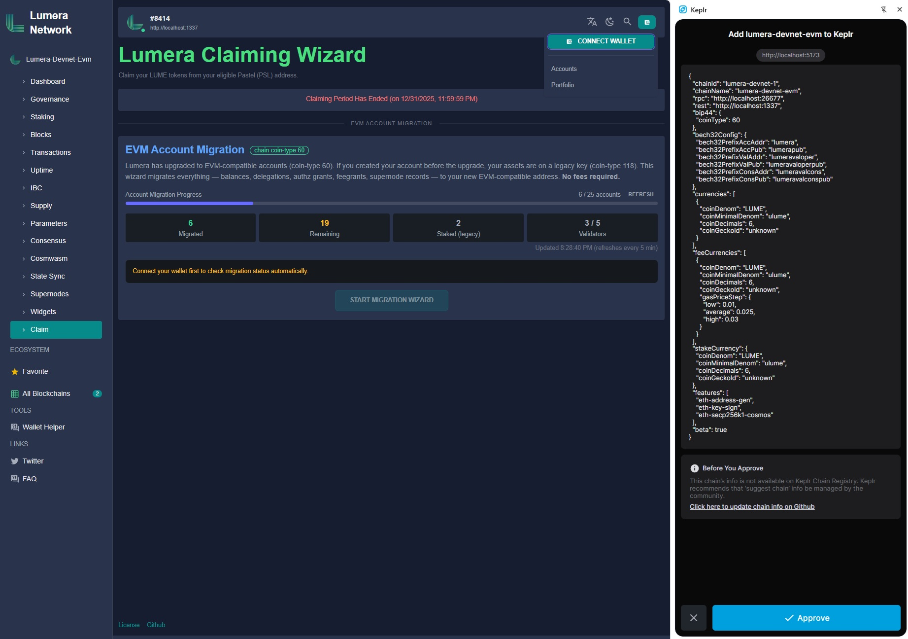

Review the chain configuration — you should see coin-type 60 and Ethereum-compatible settings — and click **Approve**. This adds the new Lumera definition to Keplr alongside the legacy one.

After approving, disconnect and reconnect your wallet in the Portal. The Portal will now connect through the new chain definition, and Keplr will derive your address using coin-type 60.

If you skip this step and reconnect without switching, you will see a **"Wallet Derivation Path Mismatch"** warning because Keplr is still using the old coin-type 118 derivation:

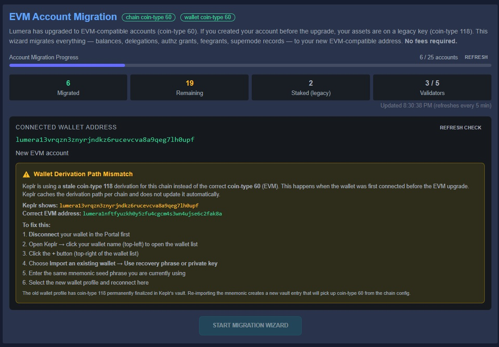

This shows Keplr using the old address while the Portal knows your correct EVM address. To resolve it, go back and add the new chain definition as described above.

**Alternative (manual re-import):** If the suggest chain flow is not available, you can manually re-import your mnemonic in Keplr:

1. **Disconnect** your wallet in the Portal first
2. Open Keplr, click your wallet name (top-left) to open the wallet list
3. Click the **+** button (top-right of the wallet list)
4. Choose **Import an existing wallet** > **Use recovery phrase or private key**
5. Enter the **same mnemonic** seed phrase you are currently using
6. Select the new wallet profile and reconnect to the Portal

After switching to the new chain definition (or re-importing), the Portal shows a clean state with the correct EVM address and your migration record:

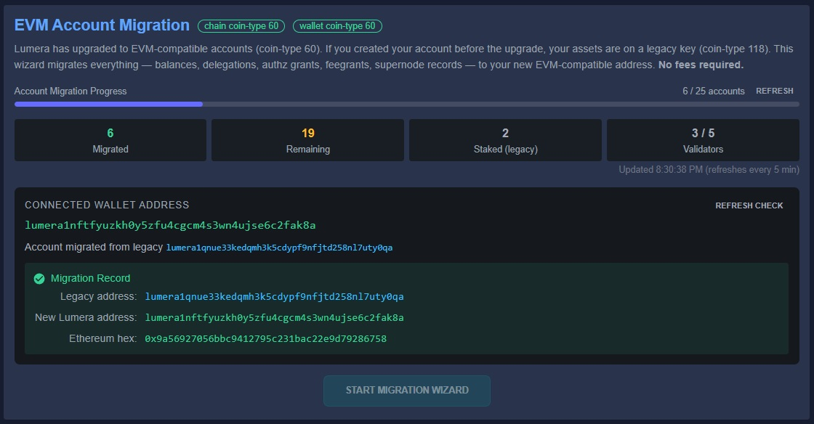

Notice the badges at the top now show **"chain coin-type 60"** and **"wallet coin-type 60"** — both aligned. Your migration record is displayed with the legacy address, new Lumera address, and Ethereum hex address. The old Lumera (Legacy) chain entry can be removed from Keplr.

### Troubleshooting

**Portal shows "Wallet Derivation Path Mismatch" warning:**

This warning appears when Keplr is still using the old Lumera chain definition (coin-type 118) instead of the new one (coin-type 60). When a legacy account is detected as ready for migration, the mismatch is expected and the warning is suppressed. If you see it after migration, switch to the new Lumera chain definition in Keplr as described in section 5 above.

**Balance shows 0 after migration:**

Your funds are safe. Keplr is showing the balance of the old coin-type 118 address, not your migrated coin-type 60 address. Switch to the new Lumera chain definition in Keplr as described in section 5 above.

**"Keplr account changed since the Review step" error:**

You switched Keplr accounts or profiles between wizard steps. Go back to Step 1 and reconnect your wallet.

---

## Method 2: Lumera CLI

The CLI requires both keys (legacy and new) in the keyring. It handles address derivation, proof signing, gas simulation, and broadcasting automatically.

### Prerequisites

- `lumerad` binary (post-EVM upgrade version)
- Your mnemonic (recovery phrase)
- Access to a running Lumera node (local or remote RPC endpoint)

### CLI Step-by-Step

Both keys must be in the keyring. The CLI extracts the public key, generates both proofs, and broadcasts automatically.

#### 1. Pre-flight: Check Migration Eligibility

```bash
# Check if migration is enabled
lumerad query evmigration params --node <rpc-endpoint>

# Check migration estimate for your legacy address
lumerad query evmigration migration-estimate <legacy-address> --node <rpc-endpoint>
```

The estimate response shows `would_succeed: true` if migration is possible. If `would_succeed: false`, the `rejection_reason` field explains why.

```bash
# Check overall migration statistics
lumerad query evmigration migration-stats --node <rpc-endpoint>
```

#### 2. Import Both Keys from the Same Mnemonic

**Import the legacy key (coin-type 118, secp256k1):**

```bash
lumerad keys add legacy-key \
  --recover \
  --coin-type 118 \
  --algo secp256k1 \
  --keyring-backend test
```

Enter your mnemonic when prompted.

**Import the new EVM key (coin-type 60, eth_secp256k1):**

```bash
lumerad keys add new-key \
  --recover \
  --coin-type 60 \
  --algo eth_secp256k1 \
  --keyring-backend test
```

Enter the **same mnemonic** when prompted.

**Verify the addresses:**

```bash
lumerad keys show legacy-key -a --keyring-backend test
lumerad keys show new-key -a --keyring-backend test
```

The legacy address should match your known pre-EVM address on chain.

#### 3. Run the Migration

**For regular account migration:**

```bash
lumerad tx evmigration claim-legacy-account legacy-key new-key \
  --keyring-backend test \
  --chain-id lumera-mainnet-1 \
  --node tcp://localhost:26657 \
```

**For validator migration:**

```bash
lumerad tx evmigration migrate-validator legacy-validator-key new-validator-evm-key \
  --keyring-backend test \
  --chain-id lumera-mainnet-1 \
  --node tcp://localhost:26657 \
```

The CLI will:

1. Read both keys from the keyring, extract public keys, and derive bech32 addresses
2. Verify the legacy key is `secp256k1` (coin-type 118)
3. Build the migration payload and sign `SHA256(payload)` with the legacy key
4. Sign the new proof with the new key (must be `eth_secp256k1`)
5. Build an unsigned, fee-free Cosmos transaction
6. Simulate gas usage automatically
7. Prompt for confirmation (unless `--yes` flag is used)
8. Broadcast the transaction

#### 4. Verify the Migration

```bash
# Check that the migration record exists
lumerad query evmigration migration-record <legacy-address> --node <rpc-endpoint>

# Verify balances moved to the new address
lumerad query bank balances <new-address> --node <rpc-endpoint>

# Confirm legacy address has zero balance
lumerad query bank balances <legacy-address> --node <rpc-endpoint>
```

#### 5. Post-Migration for Validators

After a successful validator migration, update your node immediately:

```bash
# 1. Import the new key into the node's production keyring if not already present
lumerad keys add new-operator-key \
  --recover \
  --coin-type 60 \
  --algo eth_secp256k1 \
  --keyring-backend file

# 2. Restart the validator node
systemctl start lumerad
```

> **Warning:** Your validator will miss blocks and may be jailed if you do not restart promptly after migration. Plan a maintenance window before initiating validator migration.

#### 6. Clean Up

After verifying the migration was successful:

```bash
lumerad keys delete legacy-key --keyring-backend test
```

---

## Method 3: Shell Helper Scripts

The repository ships two bash wrappers in [scripts/](../../../scripts/) that layer safety rails on top of the Method 2 CLI flow:

- `scripts/migrate-account.sh` — regular account migration (`claim-legacy-account`)
- `scripts/migrate-validator.sh` — validator migration (`migrate-validator`)

Both scripts:

- Detect and reject multisig accounts (use the offline 4-step flow in [legacy-migration.md](../evmigration/legacy-migration.md#multisig-account-migration) for those).
- Run `migration-estimate` before broadcast so you see what moves and why it might fail.
- Compare post-migration balances against a pre-broadcast snapshot.

### Single-sig account migration

```bash
./scripts/migrate-account.sh legacy-key new-key \
  --chain-id lumera-mainnet-1 \
  --node tcp://rpc.lumera:26657 \
  --keyring-backend test
```

Use `--mnemonic-file <path>` (file must be mode 0600) to import both keys from a mnemonic in one step. Add `--dry-run` to preview without broadcasting.

### Single-sig validator migration

```bash
./scripts/migrate-validator.sh legacy-op-key new-evm-key \
  --chain-id lumera-mainnet-1 \
  --node tcp://rpc.lumera:26657 \
  --keyring-backend test \
  --i-have-stopped-the-node
```

`--i-have-stopped-the-node` acknowledges the jailing risk; omitting it makes the script prompt interactively. `--yes` does NOT satisfy this acknowledgement — that's deliberate.

### Exit codes

| Code | Meaning |
|---|---|
| `0` | Success, or dry-run completed cleanly |
| `1` | Usage error / bad flags / bad input file permissions / key name collision |
| `2` | Environment error: binary missing, jq missing, node unreachable, unsupported binary version |
| `3` | Multisig rejected; use offline flow |
| `4` | Pre-flight estimate returned `would_succeed=false` |
| `5` | Account already migrated (or new address already used) |
| `6` | Wrong-script or delegation-cap error |
| `7` | Broadcast succeeded but post-migration verification failed — investigate manually |
| `10` | User aborted at a confirmation prompt |

---

## Quick Reference: Query Commands

These queries are useful before, during, and after migration:

```bash
# Module parameters (is migration enabled? deadline?)
lumerad query evmigration params

# Pre-flight estimate (what will be migrated, will it succeed?)
lumerad query evmigration migration-estimate <legacy-address>

# Migration record (has this address been migrated?)
lumerad query evmigration migration-record <legacy-address>

# Reverse lookup (find migration record by new address)
lumerad query evmigration migration-record-by-new-address <new-address>

# Global statistics (how many accounts migrated/remaining?)
lumerad query evmigration migration-stats

# List legacy accounts still needing migration
lumerad query evmigration legacy-accounts --limit 100

# List completed migrations
lumerad query evmigration migrated-accounts --limit 100
```

---

## Migration Parameters

The following chain parameters govern migration behavior. These are set by governance:

| Parameter | Default | Description |
|-----------|---------|-------------|
| `enable_migration` | `true` | Master on/off switch. When `false`, all migration messages are rejected. |
| `migration_end_time` | `0` (no deadline) | Optional Unix timestamp deadline. If non-zero and current block time is past this, migration is rejected. |
| `max_migrations_per_block` | `50` | Rate limit for `MsgClaimLegacyAccount` per block. Prevents excessive gas consumption. |
| `max_validator_delegations` | `2000` | Safety cap for `MsgMigrateValidator`. Rejects if total delegation + unbonding + redelegation records exceed this. |

---

## Validator Operator Migration

Validators have their own step-by-step walkthrough covering maintenance-window planning, the `max_validator_delegations` check, consensus-key safety, supernode-bound-to-validator re-keying, and the multisig variant — see [validator-migration.md](validator-migration.md).

Key facts (repeated here for quick reference):

- Validators **must** use `MsgMigrateValidator` (not `MsgClaimLegacyAccount`) — the chain rejects `claim-legacy-account` for validator operator addresses.
- Validator migration is a superset of regular account migration. It re-keys the validator record, every delegation pointing to the validator, unbonding/redelegation records, distribution state, the supernode record (if the supernode account matches the validator's legacy address), and action references, atomically.
- The validator consensus key (`priv_validator_key.json`, ed25519) is **not affected** by this migration — only the operator key.
- Stop the validator node before broadcasting, route the tx through a trusted external RPC, then restart promptly to minimize missed blocks.

---

## Supernode Operator Migration

Supernode operators have their own step-by-step walkthrough covering the automatic startup-migration path for single-sig supernodes and the manual `lumerad` CLI path for multisig supernodes — see [supernode-migration.md](supernode-migration.md).

Key facts:

- The supernode daemon performs automatic migration on startup when `evm_key_name` is set in `config.yml` and the supernode's legacy key is single-sig.
- For multisig supernode accounts, the daemon refuses and directs you to the offline 4-step `lumerad` CLI ceremony (`generate-proof-payload` → `sign-proof` → `combine-proof` → `submit-proof`). Restart the supernode after the offline ceremony completes — the daemon detects the on-chain migration record and drives local cleanup.
- If you run a supernode on the same account as a validator operator, migrate the validator (`MsgMigrateValidator` handles the supernode side as a side-effect), then restart both `lumerad` and the supernode.

## FAQ

**Q: Do I need LUME on my new address to pay for migration?**

No. Migration transactions are fee-free. The transaction carries a gas limit for internal processing, but no fee is charged.

**Q: Can I migrate to any address?**

No. The new address must be derived from the **same mnemonic** as the legacy address using coin-type 60 and eth_secp256k1. The chain verifies this through the dual-signature proof.

**Q: What if I'm a validator - should I use `claim-legacy-account` or `migrate-validator`?**

Validators **must** use `migrate-validator`. The `claim-legacy-account` command explicitly rejects validator operator addresses. `migrate-validator` handles the additional complexity of re-keying all delegations pointing to your validator.

**Q: Can I migrate back to the legacy address?**

No. Migration is irreversible. The legacy account is removed from the chain's auth module after migration.

**Q: What happens to my staking rewards during migration?**

All pending staking rewards and validator commission are automatically withdrawn and included in the bank balance transfer during migration.

**Q: Is there a deadline for migration?**

Check the `migration_end_time` parameter. If it's `0`, there is no deadline (only the `enable_migration` flag controls availability). Governance can set or extend the deadline.

**Q: My validator has too many delegators and migration is rejected. What do I do?**

The `max_validator_delegations` parameter (default 2000) limits how many records can be re-keyed in one transaction. If your validator exceeds this, governance may increase the limit, or delegators can redelegate before validator migration.

---

## Migrating a multisig account

Multisig legacy accounts (flat K-of-N `secp256k1`) use an offline, coordinator-driven flow with four commands. The portal wizard does not support multisig — use the CLI.

See [legacy-migration.md](../evmigration/legacy-migration.md#multisig-account-migration) for the architecture and wire-format reference.

### Overview

| Step | Who runs it | Command | Produces |
|------|-------------|---------|----------|
| 1 | Coordinator (once) | `generate-proof-payload` | `proof.json` — payload template |
| 2 | Each of K co-signers | `sign-proof` | one `*-partial.json` per signer |
| 3 | Coordinator | `combine-proof` | `tx.json` — assembled unsigned tx |
| 4 | Coordinator | `submit-proof` | broadcasts to chain |

The payload is identical across all co-signers; what differs is whose sub-key signed it. The coordinator only assembles and broadcasts — they don't need any of the legacy sub-keys.

### Precondition: ensure the multisig pubkey is on-chain

If the multisig account has never signed a transaction, its pubkey is nil on-chain and `generate-proof-payload` will fail. Submit any transaction from the multisig account first (for example a 1-ulume self-send). Then confirm the key is stored:

```bash
lumerad query auth account <multisig-legacy-address>
```

The response must show a `multisig` pubkey structure listing all sub-keys.

### Step 1: Coordinator generates the proof payload template

The coordinator (any co-signer who will drive the flow) creates a JSON template that describes the migration and contains the canonical signed payload:

```bash
lumerad tx evmigration generate-proof-payload \
  --legacy <multisig-bech32> \
  --new <new-eth-bech32> \
  --kind claim \
  --chain-id <chain-id> \
  --out proof.json
```

- `--kind claim` targets `MsgClaimLegacyAccount`; `--kind validator` targets `MsgMigrateValidator`. The chain uses different keeper entry points for each.
- `--chain-id` is **required**: the payload string `lumera-evm-migration:<chain-id>:<evm-chain-id>:<kind>:<legacy>:<new>` embeds the chain ID. The keeper reconstructs this server-side with `ctx.ChainID()`, so an empty or wrong `--chain-id` on the client makes every sub-signature fail verification with `sub-sig 0 invalid`.
- `--sig-format` (optional, default `SIG_FORMAT_CLI`): use `SIG_FORMAT_ADR036` only when sub-signers sign via a wallet that emits ADR-036 `signArbitrary` output (e.g. Keplr). CLI keyring signers should stick with `SIG_FORMAT_CLI`.
- `--legacy-key` (optional): for a legacy single-sig account whose pubkey is nil on-chain. Not used for multisig flows — the multisig pubkey is read from chain.
- `generate-proof-payload` is a query-style command and **does not accept `--keyring-backend`**. The other three commands require it because they touch the local keyring.

The output `proof.json` contains the canonical payload string, the `payload_hex` digest, the multisig sub-key list, and empty `partial_signatures`. Distribute it to all co-signers.

### Step 2: Each co-signer signs on their own machine

Each participating co-signer imports their individual sub-key and runs:

```bash
lumerad tx evmigration sign-proof proof.json \
  --from <my-sub-key> \
  --keyring-backend <backend> \
  --chain-id <chain-id> \
  --out my-partial.json
```

- `sign-proof` is idempotent: re-running it removes any previous entry for the same signer index and appends a fresh signature. `--out` defaults to the input path if omitted (useful for round-tripping one file through multiple signers in test scenarios).
- Each co-signer produces their own `<name>-partial.json`. Send all partial files back to the coordinator.
- `sign-proof` will reject a file whose `payload_hex` doesn't match a canonical reconstruction from the other fields — this catches accidental tampering or field edits between steps.

### Step 3: Coordinator combines the partials

The coordinator collects at least K partial files (where K is the multisig threshold) and merges them:

```bash
lumerad tx evmigration combine-proof \
  alice-partial.json bob-partial.json \
  --out tx.json
```

`combine-proof` validates cross-file consistency before merging — it rejects the set if any two partials disagree on `chain_id`, `evm_chain_id`, `legacy_address`, `new_address`, `payload_hex`, proof kind, or the `sub_pub_keys` list. It also verifies each partial signature against its declared sub-pub-key.

Selection behavior after validation:

- Each partial signature is verified under the sub-pub-key it claims; invalid entries are silently skipped (not fatal).
- Among the verified partials, the first K in ascending signer-index order are included in the assembled proof.
- If fewer than K partials verify, `combine-proof` errors with `need <K> valid partial signatures, have <N>` and does not write `tx.json`.

Passing *more* than K partials is accepted — extras beyond the threshold are ignored. Passing fewer than K raises the error above.

### Step 4: Broadcast the assembled transaction

The coordinator broadcasts using the new EVM destination key as the transaction signer:

```bash
lumerad tx evmigration submit-proof tx.json \
  --from <new-eth-key> \
  --chain-id <chain-id> \
  --keyring-backend <backend> -y
```

`submit-proof` signs the `new_signature` field with the EVM key, wraps the message in an unsigned Cosmos tx (no fee), and broadcasts. On success, verify the migration record:

```bash
lumerad query evmigration migration-record <multisig-legacy-address>
```

### Notes

- **Threshold and members are defined by the on-chain pubkey**, not by the CLI. `generate-proof-payload` reads the K and the N sub-keys from the chain; you don't pass them as flags.
- **Cold-wallet / nil-pubkey single-sig accounts**: if a *single-key* (non-multisig) legacy account has never signed a transaction, use `generate-proof-payload --legacy-key <local-keyring-key>` to seed the pubkey from a local key. This is distinct from the multisig flow — multisig accounts must have their multisig pubkey already populated on-chain.
- **Supernode operators** have their own step-by-step walkthrough for both the single-sig automatic path and the multisig manual path — see [supernode-migration.md](supernode-migration.md).
- **After a successful migration** follow the same post-migration steps as for any other account (add the new Lumera EVM chain definition to Keplr, verify balances at the new address, etc.).
