# EVM Legacy Account Migration - User Guide

**Last updated**: 2026-06-24
**Applies to**: Lumera chain with `x/evmigration` module enabled (post-EVM upgrade)

---

## Why Migration Is Needed

The Lumera chain upgraded from a standard Cosmos SDK chain to an EVM-compatible chain. This changed the underlying cryptography used for account addresses:

- **Before the upgrade (legacy)**: accounts used**coin-type 118** with`secp256k1` keys and Cosmos-style address hashing (`ripemd160(sha256(pubkey))`)
- **After the upgrade (EVM)**: accounts use**coin-type 60** with`eth_secp256k1` keys and Ethereum-style address hashing (`keccak256(pubkey)[12:]`)

Because the address derivation changed, the same mnemonic now produces a **different Lumera address**. Your funds, delegations, and other on-chain state remain at the old (legacy) address. Migration moves all of that state to your new EVM-compatible address.

### What Gets Migrated

Migration transfers **all** on-chain state from your legacy address to your new address in a single atomic transaction:

- **Bank balances** (all denominations)
- **Staking delegations** (active delegations to validators)
- **Unbonding delegations**
- **Redelegations**
- **Authz grants** (both as granter and grantee)
- **Feegrant allowances** (both as granter and grantee)
- **Action records** (creator and supernode references)
- **Claim records**
- **Supernode registration** (if applicable)
- **Vesting schedules** (if applicable)

For **validators**, migration additionally re-keys:

- Validator operator address
- All delegations pointing to the validator (from all delegators)
- Validator distribution state (commission tracking)
- Supernode record tied to the validator

### What Happens to the Legacy Account

After migration:

- The legacy account is removed from the auth module
- All balances are transferred to the new address (legacy balance becomes 0)
- A migration record is created on-chain linking the legacy and new addresses
- The legacy address cannot be migrated again

### Important Notes

- Migration is**irreversible** - once completed, it cannot be undone
- Migration is**fee-free** - no LUME is required on either address to submit the transaction
- Both addresses must come from the**same mnemonic** (same seed phrase)
- The migration transaction is unsigned at the Cosmos tx layer; authentication is embedded in the message as dual cryptographic proofs

---

## Validator migration

Migrating a validator's operator account (legacy coin-type 118 → EVM coin-type
60) changes its valoper address, so the chain re-keys **every delegation,
unbonding, and redelegation** pointing at the validator from the old valoper to
the new one. The work — and therefore the gas — scales with the validator's
record count.

- **Stop the node first.** The migration requires the validator node to be
  stopped before broadcasting (`--i-have-stopped-the-node`). The validator will
  miss blocks during the migration and may be jailed; unjail it afterward
  (`lumerad tx slashing unjail`).
- **Fees are waived.** Migration txs pay no fee, so the gas value is only an
  execution limit. The migration helper scripts size it automatically:
  `migrate-account.sh` and `migrate-validator.sh` use `--gas auto` (with a
  record-count fallback), and `migrate-multisig.sh combine` simulates gas at
  combine time.
- **Gas formula** (fallback if submitting by hand or if `--gas auto` simulate
  fails):
  `gas ≈ 6,000,000 + 1,500,000 × (delegations + unbondings + redelegations)`.
  `--gas auto` computes the exact value and is the preferred path.
- **Block gas is not a constraint.** Both devnet and mainnet run
  `block.max_gas = -1` (unlimited); fees are waived → gas is not a blocker.
  The `max_validator_delegations` parameter (default 2500) is a safety guard,
  not a gas-fit requirement; a validator above the cap cannot migrate in a
  single tx.
- **Raise the RPC simulate timeout — required for large validators.**
  `--gas auto` runs the full migration handler inside a simulate call; for a
  validator with thousands of records this takes tens of seconds to ~2 minutes,
  past CometBFT's default `timeout_broadcast_tx_commit = 10s`, which aborts the
  simulate with an `EOF` error. **Before migrating**, on the node you broadcast
  through, edit `~/.lumera/config/config.toml` under the `[rpc]` section and
  **restart the node** for it to take effect:

  ```toml
  [rpc]
  timeout_broadcast_tx_commit = "600s"   # default "10s"; set ≥ your expected simulate time
  ```

  Revert it to `"10s"` (and restart again) once the migration is done.
  Alternatively, skip the simulate entirely by broadcasting with a high fixed
  `--gas` from the formula above. Account and small-validator migrations finish
  well within 10s and don't need this change. Validators: see the dedicated step
  in [validator-migration.md](validator-migration.md) — your own node is stopped
  during broadcast, so this change goes on the **trusted external RPC** node.

For step-by-step instructions see [§ Single-sig validator migration](#single-sig-validator-migration) (Method 2) and [§ Post-Migration for Validators](#5-post-migration-for-validators) (Method 3). For maintenance-window planning, consensus-key safety, and the multisig variant, see [validator-migration.md](validator-migration.md).

---

## Method 1: Portal + Keplr (Recommended)

This is the easiest method. The Lumera Portal provides a guided wizard that handles address derivation, signing, and broadcasting, plus an on-page status card that walks you through the post-migration follow-up.

### Prerequisites

- [Keplr browser extension](https://www.keplr.app/) installed
- Your mnemonic (recovery phrase) imported in Keplr

### Two Lumera chain profiles

The Portal exposes the same Lumera chain through two profiles in the top-left network picker:

- **lumera-devnet-1 / lumera-testnet-2 / lumera-mainnet-1** (legacy profile) —`bip44.coinType: 118`, no EVM features. Lets users with legacy 118-derived wallets see their pre-migration account.
- **lumera-devnet-evm / lumera-testnet-evm / lumera-mainnet-evm** (EVM profile) —`bip44.coinType: 60`,`eth-secp256k1-cosmos` features enabled. Lets users with the post-migration EVM-derived wallet see their migrated state.

Both profiles connect to the **same on-chain network** (the same `chain_id`). What differs is which `bip44.coinType` and which address-derivation style the Portal asks Keplr to use. You can migrate from either profile — the wizard derives the destination EVM address through Keplr's Ethereum provider regardless — but after migration you'll generally end up on the EVM profile to see your migrated balance.

### The EVM Migration page and its state panel

Migration now has its own dedicated page. Open **EVM Migration** from the left-hand navigation (it sits below the chain menu items). The page is titled **EVM Account Migration** and opens with a **Migration Status** section. Before you connect a wallet, that section already shows two context rows (**on-chain network** and **Portal profile**), the **Migration Window** countdown, and global progress stats; the two Keplr rows appear once you connect.

The state panel at the top of **Migration Status** summarises four pieces of context. Watching these four rows is the single most reliable way to understand what the Portal sees and which follow-up step (if any) is still pending:

| Row                          | What it means                                                                                                                                                                                                                                                                                                 |
| ---------------------------- | ------------------------------------------------------------------------------------------------------------------------------------------------------------------------------------------------------------------------------------------------------------------------------------------------------------- |
| **on-chain network**   | The `chain_id` of the connected node, plus a tag indicating the chain has EVM migration support (`/ EVM support`).                                                                                                                                                                                        |
| **Portal profile**     | Which JSON profile the Portal is currently using (`lumera-devnet-1` or `lumera-devnet-evm`) and the `coin-type` it's configured for. Yellow when on the legacy profile (`118`), green on the EVM profile (`60`).                                                                                      |
| **Keplr chain config** | The `bip44.coinType` Keplr has stored for this `chain_id` in its chain registry — independent of which profile the Portal is on. Yellow when Keplr is still on `118`, green on `60`.                                                                                                                 |
| **Keplr account key**  | Which derivation Keplr is actually serving for the connected wallet (`legacy key / coin-type 118` or `EVM key / coin-type 60`). The Portal infers this by recomputing both bech32 variants from Keplr's pubkey and matching against `walletStore.currentAddress` (with a migration-record cross-check). |

When **all four rows are green**, your wallet, Keplr, and the Portal are fully aligned on the EVM-compatible config — no follow-up needed.

### Step-by-Step Guide

#### 1. Open the EVM Migration page and connect your wallet

Make sure Keplr has your legacy account selected (you'll see its legacy balance on the Dashboard while on the legacy `lumera-devnet-1` profile):

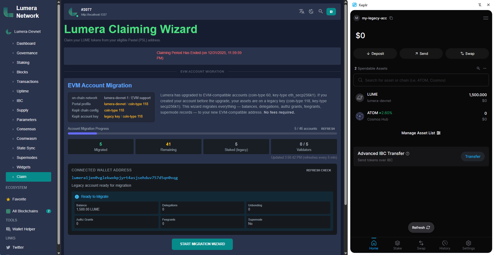

In the Portal, open **EVM Migration** from the left-hand navigation. This opens the dedicated **EVM Account Migration** page. Before you connect, the **Migration Status** section already shows the on-chain network, the current Portal profile, the **Migration Window** countdown, and global progress stats; the **START MIGRATION WIZARD** button is disabled until a wallet is connected:

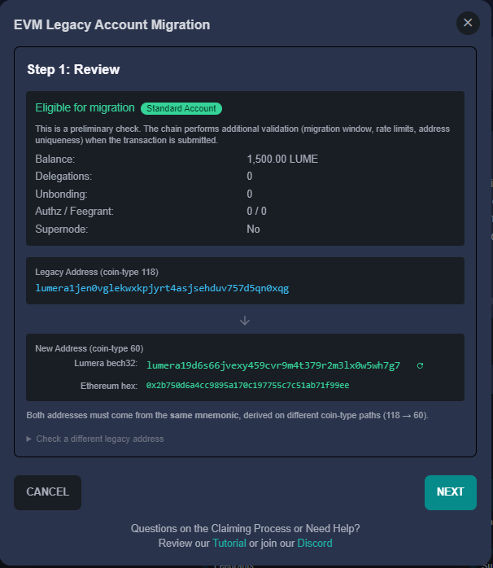

Click **Connect Wallet** (top-right) and choose **Keplr**:

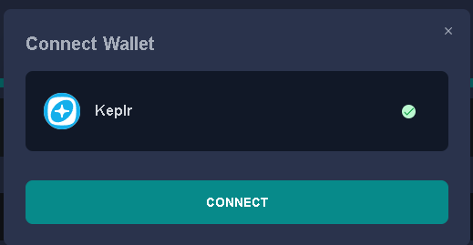

If the Lumera chain isn't yet registered in Keplr, the Portal will prompt you to approve it via Keplr's `suggestChain` dialog (the EVM-profile variant is shown later in the post-migration flow).

Once connected, the state panel fills in all four rows, and the **Connected Wallet Address** section shows your address with a status line. If you have a legacy (coin-type 118) account with on-chain state, you'll see **"Legacy account ready for migration"** and a **Ready to Migrate** breakdown of your assets:

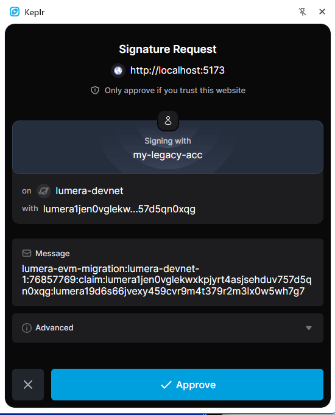

In this screenshot:

- The state panel shows**Portal profile: lumera-devnet-1 / coin-type 118**,**Keplr chain config: coin-type 118**,**Keplr account key: legacy key / coin-type 118** — all in yellow (legacy 118 derivation everywhere). The**on-chain network** row confirms`lumera-devnet-1 / EVM support`.
- The **Migration Window** card shows how long migration stays open (e.g.`1d 22h 35m left`) and the exact close time. This reflects the chain's `migration_end_time` parameter; when it shows no deadline, migration has no time limit.
- The progress stats report global counters, refreshed every 5 minutes:
  - **Migrated** — accounts already migrated
  - **Remaining** — accounts still to migrate, split into **with key** (have signed on-chain, so a key is known) and **without key** (never signed)
  - **Staked (legacy)** — legacy accounts still holding delegations
  - **Validators** — migrated / total validators
- The**Ready to Migrate** breakdown under the connected address shows what will move:
  - **Balance** — your available LUME balance
  - **Delegations** — active staking delegations
  - **Unbonding** — pending unbonding entries
  - **Authz Grants / Feegrants** — authorization and fee grant counts
  - **Supernode** — whether this account runs a supernode

> **Multisig account?** The page has a separate **Migrate a Multisig Account** section at the bottom with an address field and a **CHECK MULTISIG** preflight button. The wizard itself does not support multisig — see [§ Migrating a multisig account](#migrating-a-multisig-account).

Click **START MIGRATION WIZARD** to begin.

#### 2. Step 1: Review

The wizard opens (modal title: **EVM Legacy Account Migration**) on **Step 1: Review**. Verify that the information is correct before proceeding:

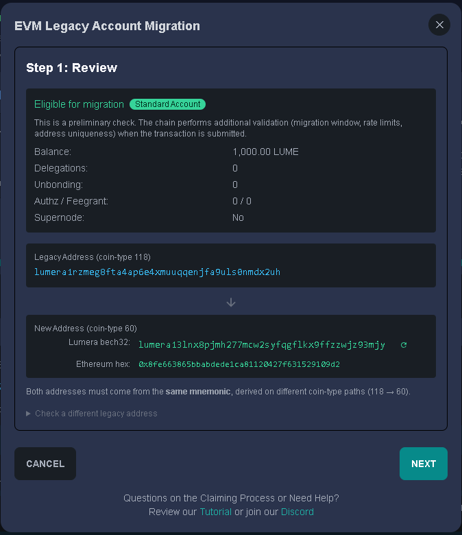

A note under the eligibility banner reminds you this is a **preliminary check** — the chain performs additional validation (migration window, rate limits, address uniqueness) when the transaction is actually submitted.

Key things to check:

- **"Eligible for migration"** banner at the top with the**Standard Account** badge (or**Validator** /**Supernode**, when applicable).
- The asset summary:**Balance**,**Delegations**,**Unbonding**,**Authz / Feegrant**,**Supernode**.
- **Legacy Address (coin-type 118)** — your current Lumera address, shown in cyan.
- **New Address (coin-type 60)** — your destination, shown both as a Lumera bech32 (`Lumera bech32:`) and an Ethereum hex (`Ethereum hex:`). The Portal derives this from Keplr's Ethereum provider using the same mnemonic.

The note at the bottom reminds you that both addresses must come from the **same mnemonic**, derived on different coin-type paths (118 → 60).

If you need to migrate a different account, expand **"Check a different legacy address"** at the bottom.

**For validators**: an additional pre-migration checklist appears here — you must confirm your maintenance window is planned, your node is stopped, and you have copied the post-migration restart commands.

Click **NEXT** when ready.

#### 3. Step 2: Sign & Confirm

This step collects two cryptographic proofs that authenticate you as the owner of both the legacy and new addresses. No private keys leave your device — both signatures are produced locally in Keplr. The wizard spells this out: when you click the button, Keplr opens **two pop-ups, one after the other**; each only *signs a message* — no tokens move, no fee is charged, and nothing is sent on-chain yet.

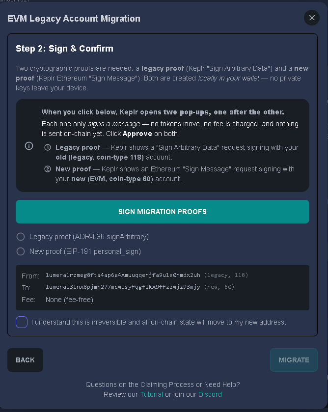

Click **SIGN MIGRATION PROOFS**. The wizard tracks progress inline ("Waiting for you to approve the first (legacy) pop-up in Keplr…") while Keplr opens **two signature popups** in sequence.

**First popup — Legacy proof (ADR-036 signArbitrary):**

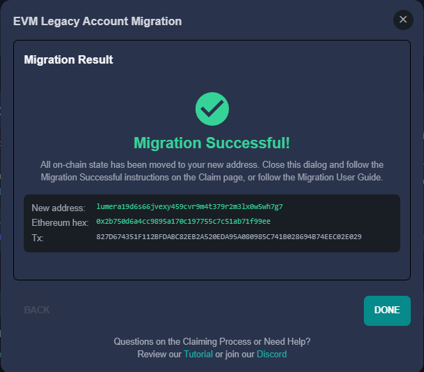

This is the legacy account proof. Notice:

- **"Signing with"** shows your Keplr wallet name (e.g. `legacy-acc`).
- **"on lumera-devnet-1"** — the Lumera chain (Keplr's Cosmos signing provider).
- **"with lumera1rzmeg8fta4…ls0nmdx2uh"** — your legacy address.
- **Message** is the migration payload string: `lumera-evm-migration:{chainID}:{evmChainID}:claim:{legacyAddr}:{newAddr}`.
- The collapsed **Advanced** drawer holds the full ADR-036 JSON sign doc (`sign/MsgSignData`) — the standard Cosmos arbitrary-message format. Expand it if you want to inspect the raw fields.

Click **Approve** to sign with your legacy key.

**Second popup — New proof (EIP-191 personal_sign):**

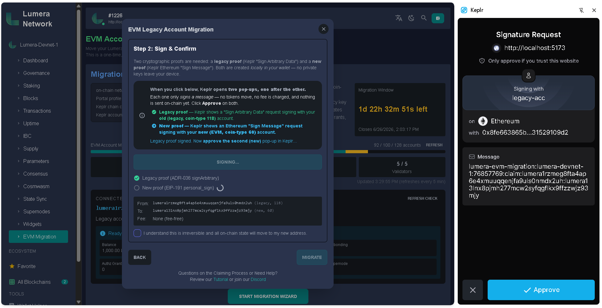

Once the legacy proof is signed the wizard advances ("Legacy proof signed. Now approve the second (new) pop-up in Keplr…") and Keplr opens the second popup. This is the new (EVM) address proof. Notice the differences:

- **"on Ethereum"** — Keplr is using its Ethereum signing provider this time, not the Cosmos one.
- **"with 0x8fe663865b…31529109d2"** — your Ethereum hex address.
- **Message** is the same migration payload string.

Click **Approve** to sign with your new (coin-type 60) key.

When both signatures land, the wizard updates: the button reads **BOTH PROOFS SIGNED**, each line shows a green check, and the confirmation checkbox becomes active:

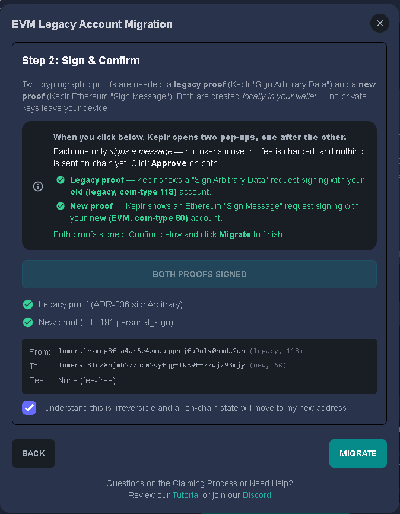

The transaction summary lists **From** (legacy, 118) and **To** (new, 60) and confirms **Fee: None (fee-free)**.

Tick **"I understand this is irreversible and all on-chain state will move to my new address."** Then click **MIGRATE**.

#### 4. Migration Result

The Portal broadcasts the transaction and waits for confirmation (typically one block, 5–6 seconds). On success the wizard shows a **Migration Result** screen — *"Migration Successful! All on-chain state has been moved to your new address. Follow the steps below to finish setting up your wallet."*

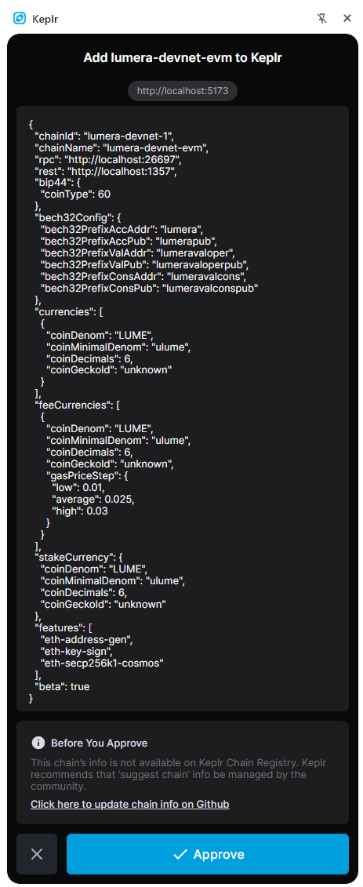

The result screen now embeds the complete post-migration checklist so you can finish without leaving the dialog:

- A **Next steps** heading with a **COPY CHECKLIST** button (copies the whole sequence to your clipboard).
- A **Multiple legacy accounts?** callout: keep Portal and Keplr on the legacy network until every legacy account is migrated, then do the cleanup once at the end (see the batching note further below).
- **1. New Lumera address** and **2. Ethereum hex address** — your post-migration addresses, each with a copy button.
- **3. Switch the Portal to Lumera EVM, reconnect Keplr, then add an existing wallet with the same recovery phrase** — the ordered sub-steps (a–e) that the Claim/EVM Migration page also walks you through after you close the dialog.
- **Tx** — the on-chain transaction hash, with copy and explorer-link buttons.

**For validators**: an urgent section shows the restart command (`systemctl start lumerad`). Restart your validator promptly to avoid missed blocks and jailing.

Click **DONE** to close the wizard. The **EVM Migration** page now switches into the post-migration follow-up flow described next.

> **Migrating more than one legacy account? Batch the wizards first, do the cleanup once at the end.**
>
> The post-migration cleanup described in section 5 below (switch Portal to the EVM profile → remove the legacy chain in Keplr and accept the EVM `suggestChain` → re-import the mnemonic into a fresh Keplr profile) is a **per-Keplr-installation** task, not a per-account one. If you have several legacy accounts to migrate from the same Keplr extension, doing the cleanup after every account means flipping Portal and Keplr back and forth between chain configs N times for no gain.
>
> Recommended order when migrating multiple legacy accounts:
>
> 1. **Stay on the legacy Portal profile** (`lumera-devnet-1` /`lumera-mainnet-1`) and the original Keplr chain definition for the entire migration phase.
> 2. After the wizard closes for account 1, ignore the**Wallet Re-Import Still Required** card for now.
> 3. In Keplr, click your wallet name (top-left) and switch to the next legacy account in the wallet list. The Connected Wallet Address on the EVM Migration page updates automatically.
> 4. The Portal will detect it as another "Legacy account ready for migration" — click**START MIGRATION WIZARD** and run through Step 1 → Step 2 → Migrate again.
> 5. Repeat steps 3–4 for every legacy account you have.
> 6. **Only once every legacy account is migrated**, follow the post-migration cleanup once: switch Portal to the EVM profile, refresh Keplr's chain registration, and then re-import the mnemonic(s) into fresh Keplr profile(s) to expose the migrated EVM-derived addresses for each account.
>
> **Many accounts? Use the shell helpers instead.** Once you're past a handful of legacy accounts, clicking through the Portal+Keplr wizard for each one becomes the bottleneck — and Keplr's signature popups can't be automated. Switch to the bundled [`scripts/migrate-account.sh`](#method-2-shell-helper-scripts) (or `migrate-validator.sh` for validators), which run the same migration non-interactively from a keyring. They're easy to drop into a loop over a list of legacy key names, produce structured exit codes for each result, and capture pre/post balance snapshots — so a batch migration is auditable rather than something you have to retrace by hand.

#### 5. Post-Migration Follow-Up on the EVM Migration Page

After the wizard closes, the **EVM Migration** page shows a **Migration Successful** card whose contents adapt to the *current* state of your Portal profile, Keplr chain config, and Keplr account key. Your funds are already safe at the new address — the remaining work is a **per-Keplr-installation** cleanup so your wallet and the Portal both render the new EVM-derived address. The four state names below (A → D) are checkpoints you pass through; the linear walkthrough that follows takes you from A to D in order.

##### State A: "Wallet Re-Import Still Required" (still on the legacy profile)

Right after the wizard closes you're still on the legacy Portal profile, so the page looks like this:

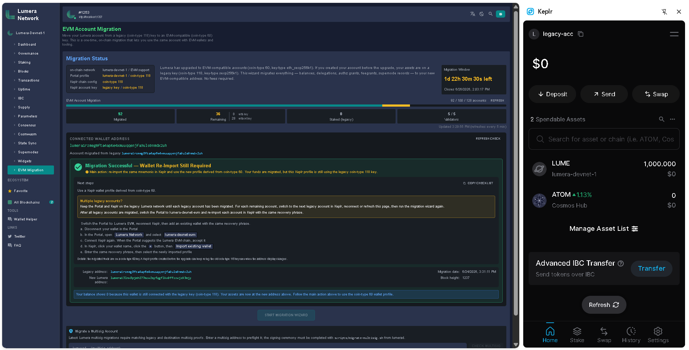

The state panel still reads `Portal profile: lumera-devnet-1 / coin-type 118` (yellow), `Keplr chain config: coin-type 118` (yellow), and `Keplr account key: legacy key / coin-type 118` (yellow). The Portal knows your migration record from the chain ("Account migrated from legacy …" appears under the connected address) but the connected key is still the legacy 118 derivation, so your displayed Keplr balance is 0 — the assets now live at the new EVM address. The card states the **main action** directly: *re-import the same mnemonic in Keplr and use the new profile derived from coin-type 60.* The migration record (legacy address, new Lumera address, **Migration date**, **Block height**) is shown at the bottom.

Work through the cleanup in the order below.

###### a. Remove the legacy Lumera chain in Keplr

In Keplr, open the **☰** menu (top-right) and choose **Add/Remove Chains**:

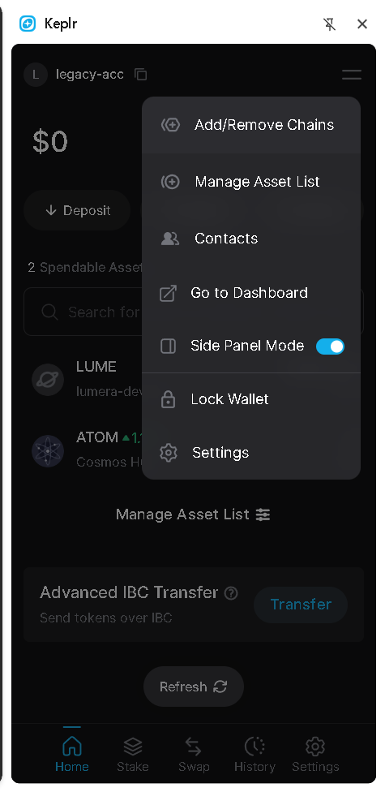

Find the legacy **lumera-devnet-1** entry and toggle it **off**. (Removing it now avoids a stale `coin-type 118` chain definition lingering in Keplr's registry.)

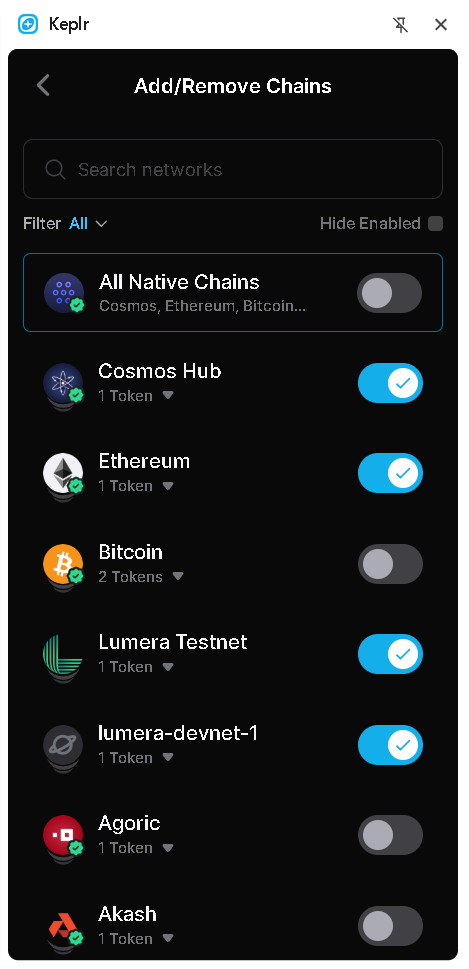

###### b. Switch the Portal to the EVM profile

Click **Lumera Network** (top-left) and select **Lumera-Devnet-Evm**:

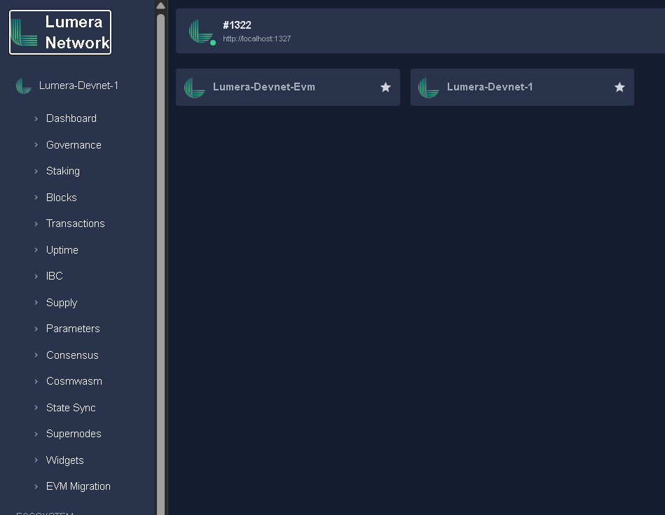

The page reloads on the EVM profile. The **Portal profile** row is now green (`lumera-devnet-evm / coin-type 60`), and the wallet is disconnected:

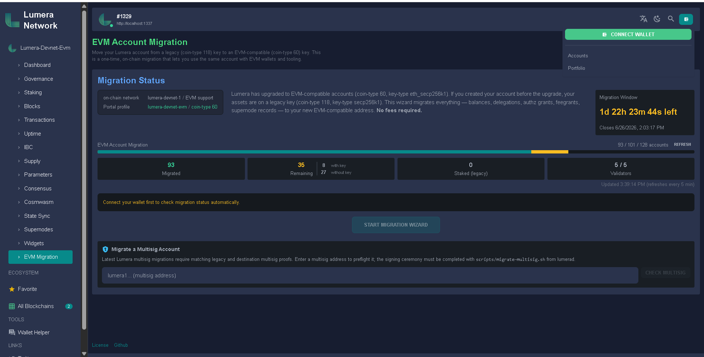

###### c. Reconnect Keplr and approve the EVM chain

Click **Connect Wallet**. On the EVM profile the dialog now also offers **MetaMask** alongside Keplr; choose **Keplr**:

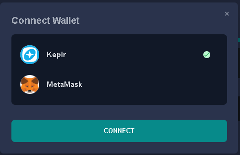

The Portal asks Keplr to add the EVM chain definition. Approve the `suggestChain` dialog (`bip44.coinType: 60`, `features: ["eth-address-gen", "eth-key-sign", "eth-secp256k1-cosmos"]`):

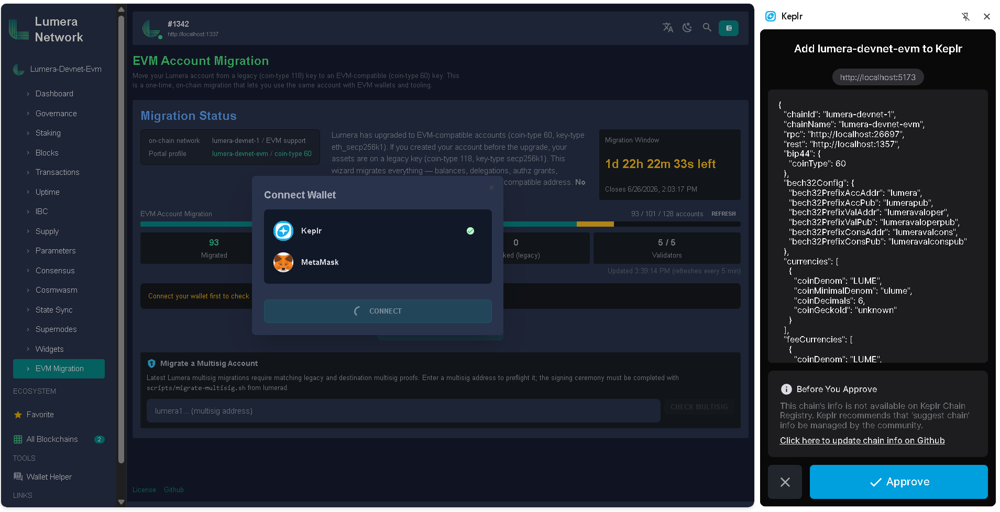

> **Checkpoint — State B ("Update Keplr Chain Definition").** If you reconnected *before* removing the legacy chain in step a, the card reads **Update Keplr Chain Definition** instead: `Portal profile` is green but `Keplr chain config` is still `coin-type 118` (yellow). Disconnect, remove the legacy chain (step a), then reconnect so the Portal re-suggests the EVM definition.

###### d. Checkpoint — State C ("vault still holds the 118 key")

After the chain config is on `60` but before you re-import the mnemonic, the same Keplr profile is still serving its original 118-derived key, just rendered eth-style for the new chain config. The state panel shows the first three rows green but **Keplr account key: legacy key / coin-type 118** still yellow:

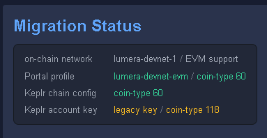

> **Why a fresh profile rather than just using the existing one?** A Keplr wallet profile derives its keys from the mnemonic at *creation time* using the chain's then-current `bip44.coinType`. Existing profiles aren't re-derived when the chain config later changes. Importing the same mnemonic into a new profile, after the chain registry is on `coin-type 60`, makes Keplr derive the EVM-compatible (P_60) key.

###### e. Re-import the mnemonic into a fresh Keplr profile

In Keplr, click your wallet name (top-left) to open **Select Wallet**, then click the **+** button:

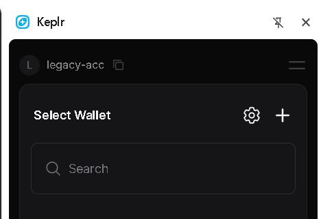

Choose **Import an existing wallet**:

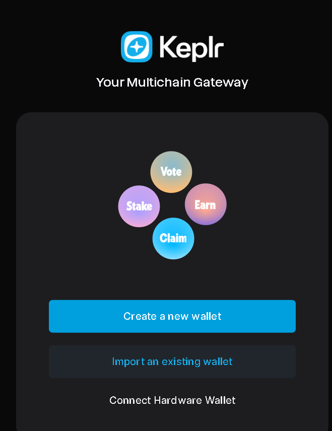

Choose **Use recovery phrase or private key**:

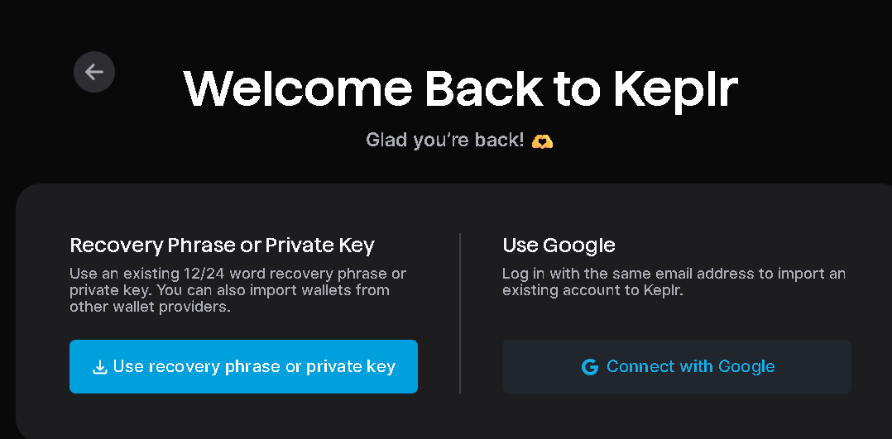

Enter the **same recovery phrase** you used for the legacy account (12- or 24-word, whichever you have):

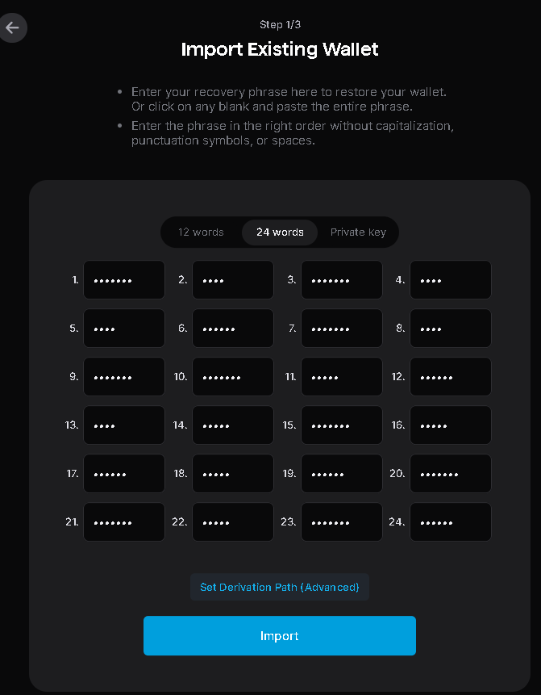

Give the new profile a name (e.g. `evm-acc`) and click **Next**:

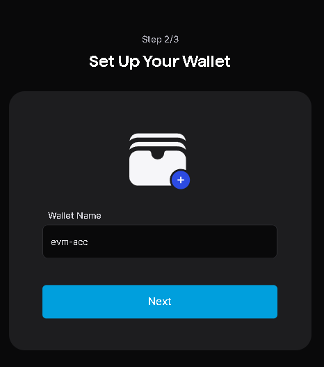

Select the chains to enable and click **Save**:

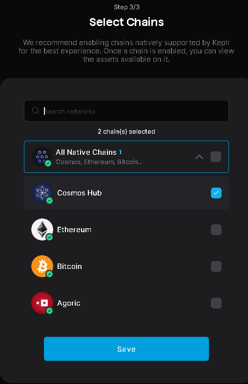

##### State D: "Migration Successful" — clean state (everything aligned)

Select the freshly-imported wallet profile. The state panel goes fully green and the card reduces to a brief confirmation:

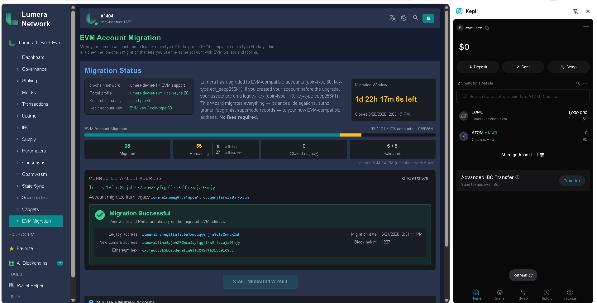

- **Portal profile**:`lumera-devnet-evm / coin-type 60` (green)
- **Keplr chain config**:`coin-type 60` (green)
- **Keplr account key**:`EVM key / coin-type 60` (green)
- **Connected wallet address** is now your post-migration bech32, matching`migrationRecord.new_address`.

The card body says *"Your wallet and Portal are already on the migrated EVM address."* The migration record is displayed with the legacy address, new Lumera address, **Ethereum hex**, **Migration date**, and **Block height**. Keplr now shows the new profile (e.g. `evm-acc`) serving the EVM-derived address.

### Troubleshooting

**The Migration Successful card says "Wallet Re-Import Still Required":**

The Keplr profile you're connected with still holds a legacy `coin-type 118` private key. Follow the action card on the page — the underlying flow is *(disconnect → switch Portal to lumera-devnet-evm if needed → reconnect Keplr → import the mnemonic into a new Keplr profile)*. State A and State C above show the same instruction at different points along the flow.

**The Migration Successful card says "Update Keplr Chain Definition":**

The Portal is on the EVM profile but Keplr's chain registry is still on `coin-type 118`. Disconnect, remove the legacy Lumera chain in Keplr (Settings → Add/Remove Chains), and reconnect from the Portal — it'll re-suggest the EVM chain definition.

**The Migration Successful card says "Switch Portal to Lumera EVM Network":**

You're on the legacy Portal profile but your Keplr wallet vault is *already* the post-migration EVM key (Keplr is just rendering it in cosmos-style because the chain config is `118`). No re-import needed — just click the **Lumera Network** logo in the Portal and pick the `lumera-devnet-evm` (or `lumera-mainnet-evm`) profile.

**Balance shows 0 after migration:**

Your funds are safe. The 0 means Keplr is still serving the legacy `coin-type 118` address, not your migrated `coin-type 60` address. Follow whichever follow-up state the Migration Successful card is currently in.

**"Keplr account changed since the Review step" error during the wizard:**

You switched Keplr accounts or profiles between wizard steps. Go back to Step 1 and reconnect your wallet.

---

## Method 2: Shell Helper Scripts

The repository ships two bash wrappers in [scripts/](../../../scripts/) that layer safety rails on top of the Method 3 CLI flow:

- `scripts/migrate-account.sh` — regular account migration (`claim-legacy-account`)
- `scripts/migrate-validator.sh` — validator migration (`migrate-validator`)

Both scripts:

- Detect and reject multisig accounts (use the offline 4-step flow in[legacy-migration.md](../evmigration/legacy-migration.md#multisig-account-migration) for those).
- Run`migration-estimate` before broadcast so you see what moves and why it might fail.
- Compare post-migration balances against a pre-broadcast snapshot.

The abbreviated invocations below cover the common cases. For the full reference — all flags, exit codes, troubleshooting keyed by exit code, mnemonic-file flow, and non-interactive / CI usage — see [migration-scripts.md](migration-scripts.md).

### Single-sig account migration

```bash
./scripts/migrate-account.sh legacy-key new-key \
  --chain-id lumera-mainnet-1 \
  --node tcp://rpc.lumera:26657 \
  --keyring-backend test
```

Use `--mnemonic-file <path>` (file must be mode 0600) to import both keys from a mnemonic in one step. Add `--dry-run` to preview without broadcasting.

### Single-sig validator migration

```bash
./scripts/migrate-validator.sh legacy-op-key new-evm-key \
  --chain-id lumera-mainnet-1 \
  --node tcp://rpc.lumera:26657 \
  --keyring-backend test \
  --i-have-stopped-the-node
```

`--i-have-stopped-the-node` acknowledges the jailing risk; omitting it makes the script prompt interactively. `--yes` does NOT satisfy this acknowledgement — that's deliberate.

### Exit codes

| Code   | Meaning                                                                                     |
| ------ | ------------------------------------------------------------------------------------------- |
| `0`  | Success, or dry-run completed cleanly                                                       |
| `1`  | Usage error / bad flags / bad input file permissions / key name collision                   |
| `2`  | Environment error: binary missing, jq missing, node unreachable, unsupported binary version |
| `3`  | Multisig rejected; use offline flow                                                         |
| `4`  | Pre-flight estimate returned `would_succeed=false`                                        |
| `5`  | Account already migrated (or new address already used)                                      |
| `6`  | Wrong-script or delegation-cap error                                                        |
| `7`  | Broadcast succeeded but post-migration verification failed — investigate manually          |
| `10` | User aborted at a confirmation prompt                                                       |

---

## Method 3: Lumera CLI

The CLI requires both keys (legacy and new) in the keyring. It handles address derivation, proof signing, gas simulation, and broadcasting automatically.

### CLI Prerequisites

- `lumerad` binary (post-EVM upgrade version)
- Your mnemonic (recovery phrase)
- Access to a running Lumera node (local or remote RPC endpoint)

### CLI Step-by-Step

Both keys must be in the keyring. The CLI extracts the public key, generates both proofs, and broadcasts automatically.

#### 1. Pre-flight: Check Migration Eligibility

```bash
# Check if migration is enabled
lumerad query evmigration params --node <rpc-endpoint>

# Check migration estimate for your legacy address
lumerad query evmigration migration-estimate <legacy-address> --node <rpc-endpoint>
```

The estimate response shows `would_succeed: true` if migration is possible. If `would_succeed: false`, the `rejection_reason` field explains why.

```bash
# Check overall migration statistics
lumerad query evmigration migration-stats --node <rpc-endpoint>
```

#### 2. Import Both Keys from the Same Mnemonic

**Import the legacy key (coin-type 118, secp256k1):**

```bash
lumerad keys add legacy-key \
  --recover \
  --coin-type 118 \
  --algo secp256k1 \
  --keyring-backend test
```

Enter your mnemonic when prompted.

**Import the new EVM key (coin-type 60, eth_secp256k1):**

```bash
lumerad keys add new-key \
  --recover \
  --coin-type 60 \
  --algo eth_secp256k1 \
  --keyring-backend test
```

Enter the **same mnemonic** when prompted.

**Verify the addresses:**

```bash
lumerad keys show legacy-key -a --keyring-backend test
lumerad keys show new-key -a --keyring-backend test
```

The legacy address should match your known pre-EVM address on chain.

#### 3. Run the Migration

**For regular account migration:**

```bash
lumerad tx evmigration claim-legacy-account legacy-key new-key \
  --keyring-backend test \
  --chain-id lumera-mainnet-1 \
  --node tcp://localhost:26657 \
```

**For validator migration:**

```bash
lumerad tx evmigration migrate-validator legacy-validator-key new-validator-evm-key \
  --keyring-backend test \
  --chain-id lumera-mainnet-1 \
  --node tcp://localhost:26657 \
```

The CLI will:

1. Read both keys from the keyring, extract public keys, and derive bech32 addresses
2. Verify the legacy key is`secp256k1` (coin-type 118)
3. Build the migration payload and sign`SHA256(payload)` with the legacy key
4. Sign the new proof with the new key (must be`eth_secp256k1`)
5. Build an unsigned, fee-free Cosmos transaction
6. Simulate gas usage automatically
7. Prompt for confirmation (unless`--yes` flag is used)
8. Broadcast the transaction

#### 4. Verify the Migration

```bash
# Check that the migration record exists
lumerad query evmigration migration-record <legacy-address> --node <rpc-endpoint>

# Verify balances moved to the new address
lumerad query bank balances <new-address> --node <rpc-endpoint>

# Confirm legacy address has zero balance
lumerad query bank balances <legacy-address> --node <rpc-endpoint>
```

#### 5. Post-Migration for Validators

After a successful validator migration, update your node immediately:

```bash
# 1. Import the new key into the node's production keyring if not already present
lumerad keys add new-operator-key \
  --recover \
  --coin-type 60 \
  --algo eth_secp256k1 \
  --keyring-backend file

# 2. Restart the validator node (or however you supervise it: docker, cosmovisor, etc.)
systemctl start lumerad
```

> **Warning:** Your validator will miss blocks and may be jailed if you do not restart promptly after migration. Plan a maintenance window before initiating validator migration.

#### 6. Clean Up

After verifying the migration was successful:

```bash
lumerad keys delete legacy-key --keyring-backend test
```

---

## Quick Reference: Query Commands

These queries are useful before, during, and after migration:

```bash
# Module parameters (is migration enabled? deadline?)
lumerad query evmigration params

# Pre-flight estimate (what will be migrated, will it succeed?)
lumerad query evmigration migration-estimate <legacy-address>

# Migration record (has this address been migrated?)
lumerad query evmigration migration-record <legacy-address>

# Reverse lookup (find migration record by new address)
lumerad query evmigration migration-record-by-new-address <new-address>

# Global statistics (how many accounts migrated/remaining?)
lumerad query evmigration migration-stats

# List legacy accounts still needing migration
lumerad query evmigration legacy-accounts --limit 100

# List completed migrations
lumerad query evmigration migrated-accounts --limit 100
```

---

## Migration Parameters

The following chain parameters govern migration behavior. These are set by governance:

| Parameter                     | Default             | Description                                                                                                         |
| ----------------------------- | ------------------- | ------------------------------------------------------------------------------------------------------------------- |
| `enable_migration`          | `true`            | Master on/off switch. When `false`, all migration messages are rejected.                                          |
| `migration_end_time`        | `0` (no deadline) | Optional Unix timestamp deadline. If non-zero and current block time is past this, migration is rejected.           |
| `max_migrations_per_block`  | `50`              | Rate limit for `MsgClaimLegacyAccount` per block. Prevents excessive gas consumption.                             |
| `max_validator_delegations` | `2500`            | Safety cap for `MsgMigrateValidator`. Rejects if total delegation + unbonding + redelegation records exceed this. |

---

## Validator Operator Migration

Validators have their own step-by-step walkthrough covering maintenance-window planning, the `max_validator_delegations` check, consensus-key safety, supernode-bound-to-validator re-keying, and the multisig variant — see [validator-migration.md](validator-migration.md).

Key facts (repeated here for quick reference):

- Validators**must** use`MsgMigrateValidator` (not`MsgClaimLegacyAccount`) — the chain rejects`claim-legacy-account` for validator operator addresses.
- Validator migration is a superset of regular account migration. It re-keys the validator record, every delegation pointing to the validator, unbonding/redelegation records, distribution state, the supernode record (if the supernode account matches the validator's legacy address), and action references, atomically.
- The validator consensus key (`priv_validator_key.json`, ed25519) is**not affected** by this migration — only the operator key.
- Stop the validator node before broadcasting, route the tx through a trusted external RPC, then restart promptly to minimize missed blocks.

---

## Supernode Operator Migration

Supernode operators have their own step-by-step walkthrough covering the automatic startup-migration path for single-sig supernodes and the manual `lumerad` CLI path for multisig supernodes — see [supernode-migration.md](supernode-migration.md).

Key facts:

- The supernode daemon performs automatic migration on startup when`evm_key_name` is set in`config.yml` and the supernode's legacy key is single-sig.
- For multisig supernode accounts, the daemon refuses and directs you to the offline 4-step`lumerad` CLI ceremony (`generate-proof-payload` →`sign-proof` →`combine-proof` →`submit-proof`). Restart the supernode after the offline ceremony completes — the daemon detects the on-chain migration record and drives local cleanup.
- If you run a supernode on the same account as a validator operator, migrate the validator (`MsgMigrateValidator` handles the supernode side as a side-effect), then restart both`lumerad` and the supernode.

## FAQ

**Q: Do I need LUME on my new address to pay for migration?**

No. Migration transactions are fee-free. The transaction carries a gas limit for internal processing, but no fee is charged.

**Q: Can I migrate to any address?**

No. The new address must be derived from the **same mnemonic** as the legacy address using coin-type 60 and eth_secp256k1. The chain verifies this through the dual-signature proof.

**Q: What if I'm a validator - should I use `claim-legacy-account` or `migrate-validator`?**

Validators **must** use `migrate-validator`. The `claim-legacy-account` command explicitly rejects validator operator addresses. `migrate-validator` handles the additional complexity of re-keying all delegations pointing to your validator.

**Q: Can I migrate back to the legacy address?**

No. Migration is irreversible. The legacy account is removed from the chain's auth module after migration.

**Q: What happens to my staking rewards during migration?**

All pending staking rewards and validator commission are automatically withdrawn and included in the bank balance transfer during migration.

**Q: Is there a deadline for migration?**

Check the `migration_end_time` parameter. If it's `0`, there is no deadline (only the `enable_migration` flag controls availability). Governance can set or extend the deadline.

**Q: My validator has too many delegators and migration is rejected. What do I do?**

The `max_validator_delegations` parameter (default 2500) limits how many records can be re-keyed in one transaction. If your validator exceeds this, governance may increase the limit, or delegators can redelegate before validator migration.

---

## Migrating a multisig account

> **Script wrapper available.** The bundled `scripts/migrate-multisig.sh` layers pre-flight, file-integrity, and post-broadcast verification onto each of the four steps below. For day-to-day use, prefer the script walkthrough at [migration-scripts.md → Multisig migration](migration-scripts.md#multisig-migration). The raw-CLI reference that follows is the canonical source for field semantics and remains useful when debugging.

Multisig legacy accounts (flat K-of-N `secp256k1`) use an offline, coordinator-driven flow with four commands. The portal wizard does not support multisig — use the CLI.

> **Consensus invariants (multisig).** These are enforced at `ValidateBasic` before the tx reaches the msg server; a violation rejects the transaction on-chain.
>
> - **Shape + K/N must mirror.** A K-of-N legacy multisig migrates to a K-of-N `eth_secp256k1` multisig — same K, same N. Different K, different N, or single↔multisig shape mismatch is rejected with `ErrMirrorSourceMismatch` (code 1121).
> - **Same K signer positions sign both halves.** `legacy_proof.signer_indices` must equal `new_proof.signer_indices`. Co-signers who sign only one side don't count toward the K-of-K threshold on the other.
> - **Sub-key uniqueness.** Each side's`sub_pub_keys` must have pairwise-distinct entries.
> - **Zero-signer submit.**`submit-proof` takes no`--from`, no fee flags, no envelope signature — authorization is the proof bytes. Mempool acceptance of zero-signer migration txs requires `app/evmigration_signer_extraction_adapter.go` to be wired into the EVM mempool's `CosmosPoolConfig.SignerExtractor`; without it, `ExperimentalEVMMempool` falls back to the SDK's default extractor and rejects the tx with `tx must have at least one signer` during app-side mempool admission/proposal selection.
>
> Full reference with error codes and helper functions: [legacy-migration.md § Consensus invariants](../evmigration/legacy-migration.md#consensus-invariants).

See [legacy-migration.md](../evmigration/legacy-migration.md#multisig-account-migration) for the architecture and wire-format reference.

### Overview

| Step | Who runs it          | Command                    | Produces                             |
| ---- | -------------------- | -------------------------- | ------------------------------------ |
| 1    | Coordinator (once)   | `generate-proof-payload` | `proof.json` — payload template   |
| 2    | Each of K co-signers | `sign-proof`             | one `*-partial.json` per signer    |
| 3    | Coordinator          | `combine-proof`          | `tx.json` — assembled unsigned tx |
| 4    | Coordinator          | `submit-proof`           | broadcasts to chain                  |

The payload is identical across all co-signers; what differs is whose sub-key signed it. The coordinator only assembles and broadcasts — they don't need any of the legacy sub-keys.

### Precondition: ensure the multisig pubkey is on-chain

`generate-proof-payload` reads the legacy multisig's `LegacyAminoPubKey` (its threshold and sub-key list) from chain state. If that pubkey is not on-chain, the command fails — the keeper cannot know the account is a multisig, let alone verify a K-of-N proof against it.

**Why a multisig pubkey can be missing.** A Cosmos account only records its public key when the account *signs* an accepted transaction. An account funded at genesis, or one that has only ever *received* funds, exists on-chain with no pubkey stored. The bech32 address alone never reveals whether it was derived from a single key or a multisig — that becomes knowable only after the account signs once. This bites genesis-funded multisigs in particular: they hold a balance and look ready to migrate, but the chain has nothing to verify against.

**How to recognize the unseeded state.** Query the account:

```bash
lumerad query auth account <multisig-legacy-address>
```

- `pub_key` is a `/cosmos.crypto.multisig.LegacyAminoPubKey` with a `public_keys` list → seeded; proceed with migration.
- `pub_key: null` **and** `sequence: "0"` → the account has never signed; the multisig pubkey is not seeded. Seed it (below) before migrating.
- `pub_key: null` with `sequence` greater than `0` → inconsistent state (signed but no stored key). Stop and investigate before doing anything else.

**Seeding is itself a K-of-N multisig transaction.** "Submit any transaction first" is the right idea, but for, say, a 2-of-3 multisig the seeding tx must itself be signed by at least K members and assembled as a multisig tx — a single member cannot seed it alone. A 1-ulume self-send (multisig → the same multisig address) is the cheapest option: the send amount returns to the account and only the fee is spent.

```bash
# 1. Build the unsigned self-send (use the multisig's keyring key name).
lumerad tx bank send <multisig-key> <multisig-legacy-address> 1ulume \
  --generate-only --chain-id <chain-id> > seed.json

# 2. K members each sign independently (--multisig takes the multisig address).
lumerad tx sign seed.json --from <member-1> --multisig <multisig-legacy-address> \
  --chain-id <chain-id> --output-document sig1.json
lumerad tx sign seed.json --from <member-2> --multisig <multisig-legacy-address> \
  --chain-id <chain-id> --output-document sig2.json

# 3. Combine the K signatures under the multisig key.
lumerad tx multisign seed.json <multisig-key> sig1.json sig2.json \
  --chain-id <chain-id> > seed-signed.json

# 4. Broadcast. Once included, the chain stores the multisig pubkey.
lumerad tx broadcast seed-signed.json --node <rpc-url>
```

Re-run the `auth account` query and confirm `pub_key` is now a `LegacyAminoPubKey` listing all sub-keys.

**Paying gas after the EVM upgrade.** Unlike the fee-waived migration tx, the seeding self-send is an ordinary fee-paying transaction, so the multisig needs spendable `ulume` for gas (the send amount nets out; the fee does not). If the multisig has no spendable balance — common right after the EVM upgrade, when an operator hasn't funded the legacy account — you have two options:

- **Fund it first** — send a small amount of `ulume` to the multisig from any funded account, then run the self-send.
- **Use a feegrant** — have a funded account grant fees to the multisig (`lumerad tx feegrant grant <funder> <multisig-legacy-address>`), then add `--fee-granter <funder>` to the broadcast so the grantor pays.

Either way the *signatures* must still come from K multisig members; only the gas source changes.

When using raw `lumerad tx broadcast`, inspect the returned JSON `code`. The CLI process can exit `0` even when CheckTx rejected the tx, for example `code: 13` with `raw_log: "fee not provided... insufficient fee"`. For the seed transaction, `code: 0` means accepted; nonzero means fix the error and broadcast a corrected tx before continuing.

### Step 1: Coordinator generates the proof payload template

The destination of a K-of-N legacy multisig is **also** a K-of-N multisig, built from fresh `eth_secp256k1` sub-keys (mirror-source rule — see [evmigration/main.md → Multisig account migration](../evmigration/main.md#multisig-account-migration)). Each co-signer generates their own eth sub-key; the coordinator collects the N eth pubkeys (or local key-names) and runs:

```bash
lumerad tx evmigration generate-proof-payload \
  --legacy <multisig-bech32> \
  --new-sub-pub-keys <eth-k1>,<eth-k2>,<eth-k3> \
  --new-threshold    2 \
  --kind claim \
  --chain-id <chain-id> \
  --keyring-backend <backend> \
  --out proof.json
```

- `--new-sub-pub-keys` entries are either local keyring key names (eth_secp256k1) or base64-encoded 33-byte compressed eth pubkeys. Mix freely. `--new-threshold` is required with `--new-sub-pub-keys`.
- **Member order is significant — pass `--nosort` when building the destination key.** `generate-proof-payload` preserves the order you list `--new-sub-pub-keys` (it does not sort), and the signer index is the position in that list. Because the mirror-source rule requires `legacy_proof.signer_indices == new_proof.signer_indices`, list the eth sub-keys in the **same member order as the legacy multisig's `public_keys`** (`lumerad query auth account <multisig-bech32>`), so each co-signer holds the same signer index on both sides.

  > **⚠️ When pre-creating the destination composite with `lumerad keys add --multisig`, you MUST pass `--nosort`.** The default behavior is to sort sub-pubkeys by bytes, and because legacy `secp256k1` and new `eth_secp256k1` pubkey bytes sort differently, the default sort produces a destination whose member order does not mirror the legacy side. Co-signers will then fail at `sign-proof` with a "signer index mismatch" error and you'll have to rebuild the destination key and regenerate `proof.json`. Always:
  >
  > ```bash
  > lumerad keys add <new-multisig-key> \
  >   --multisig=<eth-sub-1>,<eth-sub-2>,...,<eth-sub-N> \
  >   --multisig-threshold=<K> \
  >   --nosort
  > ```
  >
  > where the `<eth-sub-i>` order matches the legacy multisig's on-chain `public_keys` order.

- For same-mnemonic migrations, signer index 0's legacy mnemonic should be used to recover signer index 0's EVM sub-key, signer index 1's legacy mnemonic should be used for signer index 1's EVM sub-key, and so on. Reordering the same EVM sub-keys produces a different destination multisig address.
- `--new <bech32>` is optional; the CLI derives the new multisig address from the sub-keys/threshold and cross-checks `--new` if supplied.
- `--kind claim` targets `MsgClaimLegacyAccount`; `--kind validator` targets `MsgMigrateValidator`.
- `--chain-id` is **required**: the payload string `lumera-evm-migration:<chain-id>:<evm-chain-id>:<kind>:<legacy>:<new>` embeds the chain ID. An empty or wrong `--chain-id` makes every sub-signature fail verification with `sub-sig 0 invalid`.
- `--sig-format` (optional, default `SIG_FORMAT_CLI`) applies to the legacy side. Use `SIG_FORMAT_ADR036` only when sub-signers sign via a wallet that emits ADR-036 `signArbitrary` output (e.g. Keplr).
- `generate-proof-payload` **needs keyring access** to resolve `--new-sub-pub-keys` key names, so pass `--keyring-backend` (and `--keyring-dir` / `--home` when needed). It still does not broadcast anything.

The output `proof.json` is a v2 `PartialProof` with two sibling `SideSpec`s (`legacy` and `new`), each listing `threshold` + `sub_pub_keys`, plus empty `partial_legacy_signatures` and `partial_new_signatures` arrays. Distribute to all co-signers.

### Step 2: Each co-signer signs both sides on their own machine

Each co-signer holds their legacy Cosmos sub-key **and** their destination-side eth sub-key in the same keyring, and signs both sides in one invocation:

```bash
lumerad tx evmigration sign-proof proof.json \
  --from    <my-legacy-sub-key> \
  --new-key <my-eth-sub-key> \
  --keyring-backend <backend> \
  --chain-id <chain-id> \
  --out my-partial.json
```

- `--from` signs the legacy half; `--new-key` signs the new half. At least one is required. A co-signer who holds only one sub-key may pass just that flag, but **one-sided partials do not count toward quorum by themselves** — the consensus mirror-source rule requires the same K signer positions to approve both halves, so combine-proof only counts an index that has a valid signature on *both* sides. One-sided partials contribute only when another co-signer supplies the other-side signature at the same index.
- `sign-proof` is idempotent: re-running with the same key replaces that signer's entry on the corresponding side.
- When a co-signer passes **both** `--from` and `--new-key`, the two keys must resolve to the **same signer index** in their respective multisigs; `sign-proof` aborts before writing a partial with `legacy key "..." is signer index N, but new key "..." is signer index M; multisig migration requires the same signer position to approve both halves`. A mismatch means the destination multisig's member order doesn't mirror the legacy side — rebuild it per the order note in Step 1.
- `sign-proof` rejects a file whose `payload_hex` doesn't match a canonical reconstruction from the other fields — catches accidental tampering between steps.

Each co-signer sends their `*-partial.json` back to the coordinator.

### Step 3: Coordinator combines the partials

```bash
lumerad tx evmigration combine-proof \
  alice-partial.json bob-partial.json \
  --out tx.json
```

`combine-proof` validates cross-file consistency — it rejects the set if any two partials disagree on `chain_id`, `evm_chain_id`, `legacy_address`, `new_address`, `payload_hex`, `kind`, or the per-side `threshold` / `sig_format` / `sub_pub_keys`. It verifies every partial signature cryptographically on **both** sides, drops invalid entries with a stderr warning, then **intersects** the valid signer-index sets across the two sides and selects the first K indices present on BOTH. This is what satisfies the consensus mirror-source rule (`legacy_proof.signer_indices == new_proof.signer_indices`). A one-sided partial (e.g. co-signer Alice signed only the legacy side) does not count toward quorum unless another co-signer supplied a new-side signature at the same index. If the intersection has fewer than K entries, it errors with `need <K> valid partial signatures signed on BOTH sides at matching indices, have <N>` and writes nothing.

### Step 4: Broadcast the assembled transaction

```bash
lumerad tx evmigration submit-proof tx.json \
  --chain-id <chain-id> \
  --node <rpc-url> -y
```

Migration messages declare **zero signers** — authorization is embedded in `legacy_proof` and `new_proof`, fees are waived by the evmigration ante handler, and replay is prevented by the keeper's migration-record check. There is no `--from` and no envelope signature; `submit-proof` loads `tx.json`, runs `ValidateBasic`, simulates gas via the migration-specific estimator, builds an unsigned tx, and broadcasts. On success, verify the migration record:

```bash
lumerad query evmigration migration-record <multisig-legacy-address>
```

### Notes

- **Legacy-side threshold and members** are defined by the on-chain `LegacyAminoPubKey` and read automatically; you don't pass them as flags. **New-side threshold and members** are supplied by `--new-sub-pub-keys` + `--new-threshold` because the destination multisig doesn't exist on-chain yet.
- **Cold-wallet / nil-pubkey single-sig accounts**: if a *single-key* (non-multisig) legacy account has never signed a transaction, use `generate-proof-payload --legacy-key <local-keyring-key>` to seed the pubkey from a local key. This is distinct from the multisig flow — multisig accounts must have their multisig pubkey already populated on-chain.
- **Non-EVM-addressable destination.** The new multisig bech32 can perform Cosmos-side operations (staking, supernode, IBC, authz) but cannot originate `MsgEthereumTx`. Operators who want EVM DeFi access for rewards should configure a separate single-EOA withdraw address via `MsgSetWithdrawAddress`.
- **Supernode operators** have their own step-by-step walkthrough for both the single-sig automatic path and the multisig manual path — see [supernode-migration.md](supernode-migration.md).
- **After a successful migration** follow the same post-migration steps as for any other account (add the new Lumera EVM chain definition to Keplr, verify balances at the new address, etc.).
