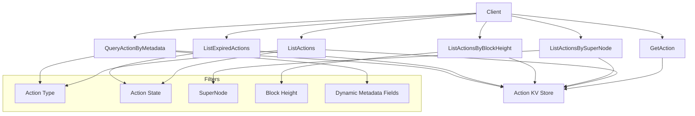

# Action Module Query Implementation Plan

## Overview

We'll implement six primary query methods for the action module:

1. `GetAction` - Get a single action by ID
2. `ListActions` - List all actions with type and state filters
3. `ListActionsBySuperNode` - List actions for a specific supernode
4. `ListActionsByBlockHeight` - List actions for a specific block height  
5. `ListExpiredActions` - List expired actions (specialized case of ListActions)
6. `QueryActionByMetadata` - Flexible metadata-specific queries

Each query will be implemented using the `ignite scaffold query` command, then enhanced with appropriate filters and pagination.

## Query Design Details

Here's a diagram showing the relationship between the different queries:



## Implementation Plan

### 1. GetAction (Get Action by ID)

**Command:**
```
ignite scaffold query getAction actionID --module action --response action
```

**Fields:**
- `actionID` (string): The unique identifier of the action

**Implementation Approach:**
- Use the existing `GetActionByID` method in the keeper
- Return the action if found, or an appropriate error if not found

### 2. ListActions (List with Type and State Filters)

**Command:**
```
ignite scaffold query listActions actionType actionState pagination.skip pagination.limit --module action --response actions,pagination,total
```

**Fields:**
- `actionType` (ActionType, optional): Filter by action type
- `actionState` (ActionState, optional): Filter by action state
- `pagination` (cosmos.base.query.v1beta1.PageRequest): Standard pagination parameters

**Implementation Approach:**
- Use the `IterateActions` method, applying filters for type and state as needed
- Implement pagination using the cosmos-sdk pagination tools
- Return a list of actions and pagination info

### 3. ListActionsBySuperNode (List Actions for SuperNode)

**Command:**
```
ignite scaffold query listActionsBySuperNode superNodeAddress pagination.skip pagination.limit --module action --response actions,pagination,total
```

**Fields:**
- `superNodeAddress` (string): The supernode validator address
- `pagination` (cosmos.base.query.v1beta1.PageRequest): Standard pagination parameters

**Implementation Approach:**
- Create a specialized iterator that checks if the supernode is in the Action's SuperNodes list
- Implement pagination
- Return actions associated with the specified supernode

### 4. ListActionsByBlockHeight (List Actions for Block Height)

**Command:**
```
ignite scaffold query listActionsByBlockHeight blockHeight pagination.skip pagination.limit --module action --response actions,pagination,total
```

**Fields:**
- `blockHeight` (int64): The block height to query
- `pagination` (cosmos.base.query.v1beta1.PageRequest): Standard pagination parameters

**Implementation Approach:**
- Implement a specialized iterator that filters actions by block height
- Implement pagination
- Return actions created at the specified block height

### 5. ListExpiredActions (List Expired Actions)

**Command:**
```
ignite scaffold query listExpiredActions pagination.skip pagination.limit --module action --response actions,pagination,total
```

**Fields:**
- `pagination` (cosmos.base.query.v1beta1.PageRequest): Standard pagination parameters

**Implementation Approach:**
- This is a specialized case of ListActions where state = EXPIRED
- Use the existing `IterateActionsByState` method with EXPIRED state
- Implement pagination
- Return expired actions

### 6. QueryActionByMetadata (Flexible Metadata Queries)

**Command:**
```
ignite scaffold query queryActionByMetadata actionType metadataQuery pagination.skip pagination.limit --module action --response actions,pagination,total
```

**Fields:**
- `actionType` (ActionType): The action type (e.g., SENSE or CASCADE)
- `metadataQuery` (string): Metadata query in format "field=value" 
- `pagination` (cosmos.base.query.v1beta1.PageRequest): Standard pagination parameters

**Implementation Approach:**
- Parse the `metadataQuery` parameter (format: "field=value")
- Implement a specialized iterator that:
  - Checks the action type
  - Retrieves the correct metadata type (sense or cascade)
  - Applies the metadata field filter
- Support different metadata fields based on action type
  - For CASCADE: file_name, data_hash, etc.
  - For SENSE: collection_id, group_id, data_hash, etc.
- Implement pagination
- Return matching actions

## Implementation Steps

1. **Generate Query Boilerplate**
   - Execute each `ignite scaffold query` command
   - This will generate proto files, keeper methods, CLI commands, and basic implementations

2. **Implement Query Logic**
   - Enhance the generated keeper methods with appropriate filtering logic
   - For basic queries (GetAction), simply adapt the existing keeper methods
   - For complex queries (ListActions, QueryActionByMetadata), implement custom iteration logic

3. **Add Pagination Support**
   - Implement proper pagination for all list queries
   - Use the cosmos-sdk pagination tools for consistent behavior

4. **Implement Metadata Query Parser**
   - Develop a parser for the metadata query format
   - Support different fields based on action type
   - Design for easy extension when new action types are added

5. **Testing**
   - Create unit tests for each query method
   - Test with various filter combinations
   - Test edge cases and error handling

## Specific Implementation Details

### Metadata Query Implementation

The metadata query implementation will be particularly important. Here's how it will work:

```mermaid
graph TD
    Input[metadataQuery: "field=value"] --> Parser[Parse Query]
    Parser --> TypeCheck[Check Action Type]
    TypeCheck -->|CASCADE| CascadeFields[Validate CASCADE Field]
    TypeCheck -->|SENSE| SenseFields[Validate SENSE Field]
    CascadeFields --> Iterator[Create Filtered Iterator]
    SenseFields --> Iterator
    Iterator --> Results[Return Matching Actions]
```

For the action type SENSE, valid metadata fields to query would include:
- data_hash
- collection_id
- group_id

For the action type CASCADE, valid metadata fields would include:
- data_hash
- file_name

The implementation will be designed to be extensible so new action types and metadata fields can be added in the future.

## Potential Challenges and Solutions

1. **Performance Considerations**
   - For metadata queries, we'll need to iterate through all actions of a certain type and check the metadata fields
   - Solution: Use efficient iteration and early filtering to reduce processing
   
2. **Query Flexibility vs. Complexity**
   - The metadata query needs to be flexible yet maintainable
   - Solution: Start with a simple field=value format, with designs to extend to more complex queries if needed

3. **Pagination Consistency**
   - Pagination needs to work consistently across all query types
   - Solution: Follow the cosmos-sdk pagination patterns consistently

4. **Future Extensibility**
   - New action types may be added in the future
   - Solution: Design the metadata query system to be easily extended for new action types